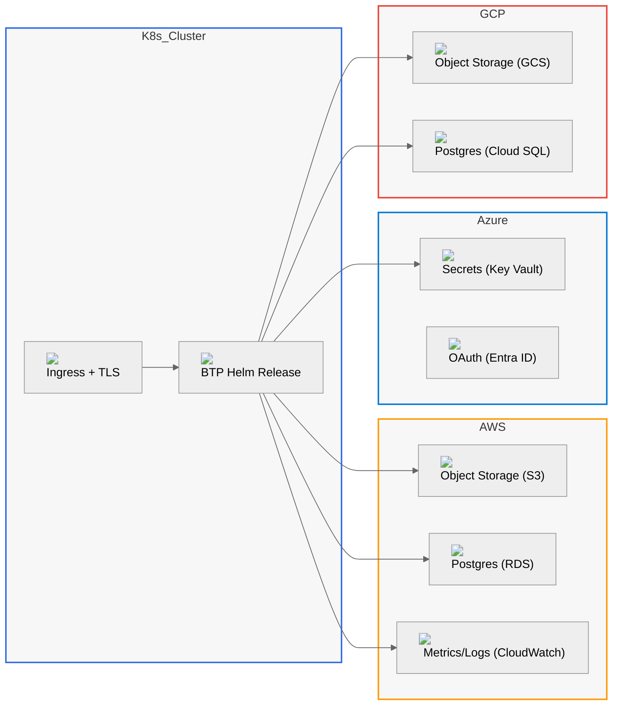
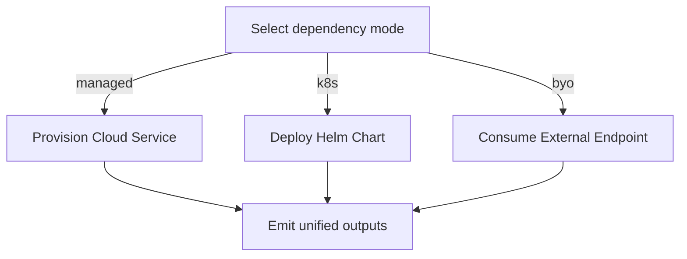
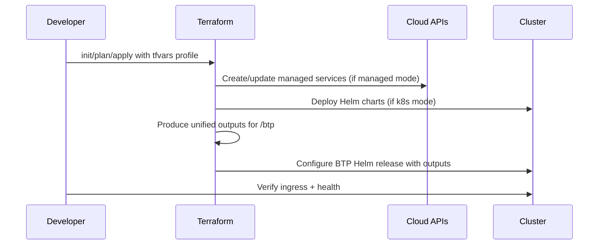

# Documentation Plan

## Goals
- Describe the full system end-to-end: what is deployed, how pieces are wired, and how to operate it.
- Keep docs authoritative: generated references for Terraform inputs/outputs; curated guides for concepts and architecture.
- Use elegant, accurate Mermaid diagrams with real icons (HTML labels) without clutter.
- Support local dev (k8s + Helm) and universal mix-and-match across AWS, Azure, GCP, and BYO.

## Information Architecture (Markdown-Only)
- Overview
  - What this project is; key features; supported modes and providers.
  - "How it works" at a glance: one big architecture diagram (multi-cloud).
- Quickstart
  - Local cluster flow (OrbStack/kind/minikube) + Helm install.
  - Cloud flow: pick a provider profile; init/plan/apply; verify.
- Concepts
  - Modes: managed | k8s | byo (three‑mode pattern).
  - Dependency model and unified outputs contract consumed by `/btp`.
  - Mix‑and‑match strategy across providers (cross‑cloud patterns).
  - State management, backends, environments layout, tfvars strategy.
- Architecture
  - High-level architecture (whole picture, multi‑cloud).
  - Component deep‑dives: Kubernetes, networking/ingress, TLS, identity/OAuth, secrets, storage (object + DB), cache, metrics/logs.
  - Data flows and trust boundaries; RBAC and IAM surfaces; encryption.
- Modules
  - Root module (wiring and orchestration).
  - Cloud scaffolding: `cloud/{aws,azure,gcp,generic}`.
  - Dependencies: `deps/{postgres,redis,object_storage,oauth,secrets,ingress_tls,metrics_logs}`.
  - BTP Helm release: `/btp` mapping dependency outputs → chart values.
  - For each: purpose, supported modes, provider resources used, inputs/outputs (auto‑generated), example snippets, decision guidance.
- Reference
  - Auto‑generated Terraform references per module (inputs/outputs/providers/resources).
  - Compatibility & Mix Matrix (dependency × mode × provider).
  - IAM/permissions reference per provider; required roles/policies.
- Operations
  - Preflight checks, readiness, health verification.
  - Plan/apply/destroy flows; promotion between envs.
  - Day‑2 ops playbooks: scaling, rotations (TLS/keys), backups/restore, failover, migrations (e.g., k8s → managed), blue/green or canary.
  - Troubleshooting: common failures, how to debug, provider‑specific gotchas.
- Security
  - Secrets handling, key management, TLS everywhere.
  - Identity: service principals/IAM users; SSO and OAuth provider choices.
  - Network posture: private endpoints, ingress, firewalling, policies.
- Cost & Sizing
  - Right‑sizing guidance; cost levers per dependency and provider.
  - Optional Infracost workflow and where it fits.
- Examples
  - Curated `*.tfvars` sets: local dev, all‑AWS, all‑Azure, all‑GCP, k8s‑only, BYO‑only, and mixed cross‑cloud setups.
  - “Choose your profile” guide that links to examples.
- Contribution
  - Docs & Mermaid style guides; PR checklist (lint/validate/terraform‑docs update).
  - How to add a new provider/mode/dependency without breaking contracts.
  - ADRs for key design decisions.

## Docs Repository Layout (Markdown Only)
- `docs/overview/*`
- `docs/quickstart/*`
- `docs/concepts/*`
- `docs/architecture/*`
- `docs/modules/root.md`
- `docs/modules/cloud/{aws,azure,gcp,generic}.md`
- `docs/modules/deps/{postgres,redis,object_storage,dns,oauth,secrets,ingress_tls,metrics_logs}.md`
- `docs/modules/btp.md`
- `docs/reference/{terraform/*, iam/*, compatibility.md}`
- `docs/operations/{preflight.md, runbooks/*.md, troubleshooting.md}`
- `docs/security/*`
- `docs/cost/*`
- `docs/examples/*.md`
- `docs/contributing/{style.md, mermaid.md, adr/*.md}`
- `docs/assets/icons/{aws,azure,gcp,k8s,btp}/*.svg`

## Mermaid Strategy (with Real Icons)
- Use Mermaid flowcharts, sequence, and ER diagrams.
- Init block to enable HTML labels and consistent styling:

```mermaid
%%{init: {
  'theme':'neutral',
  'securityLevel':'loose',
  'flowchart': {'htmlLabels': true, 'curve': 'basis'}
}}%%
```

- Conventions
  - Providers as subgraphs with brand color accents (via `classDef`).
  - Nodes labeled with short names and an inline `` icon (SVG from `docs/assets/icons/...`).
  - Limit cross‑edges; group flows and annotate sparingly.
  - Prefer multiple focused diagrams over a single cluttered one; include a large “whole picture” where appropriate.

### Example – Whole Picture (Multi‑Cloud)



### Example – Mode Decision per Dependency



### Example – Terraform Flow



## Module Pages (Per Module)
For each of `/deps/*`, `/cloud/*`, `/btp`, and root:
- Purpose and scope.
- Supported modes and provider resource mappings.
- Inputs/outputs (auto‑generated into `docs/reference/terraform/...`).
- Sequence diagram of how the module composes into the whole.
- Decision guide (when to pick which mode).
- Example snippet(s): focused `*.tfvars` or module stanzas.

## Compatibility & Mix Matrix
- One page with a table and a compact Mermaid diagram for supported combinations:
  - Rows: dependencies; Columns: modes; Cells: providers/services supported.
- Short “Profiles” section linking to example configs:
  - All‑managed AWS/Azure/GCP, All‑k8s, All‑byo, Mixed profiles (e.g., AKS + S3 + Cloud SQL).

## Reference Generation
- Use `terraform-docs` to generate per‑module references (inputs/outputs/providers/resources) into `docs/reference/terraform/<module>.md`.
- Keep human‑written overviews separate; never hand‑write variable tables.

## Operations & Runbooks
- Preflight: what `scripts/preflight.sh` verifies and how to interpret failures.
- Environment workflows: local dev (nip.io), cloud bootstrap (credentials/roles), remote state, promotion.
- Runbooks: rotate TLS/secrets; scale Postgres/Redis; change storage; switch modes with migration guidance; backup/restore; DR.
- Troubleshooting: Terraform errors, Helm release issues, ingress/DNS/TLS, IAM failures.

## Security Model
- Secrets lifecycle; masking sensitive outputs.
- IAM/role requirements per provider (`docs/reference/iam/*`).
- TLS everywhere; cert sources and renewal.
- Network posture and private endpoints guidance.

## Cost & Sizing
- Instance classes per provider; cost levers per dependency.
- Optional Infracost workflow example (if used).

## Examples
- Curated `examples/*.tfvars`:
  - `generic-orbstack-dev.tfvars` (local dev).
  - `aws-all-managed.tfvars`, `azure-all-managed.tfvars`, `gcp-all-managed.tfvars`.
  - `k8s-only.tfvars`, `byo-only.tfvars`.
  - `mixed-aks-s3-cloudsql.tfvars` (illustrative cross‑cloud).
- Each example page includes a small diagram of provisioned components.

## Contributing & Standards
- Docs style guide: short sentences, active voice, one concept per paragraph.
- Mermaid style guide: provider subgraphs, consistent colors, HTML labels with icons, max nodes per diagram unless “whole picture”.
- PR checklist: `terraform fmt`, `terraform validate`, `tflint` (if configured), update `terraform-docs`, validate example plans, update diagrams and compatibility matrix.

## Tooling & CI (Optional)
- Script to run `terraform-docs` across modules to refresh references.
- Lint checks for broken links and Mermaid blocks.
- Optional: run dry‑run `terraform plan` against a representative set of examples.

## Rollout
1) Skeleton + shared Mermaid config + icon library; import Overview, Quickstart, Concepts; add “whole picture” diagram.
2) Module pages with auto‑generated references; one deep‑dive architecture page.
3) Operations (preflight, runbooks, troubleshooting) and Examples catalog.
4) Security, IAM references, Cost/Sizing, Compatibility matrix automation.
5) Contributions, ADRs, cross‑links and polish.
