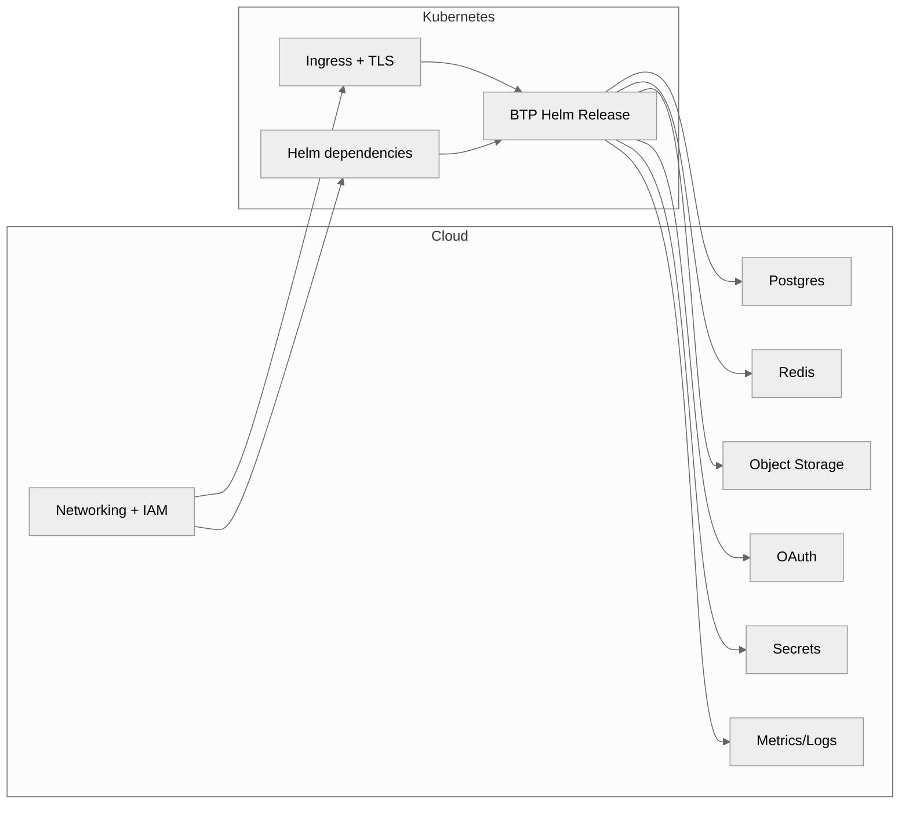

# Architecture

**The stack orchestrates cloud scaffolding, dependency modules, and the BTP Helm release through a normalized contract.**

## Components and data flow

## Dependency groups

**Data plane** – Postgres and Redis
- AWS: RDS and ElastiCache
- Kubernetes: Zalando Postgres Operator and Bitnami Redis
- Bring-your-own: Your existing endpoints

**Storage and identity** – Object Storage, OAuth, Secrets
- AWS: S3, Cognito, Secrets Manager (planned)
- Kubernetes: MinIO, Keycloak, Vault
- Bring-your-own: Your existing services

**Edge and observability** – Ingress, TLS, Metrics, Logs
- Kubernetes: ingress-nginx, cert-manager, kube-prometheus-stack, Loki
- Managed observability integrations are planned

## Networking and IAM

**AWS scaffolding** (`cloud/aws`)
- VPC networking, subnets, security groups
- IAM roles and policies
- Route53 context
- Consumed by dependency modules

**Kubernetes scaffolding**
- Namespaces created when `manage_namespace = true`
- Service accounts for Helm releases

**Managed modes** use least-privilege IAM policies tied to specific resources.

## Security posture

**TLS termination** at ingress layer
- cert-manager issues certificates
- DNS-01 via Route53 (when AWS credentials provided)
- HTTP-01 otherwise

**Secrets** remain in authoritative stores
- AWS Secrets Manager
- Vault-backed Kubernetes secrets
- Bring-your-own secret backend

**Credential rotation**
- Rotate in source system (Secrets Manager, Vault, bring-your-own)
- Run `terraform apply` to propagate changes to Helm releases
