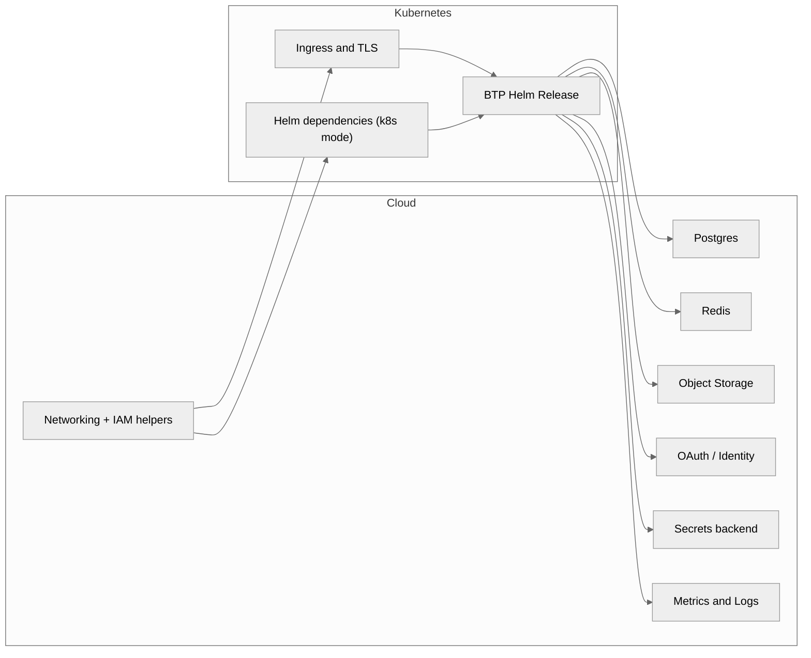

# Architecture

The Terraform stack orchestrates cloud scaffolding, dependency modules, and the BTP Helm release through a normalized contract. This page highlights the moving parts and how traffic flows between them.

## Whole picture

Managed dependency provisioning is implemented for AWS today via the `cloud/aws` module and AWS-specific modes within each dependency. Azure and GCP mode files are placeholders that let you wire existing services until native support ships.

## Dependency groups
- **Data plane** – Postgres and Redis provide persistence. AWS managed paths (RDS, ElastiCache) are available, while Azure and GCP currently rely on either Kubernetes charts or bring-your-own connection details.
- **Storage & identity** – Object storage, OAuth, and secrets modules support AWS managed services (S3, Cognito, Secrets Manager) alongside Kubernetes charts such as MinIO, Keycloak, and Vault. Other clouds fall back to BYO until their modules are implemented.
- **Edge & observability** – `ingress_tls` installs ingress-nginx and cert-manager in Kubernetes. Metrics/logs are provided via kube-prometheus-stack and Loki today; managed observability integrations are still pending.

## Networking & IAM
- `cloud/aws` prepares foundational AWS resources: VPC networking, security groups, IAM roles, and Route53 context consumed by dependencies.
- When running in k8s mode, Terraform ensures namespaces and service accounts exist before Helm releases are applied.
- Managed modes use least-privilege IAM policies tied to the AWS resources they create (e.g., S3 bucket policies, RDS parameter groups). Similar scaffolding for other providers will follow.

## Security posture
- TLS termination happens at the ingress layer with cert-manager issuing certificates (DNS-01 through Route53 when AWS credentials are provided, otherwise HTTP-01).
- Secrets remain in their authoritative stores: AWS Secrets Manager or Vault-backed Kubernetes secrets depending on mode.
- Rotate credentials in the source system (Secrets Manager, Vault, BYO endpoint) and re-run `terraform apply` so Helm releases pick up the changes.
