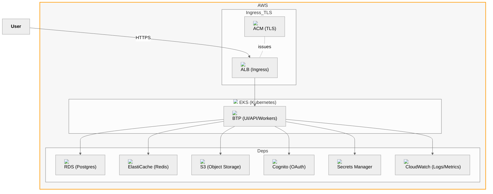

# Architecture — Full AWS (All Managed)

Notes
- Ingress via ALB; certificates via ACM; DNS via Route53 (not shown).
- Dependencies are fully managed: RDS, ElastiCache, S3, Cognito, Secrets Manager, CloudWatch.
- BTP in Kubernetes consumes unified outputs for all dependencies.
