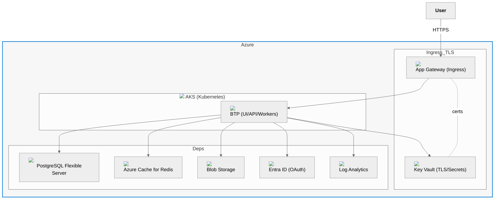

# Architecture — Full Azure (All Managed)

Notes
- Ingress via Application Gateway; TLS/certs in Key Vault.
- Managed services across data, cache, storage, identity, and observability.
- BTP in Kubernetes reads unified outputs to configure connectivity.
