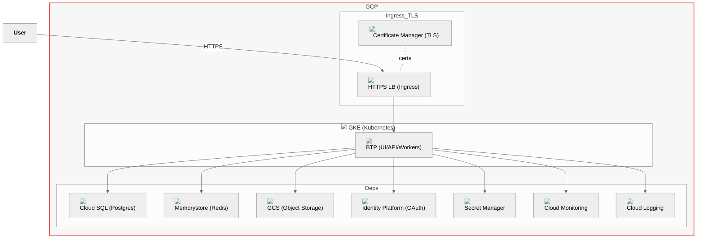

# Architecture — Full GCP (All Managed)

Notes
- Ingress via HTTPS Load Balancer; certificates via Certificate Manager.
- Managed services across data, cache, storage, identity, secrets, and observability.
- Use Private Service Connect for Cloud SQL; Workload Identity for k8s → GCP APIs.
