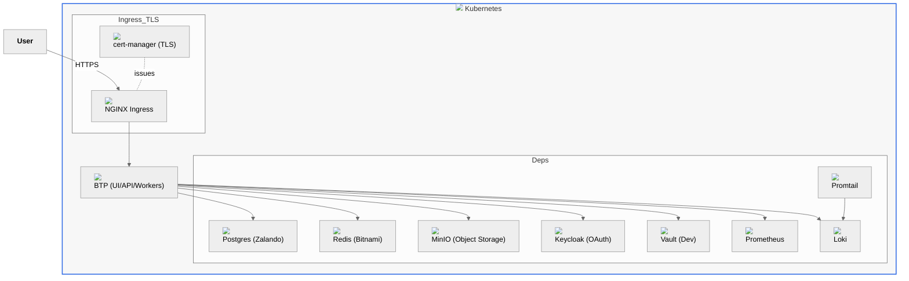

# Architecture — Full Kubernetes (All k8s mode)

Notes
- All dependencies run in cluster via Helm charts for speed and simplicity.
- Self-signed issuer for local; switch to ACME/real certs for shared environments.
