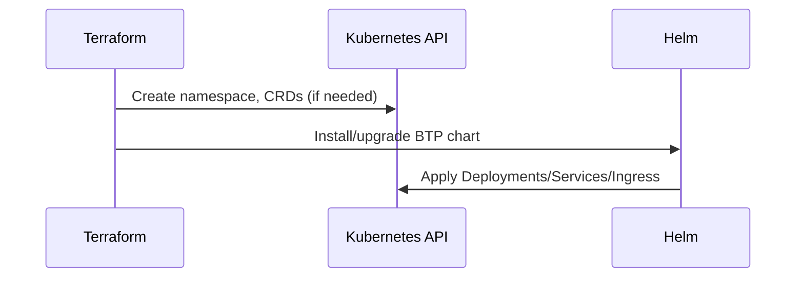

# Kubernetes

Focus on cluster topology, namespaces, RBAC, and Helm releases.

```mermaid
sequenceDiagram
  participant TF as Terraform
  participant K as Kubernetes API
  participant H as Helm
  TF->>K: Create namespace, CRDs (if needed)
  TF->>H: Install/upgrade BTP chart
  H->>K: Apply Deployments/Services/Ingress
```

