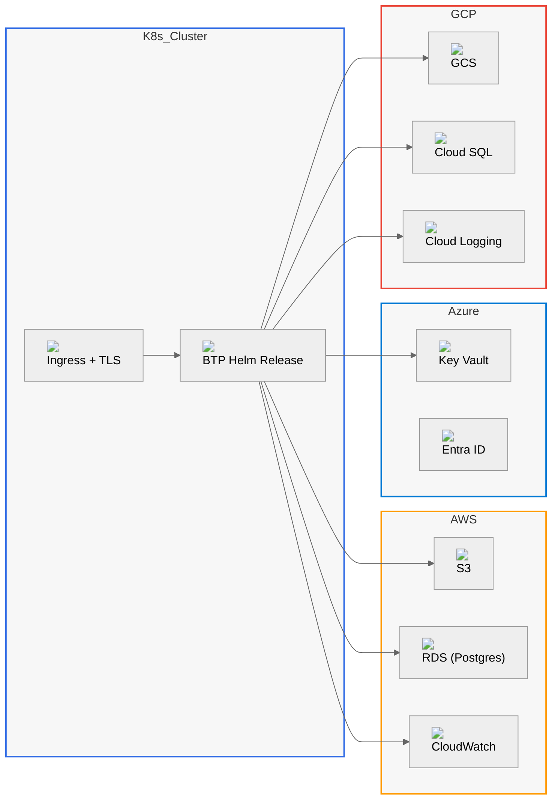

# Architecture — Whole Picture

High-level view of Kubernetes, ingress/TLS, dependencies, and provider mix.

```mermaid
%%{init: {'theme':'neutral','securityLevel':'loose','flowchart':{'htmlLabels':true}}}%%
flowchart LR
  classDef aws fill:#F7F7F7,stroke:#FF9900,stroke-width:2px
  classDef azure fill:#F7F7F7,stroke:#0078D4,stroke-width:2px
  classDef gcp fill:#F7F7F7,stroke:#EA4335,stroke-width:2px
  classDef k8s fill:#F7F7F7,stroke:#326CE5,stroke-width:2px

  subgraph K8s_Cluster
    direction TB
    app["<img src='../assets/icons/k8s/k8s.svg' width='18'/> BTP Helm Release"]
    ing["<img src='../assets/icons/k8s/ingress.svg' width='18'/> Ingress + TLS"]
  end
  class K8s_Cluster k8s

  subgraph AWS
    s3["<img src='../assets/icons/aws/s3.svg' width='18'/> S3"]
    rds["<img src='../assets/icons/aws/rds.svg' width='18'/> RDS (Postgres)"]
    cw["<img src='../assets/icons/aws/cloudwatch.svg' width='18'/> CloudWatch"]
  end
  class AWS aws

  subgraph Azure
    kv["<img src='../assets/icons/azure/key-vault.svg' width='18'/> Key Vault"]
    entra["<img src='../assets/icons/azure/entra.svg' width='18'/> Entra ID"]
  end
  class Azure azure

  subgraph GCP
    gcs["<img src='../assets/icons/gcp/gcs.svg' width='18'/> GCS"]
    csql["<img src='../assets/icons/gcp/cloud-sql.svg' width='18'/> Cloud SQL"]
    clogs["<img src='../assets/icons/gcp/cloud-logging.svg' width='18'/> Cloud Logging"]
  end
  class GCP gcp

  ing --> app
  app --> rds
  app --> s3
  app --> kv
  app --> gcs
  app --> csql
  app --> cw
  app --> clogs
```

