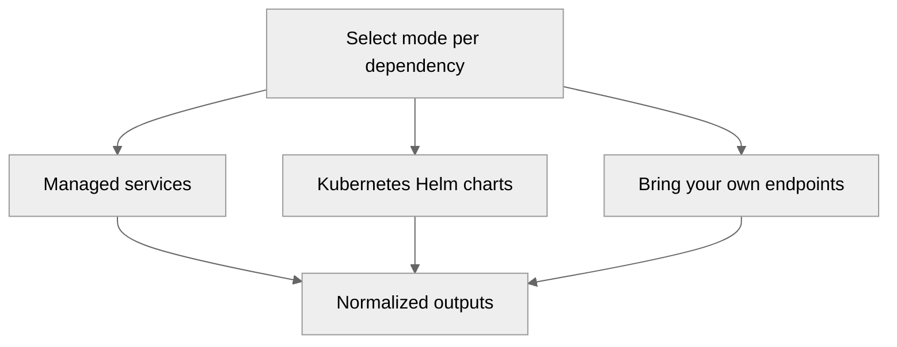

# Core Concepts

Understanding these patterns makes it easy to mix providers and modes without changing how the BTP Helm release consumes infrastructure.

## Dependency modes
Each dependency can run in one of three modes, and you can mix modes across dependencies to fit the environment:
- **managed** – leverage a fully managed cloud service (AWS implementations ship today; Azure/GCP are on the roadmap).
- **k8s** – install a curated Helm chart inside the Kubernetes cluster.
- **byo** – reference an externally managed endpoint and supply connection details.

## Unified outputs contract
- Dependencies return consistent objects (`host`, `port`, `credentials`, `tls`, etc.) regardless of provider.
- The `/btp` module consumes those outputs to populate Helm values without conditional logic.
- Sensitive values are flagged so Terraform masks them, while non-sensitive URLs aid verification.

## Configuration surfaces
- Root module inputs accept one `mode` per dependency plus optional provider-specific `config` blocks.
- tfvars files are the primary way to select modes and tweak defaults.
- State layouts follow environment separation: one backend per workspace or env to avoid accidental cross-talk.

## Cross-cloud composition
- Mix `aws`, `k8s`, and `byo` modes to suit each environment; managed modules exist for AWS today, while Azure and GCP rely on bring-your-own endpoints until native support lands.
- The `cloud/aws` module exposes networking and IAM helpers consumed by dependency modules; equivalent scaffolding for other clouds is planned.
- Dependencies never reach across provider boundaries; the root module orchestrates multiple dependency modules when needed.

## Environment strategy
- Use local profiles for development to validate charts and ingress quickly.
- Promote shared environments by pinning tfvars and state backends (e.g., remote state in Terraform Cloud or S3/GCS).
- Track secrets and credentials in the provider’s secret manager or external vault; avoid embedding them in tfvars or logs.
