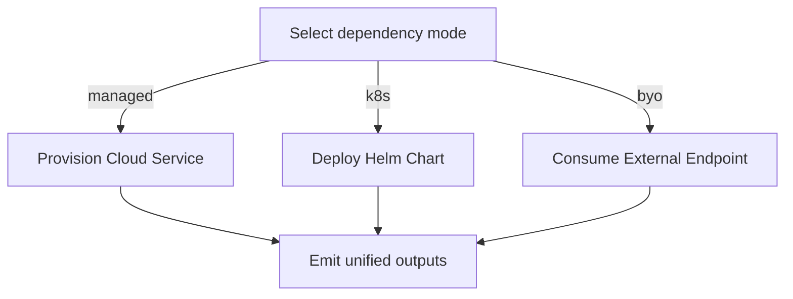

# Modes: managed | k8s | byo

Each dependency supports three modes with a unified output contract:

- managed: provision cloud-native services (e.g., RDS, Cloud SQL, Key Vault)
- k8s: deploy Helm charts in the target cluster
- byo: consume external endpoints you provide

