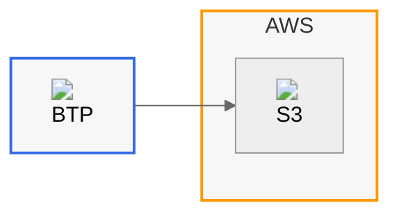

# Mermaid Style Guide

- Always include an init block enabling HTML labels and consistent curves.
- Use provider subgraphs and classDefs for brand colors.
- Embed icons from `docs/assets/icons/...` with `` in labels.
- Prefer LR for architecture; TD for flows; sequence diagrams for processes.
- Target ≤12 nodes per diagram unless showing the whole picture.

