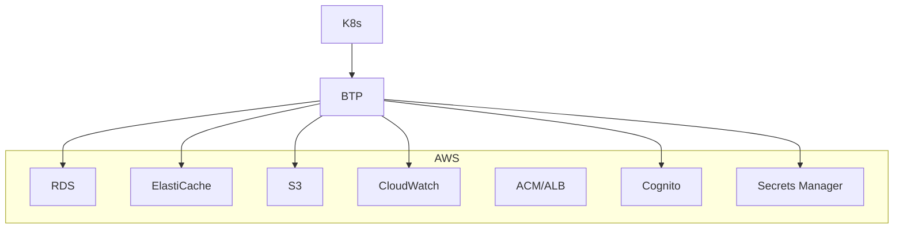

# Example — All AWS Managed

Use AWS-native services for all dependencies (RDS, ElastiCache, S3, CloudWatch, ACM/ALB, Cognito, Secrets Manager).

```mermaid
flowchart TD
  subgraph AWS
    RDS[RDS]
    EC[ElastiCache]
    S3[S3]
    CW[CloudWatch]
    ACM[ACM/ALB]
    COG[Cognito]
    SM[Secrets Manager]
  end
  K8s-->BTP
  BTP-->RDS & EC & S3 & CW & COG & SM
```

