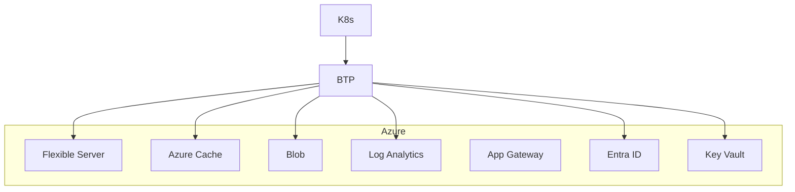

# Example — All Azure Managed

Use Azure-native services for all dependencies (Flexible Server, Azure Cache, Blob, Log Analytics, App Gateway + certs, Entra ID, Key Vault).

```mermaid
flowchart TD
  subgraph Azure
    PG[Flexible Server]
    RC[Azure Cache]
    BLOB[Blob]
    LA[Log Analytics]
    AG[App Gateway]
    EN[Entra ID]
    KV[Key Vault]
  end
  K8s-->BTP
  BTP-->PG & RC & BLOB & LA & EN & KV
```

