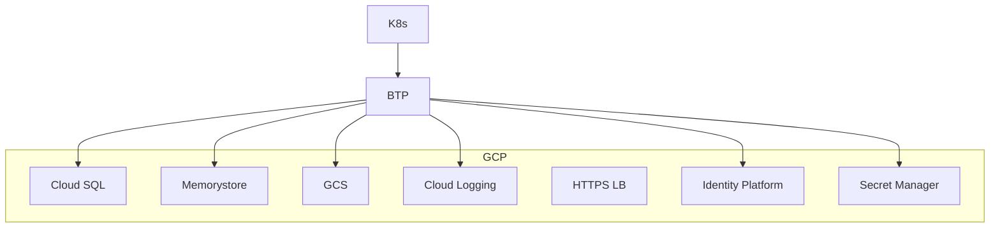

# Example — All GCP Managed

Use GCP-native services for all dependencies (Cloud SQL, Memorystore, GCS, Cloud Logging, HTTPS LB + managed certs, Identity Platform, Secret Manager).

```mermaid
flowchart TD
  subgraph GCP
    CSQL[Cloud SQL]
    MEM[Memorystore]
    GCS[GCS]
    CL[Cloud Logging]
    LB[HTTPS LB]
    IDP[Identity Platform]
    SM[Secret Manager]
  end
  K8s-->BTP
  BTP-->CSQL & MEM & GCS & CL & IDP & SM
```

