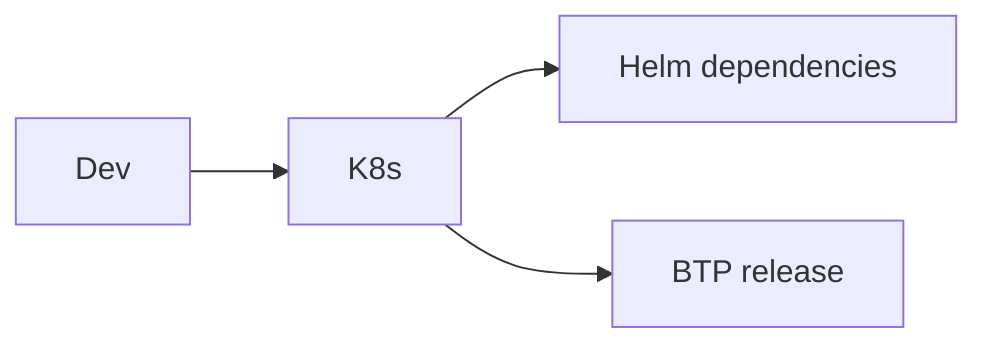

# Example — Local (OrbStack)

Config: `examples/generic-orbstack-dev.tfvars`

Summary: Deploys all dependencies via Helm into a local cluster for fast development.

```mermaid
flowchart LR
  Dev-->K8s
  K8s-->Helm[Helm dependencies]
  K8s-->BTP[BTP release]
```

