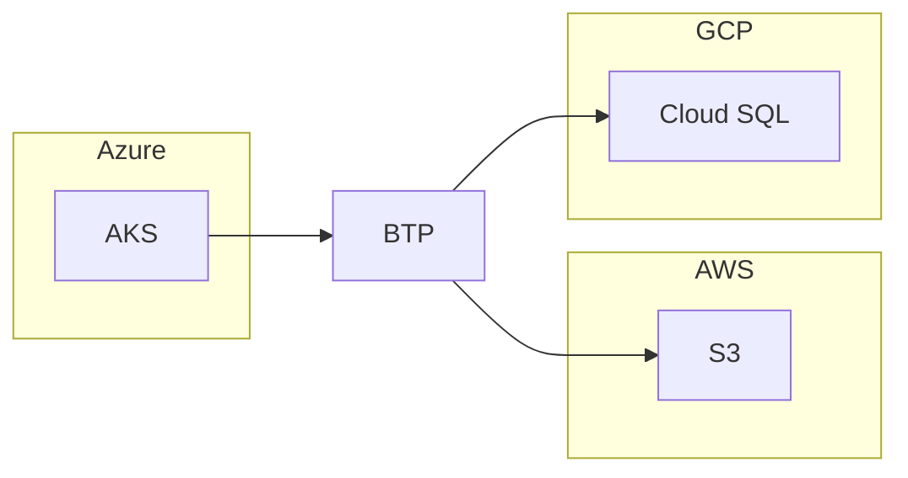

# Example — Mixed (AKS + S3 + Cloud SQL)

Illustrates cross‑cloud composition: AKS cluster with S3 for object storage and Cloud SQL for Postgres.

```mermaid
flowchart LR
  subgraph Azure
    AKS[AKS]
  end
  subgraph AWS
    S3[S3]
  end
  subgraph GCP
    CSQL[Cloud SQL]
  end
  AKS-->BTP
  BTP-->S3 & CSQL
```

