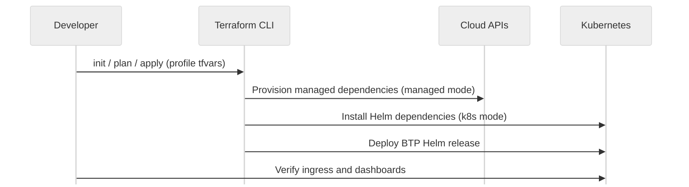

# Getting Started

This guide walks through the common Terraform workflow and how to apply it to both local clusters and cloud providers.

## Prerequisites
- Terraform 1.6 or newer.
- `kubectl` and `helm` installed and pointed at your target cluster.
- AWS credentials with permissions to create networking, database, cache, storage, and Cognito resources when you enable managed modes.
- Optional: OrbStack, kind, or minikube for the local profile.

## Terraform workflow
1. `terraform init` – download providers and set up backends.
2. `terraform plan -var-file <profile>.tfvars` – inspect the changes for your chosen dependency mix.
3. `terraform apply -var-file <profile>.tfvars` – create/update infrastructure.
4. `terraform destroy -var-file <profile>.tfvars` – clean up when done.



## Local fast path
Use `examples/k8s-config.tfvars` to install everything inside your Kubernetes cluster.

```bash
./scripts/preflight.sh
terraform init
terraform apply -var-file examples/k8s-config.tfvars
kubectl get pods -A
```

## Cloud profile flow
1. Choose a provider file under `examples/` (e.g., `aws-config.tfvars`, `azure-config.tfvars`, `gcp-config.tfvars`, `mixed-config.tfvars`, or `byo-config.tfvars`). Azure and GCP profiles currently operate in BYO mode until native modules are implemented.
2. Export AWS credentials with permissions to create networking, database, cache, storage, and Cognito resources.
3. Initialize Terraform and run `plan` to review managed resources.
4. Apply and capture the Terraform outputs (ingress hostnames, service URLs) needed by the BTP application team.

Verification tips:
- Confirm ingress reachability on the published hostnames (NodePort or load balancer, depending on your cluster).
- Check managed service dashboards (e.g., AWS RDS) when you enable managed modes.
- Rotate secrets via the provider’s secret manager (or Vault) to ensure bindings work end-to-end.
