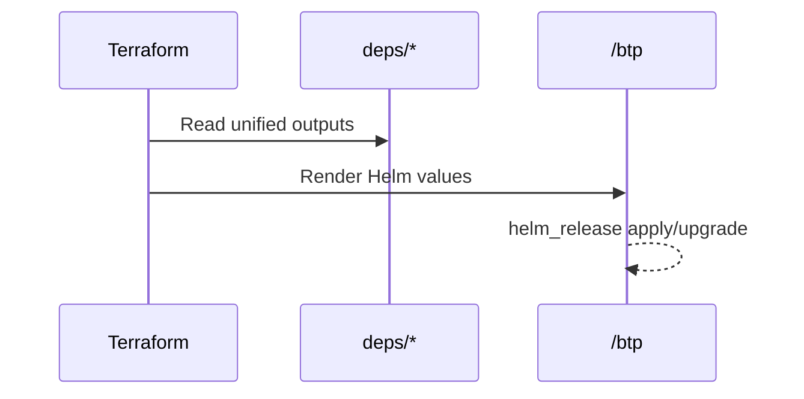

# BTP Module

What this does (in plain English)
- Translates dependency outputs into Helm values and installs the SettleMint Platform chart
- Adds optional license fields and image pull creds; disables duplicate in-chart ingress controller

At a glance
- Inputs
  - `chart`, `chart_version`, `namespace`, `deployment_namespace`, `release_name`, `create_namespace`
  - `values` (map) and `values_file` (YAML) merged with auto-generated values
  - `base_domain` influences dev defaults for ingress hosts
  - Dependencies: `postgres`, `redis`, `object_storage`, `dns`, `oauth`, `secrets`, `ingress_tls`, `metrics_logs`
- Auto-wiring
  - Ingress class and issuer from `ingress_tls`
  - Hostnames, TLS secret naming, and ingress annotations from `dns` (falls back to `base_domain`)
  - DB, cache, storage, OAuth, secrets endpoints mapped into chart values
  - Dev defaults for quick local use; disable Vault in prod or configure external auth
- Outputs
  - `release_name`, `namespace`

How it composes


Example values overlay
```hcl
btp = {
  enabled       = true
  chart_version = "1.2.3"
  values = {
    ingress = { hosts = ["app.${var.base_domain}"] }
  }
}
```

Verification
```bash
kubectl get pods -n $(terraform output -json btp | jq -r .namespace)
kubectl get ing -n $(terraform output -json btp | jq -r .namespace)
```

Gotchas & tips
- Ensure `license_*` fields are provided for private registry access
- Don’t enable the chart’s own ingress-nginx — the module turns it off to avoid conflicts
