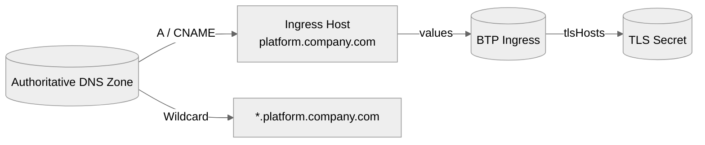

# Dependency — DNS

Summary
- Automates platform DNS records (root + wildcard) and returns ingress annotations/TLS hints.

Modes at a glance
- aws: Route53 `A`/`CNAME` or ALIAS records (implemented).
- byo: Surface pre-existing DNS details without managing records.
- azure / gcp / cf: Planned; the module raises a friendly error if selected today.

How it works
- Inputs: `domain`, provider-specific targets, optional wildcard and TLS settings.
- Outputs: `hostname`, `wildcard_hostname`, `tls_secret_name`, `tls_hosts`, `ingress_annotations`, `ssl_redirect`, `records`.
- `/btp` consumes these outputs to build ingress and deployment-engine domains automatically.

Example — Route53
```hcl
dns = {
  mode                    = "aws"
  domain                  = "platform.company.com"
  enable_wildcard         = true
  include_wildcard_in_tls = false # Enable when using DNS-01 or Cloudflare Total TLS
  cert_manager_issuer     = "letsencrypt-prod"
  ssl_redirect            = false
  aws = {
    zone_name            = "platform.company.com"
    main_record_type     = "A"
    main_record_value    = "203.0.113.10"
    wildcard_record_type = "CNAME"
    wildcard_record_value = "platform.company.com"
  }
}
```

Cloudflare quick notes
- Provide either `zone_id` or `zone_name`.
- `proxied=true` forces TTL `1` (automatic) and enables DDoS/CDN/Total TLS.
- Combine with Cloudflare Total TLS for managed wildcard certificates; keep `include_wildcard_in_tls = true`.

Diagram


Verification
```bash
# After apply, confirm records and certificate status
terraform output -json dns | jq
dig platform.company.com +short
dig '*.platform.company.com' +short
kubectl get certificate -n settlemint
```

Troubleshooting
- Not resolving: confirm hosted zone/record target, allow DNS propagation.
- Wrong IP: verify ingress LB address before applying.
- TLS failed: ensure issuer supports wildcard (DNS-01 or Cloudflare Total TLS) or disable wildcard in TLS list.

Next steps
- Pair with `ingress_tls` (cert-manager) and review `/docs/modules/btp.md` to see how DNS outputs flow into the Helm values.
