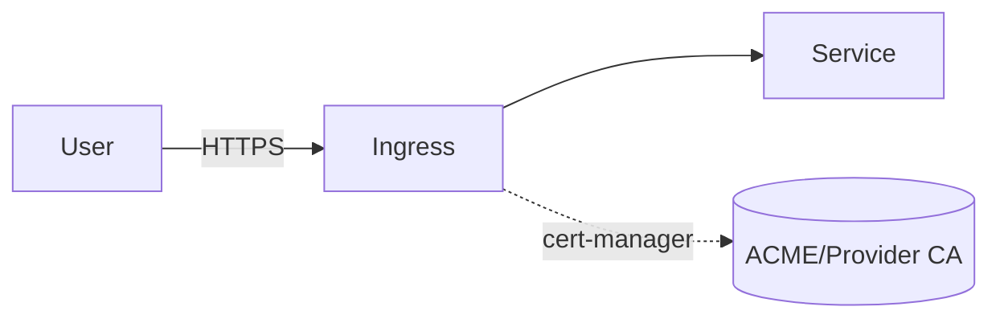

# Dependency — Ingress & TLS

Summary
- HTTP ingress and TLS termination with a consistent class and issuer model.

Modes at a glance
- managed: ALB+ACM (AWS) | App Gateway+Key Vault (Azure) | HTTPS LB+Managed Certs (GCP)
- k8s: NGINX Ingress + cert-manager (ClusterIssuer)
- byo: External ingress endpoints and certs

How k8s mode works (this repo)
- Installs ingress-nginx and cert-manager (CRDs), creates a self-signed ClusterIssuer
- Inputs: `nginx_chart_version`, `cert_manager_chart_version`, `issuer_name`, `values_*`
- Outputs: `ingress_class="nginx"`, `issuer_name`

Managed mode (guidance)
- AWS: ALB Ingress Controller, ACM, Route53; annotate services appropriately
- Azure: AGIC with Key Vault certs via managed identity
- GCP: Cloud HTTP(S) LB with managed certs and BackendConfig

BYO mode
- Inputs: `ingress_class`, `issuer_name` or `tls_secret_name`, hosts

Diagram


Verification (k8s mode)
```bash
kubectl get pods -n <namespace> | egrep "ingress|cert"
kubectl get clusterissuer
```

Security & gotchas
- Use real ACME/provider-managed certs outside local; private LBs and WAFs recommended
- Webhook timing for cert-manager CRDs — this module waits, but slow clusters may need extra time

Next steps
- Configure application hosts in `/btp` values referencing the chosen issuer
