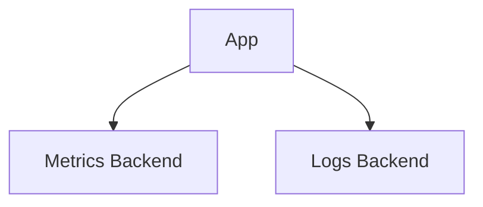

# Dependency — Metrics & Logs

Summary
- Observability via metrics and logs using provider-native or k8s-native stacks.

Modes at a glance
- managed: CloudWatch/AMP (AWS) | Log Analytics (Azure) | Cloud Logging/Monitoring (GCP)
- k8s: kube-prometheus-stack + loki-stack
- byo: Datadog/New Relic/etc.

How k8s mode works (this repo)
- Installs kube-prometheus-stack and loki-stack; Grafana with generated/provided password; no persistence in dev
- Inputs: `kp_stack_chart_version`, `loki_stack_chart_version`, `grafana_password`, `values`
- Outputs: `prometheus_endpoint`, `loki_endpoint`, `grafana_url`, `grafana_username=admin`, `grafana_password`

Managed mode (guidance)
- AWS: Fluent Bit to CloudWatch; AMP/AMG for Prometheus/Grafana
- Azure: AMA to Log Analytics; Managed Grafana for dashboards
- GCP: Managed Prometheus + Cloud Logging/Monitoring

BYO mode
- Inputs: provider endpoints and API keys; configure via Helm values

Examples
```hcl
metrics_logs = { mode = "k8s" }

metrics_logs = {
  mode = "managed"
  managed = { provider = "gcp", managed_prometheus = true }
}
```

Diagram


Verification (k8s mode)
```bash
kubectl get svc -n <namespace> | egrep "grafana|prom"
open $(terraform output -json metrics_logs | jq -r .grafana_url)
```

Security & gotchas
- Limit Grafana exposure; enable SSO; prefer managed offerings in prod
- Control retention and persistence to avoid runaway disk usage

Next steps
- Connect app dashboards and alerts; secure Grafana with your IdP
