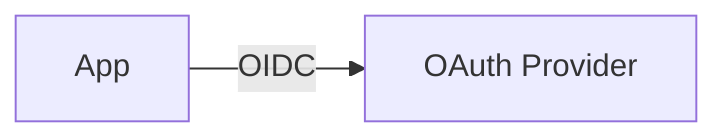

# Dependency — OAuth

Summary
- OIDC/OAuth2 identity provider for the platform.

Modes at a glance
- managed: Cognito (AWS) | Entra ID (Azure) | Identity Platform (GCP)
- k8s: Keycloak (Bitnami) for local/dev
- byo: External IdP (Auth0/Okta/etc.)

How k8s mode works (this repo)
- Installs Keycloak with embedded Postgres for dev; optional ingress
- Inputs: `ingress_enabled`, `base_domain`, `admin_password`, `chart_version`, `values`
- Outputs: `issuer` (realm URL), `admin_url`; `client_id`/`client_secret` are null by default

Managed mode (guidance)
- Cognito: user pool, app client, hosted domain; client secret and callback URLs
- Entra ID: app registration, redirect URIs, scopes, custom domain
- Identity Platform: OAuth2 client and IdP config; callback URLs

BYO mode
- Inputs: `issuer`, `client_id`, `client_secret`, `scopes`, `callback_urls`

Examples
```hcl
oauth = { mode = "k8s", k8s = { ingress_enabled = true } }

oauth = {
  mode = "byo"
  byo = {
    issuer        = "https://auth.example.com/"
    client_id     = "btp-web"
    client_secret = "…"
    callback_urls = ["https://app.example.com/callback"]
    scopes        = ["openid","profile","email"]
  }
}
```

Diagram


Verification (k8s mode)
```bash
kubectl get svc -n <namespace> | grep keycloak
open http://keycloak.127.0.0.1.nip.io || echo "Open in browser"
```

Security & gotchas
- Prefer managed IdPs for prod; rotate client secrets; use PKCE for public clients
- Ingress race on first install: enable `ingress_enabled` after ingress and cert-manager are healthy

Next steps
- Map your app clients and callback URLs; see `/btp` Helm values mapping
