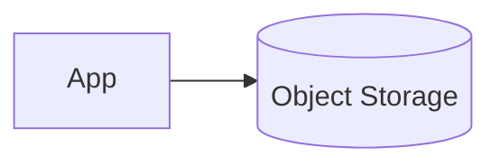

# Dependency — Object Storage

Summary
- Durable storage for artifacts, backups, and logs via S3-compatible outputs.

Modes at a glance
- managed: S3 (AWS) | Blob (Azure) | GCS (GCP)
- k8s: MinIO (dev-friendly)
- byo: External bucket/endpoint

How k8s mode works (this repo)
- Installs Bitnami MinIO, no persistence for dev; creates a default bucket
- Inputs: `default_bucket`, `access_key`, `secret_key`, `chart_version`, `release_name`, `values`
- Outputs: `endpoint`, `bucket`, `access_key`, `secret_key`, `region=us-east-1`, `use_path_style=true`

Managed mode (guidance)
- AWS S3: enforce encryption, versioning, lifecycle; IAM policies
- Azure Blob: storage account + container, SAS/keys; consider native SDKs
- GCP GCS: bucket with uniform access; HMAC keys for S3 clients

BYO mode
- Inputs: `endpoint`, `bucket`, `region`, `access_key`, `secret_key`, `use_path_style`

Examples
```hcl
object_storage = { mode = "k8s", k8s = { default_bucket = "btp-artifacts" } }

object_storage = {
  mode = "managed"
  managed = { provider = "aws", bucket = "btp-artifacts", region = "eu-west-1" }
}
```

Diagram


Verification (k8s mode)
```bash
ACCESS_KEY=$(terraform output -json object_storage | jq -r .access_key)
SECRET_KEY=$(terraform output -json object_storage | jq -r .secret_key)
ENDPOINT=$(terraform output -json object_storage | jq -r .endpoint)
mc alias set local $ENDPOINT $ACCESS_KEY $SECRET_KEY --api S3v4
mc ls local
```

Security & gotchas
- Enforce versioning, encryption, lifecycle on managed buckets; avoid plaintext creds in repos
- Path-style vs virtual-hosted addressing differs by provider/gateway; use `use_path_style` when needed

Next steps
- See how `/btp` consumes these outputs in docs/modules/btp.md
