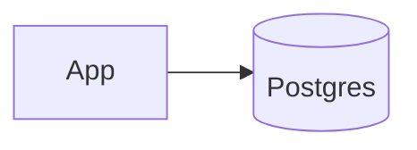

# Dependency — Postgres

Summary
- PostgreSQL for BTP with a single, stable output contract regardless of mode.

Modes at a glance
- managed: AWS RDS | Azure Flexible Server | GCP Cloud SQL
- k8s: Zalando Postgres Operator (dev-friendly)
- byo: External connection (you provide host/port/creds)

How k8s mode works (this repo)
- Installs Zalando Postgres Operator and creates a minimal cluster
- Inputs: `operator_chart_version`, `release_name`, `database`, `postgresql_version`, `enable_ssl`, `pg_hba_rules`
- Outputs: `host`, `port=5432`, `username=postgres`, `password` (Secret), `database`, `connection_string`

Managed mode (guidance)
- AWS: RDS Postgres with SSL, backups, parameter groups; optional IAM auth
- Azure: Flexible Server with private endpoints; sizing + HA choices
- GCP: Cloud SQL with PSC; automated backups; optional CMEK

BYO mode
- Inputs: `host`, `port`, `database`, `username`, `password`, `ssl_mode`

Unified outputs
- `host`, `port`, `database`, `username`, `password` (sensitive), `connection_string`, optional `ssl_mode`

Examples
```hcl
# k8s mode
postgres = {
  mode = "k8s"
  k8s = {
    database           = "btp"
    postgresql_version = "15"
  }
}

# managed (AWS RDS)
postgres = {
  mode = "managed"
  managed = {
    provider = "aws"
    instance_class = "db.t3.medium"
    storage_gb     = 20
    multi_az       = false
  }
}

# byo
postgres = {
  mode = "byo"
  byo = {
    host = "db.example.com"
    port = 5432
    database = "btp"
    username = "btp"
    password = "..."
    ssl_mode = "require"
  }
}
```

Diagram


Verification (k8s mode)
```bash
kubectl get pg -n <namespace> || true
kubectl get svc -n <namespace> | grep postgres
kubectl get secret -n <namespace> <release>.postgres.credentials.postgresql.acid.zalan.do -o jsonpath='{.data.password}' | base64 -d; echo
```

Scaling & maintenance
- Scale replicas via Zalando `numberOfInstances`, adjust volume size, and parameters
- Backups: operator logical backups, or snapshot PVCs for dev

Security
- Enforce SSL when not on localhost; rotate credentials by replacing the Secret

Common issues
- CRDs not ready (operator install timing): re-run apply or wait; the module already sequences installation
- DNS resolution inside cluster: ensure CoreDNS healthy
