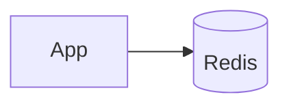

# Dependency — Redis

Summary
- Low-latency cache for BTP with a simple, uniform connection contract.

Modes at a glance
- managed: ElastiCache (AWS) | Azure Cache | Memorystore (GCP)
- k8s: Bitnami Redis (standalone) for fast local/dev
- byo: External Redis endpoint you provide

How k8s mode works (this repo)
- Installs Bitnami Redis (standalone) with AUTH enabled; no persistence for speed
- Inputs: `chart_version`, `release_name`, `password` (optional), `values`
- Outputs: `host`, `port=6379`, `password` (sensitive), `scheme=redis`, `tls_enabled=false`

Managed mode (guidance)
- AWS: node type, engine version, subnet groups, auth token, in-transit encryption
- Azure: SKU/capacity, TLS enforced
- GCP: tier, memory size, version, AUTH

BYO mode
- Inputs: `host`, `port`, `auth_token`, `tls_enabled`

Examples
```hcl
redis = { mode = "k8s" }

redis = {
  mode = "managed"
  managed = { provider = "aws", node_type = "cache.t4g.small" }
}
```

Diagram


Verification (k8s mode)
```bash
kubectl get svc -n <namespace> | grep redis
REDIS_PASSWORD=$(terraform output -json redis | jq -r .password)
echo PING | nc <release>-master.<namespace>.svc.cluster.local 6379 || true
```

Security & gotchas
- Use AUTH everywhere; enable TLS for managed offerings in production
- Match `password` between values and outputs if overriding

Next steps
- Wire outputs into your app or inspect how `/btp` consumes them in docs/modules/btp.md
