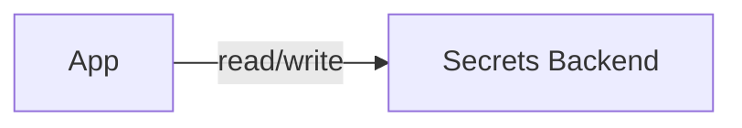

# Dependency — Secrets

Summary
- Secrets backend and references for the platform.

Modes at a glance
- managed: Secrets Manager/SSM (AWS) | Key Vault (Azure) | Secret Manager (GCP)
- k8s: HashiCorp Vault (dev mode) or Sealed Secrets
- byo: External Vault or enterprise secret backends

How k8s mode works (this repo)
- Installs Vault in dev mode with ClusterIP; easy-to-start, not for prod
- Inputs: `dev_mode`, `dev_token`, `chart_version`, `values`
- Outputs: `vault_addr`, `token` (dev only), `kv_mount=secret`, `paths=[]`

Managed mode (guidance)
- AWS: KMS, rotation, IAM policies; access via IRSA or app roles
- Azure: Key Vault with RBAC/Access Policies; private endpoints
- GCP: Secret Manager with unified IAM

BYO mode
- Inputs: `vault_addr`; auth to the backend is handled via app/Helm values

Examples
```hcl
secrets = { mode = "k8s", k8s = { dev_mode = true } }

secrets = {
  mode = "managed"
  managed = { provider = "aws", engine = "secrets_manager" }
}
```

Diagram


Verification (k8s mode)
```bash
kubectl get pods -n <namespace> | grep vault
export VAULT_ADDR=$(terraform output -json secrets | jq -r .vault_addr)
export VAULT_TOKEN=$(terraform output -json secrets | jq -r .token)
vault status || true
```

Security & gotchas
- Never use dev mode in production; configure storage and auth engines correctly
- Lock down network access; prefer private endpoints and service mesh policies

Next steps
- Configure app-side auth to the secrets backend via Helm values
