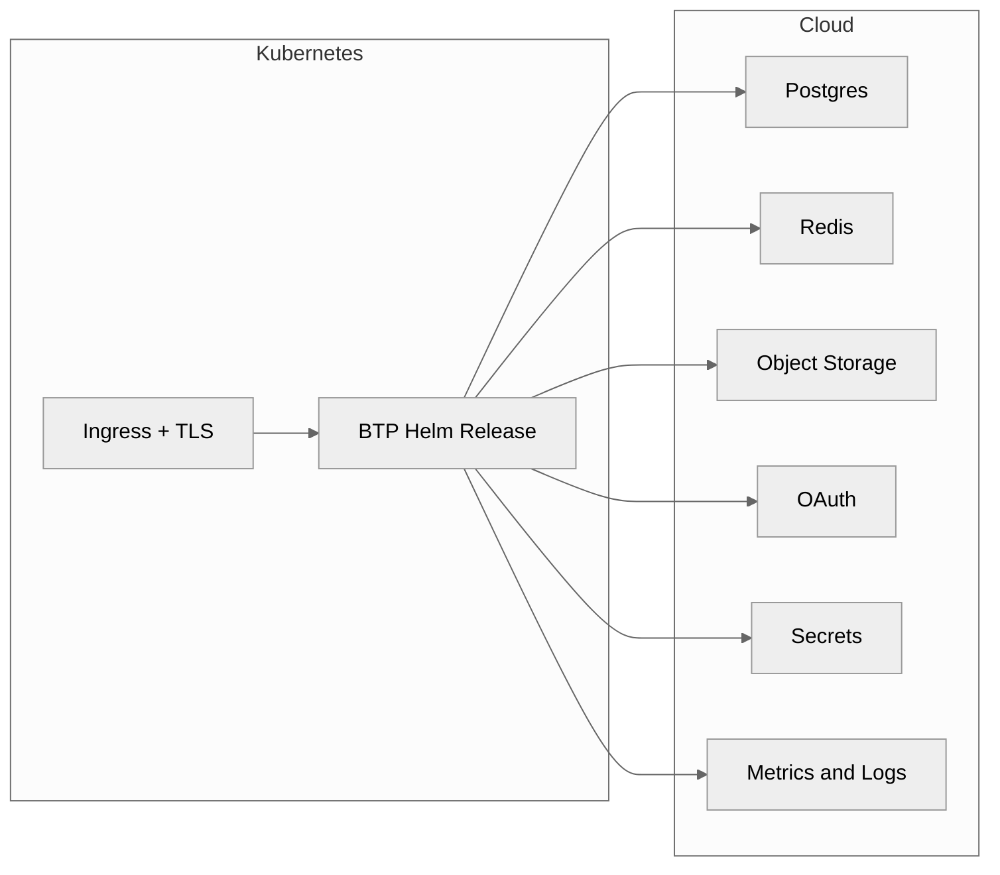

# Overview

BTP Universal Terraform provides a single Terraform stack that deploys the BTP Helm release on Kubernetes while wiring required dependencies (Postgres, Redis, Object Storage, OAuth, Secrets, Ingress/TLS, Metrics/Logs) from any supported provider mode: managed, in-cluster, or bring-your-own.

## Why it matters
- Settlemint-validated Terraform stack that covers AWS managed services today and Kubernetes-first installs everywhere.
- Flexible installs: toggle dependencies between AWS managed, in-cluster Helm charts, or bring-your-own endpoints without touching BTP values.
- Clear contracts and examples so teams can add other clouds (Azure, GCP) while native modules are completed.

## Start here
- Run the stack: [docs/getting-started.md](getting-started.md)
- Understand the contract: [docs/concepts.md](concepts.md)
- Review provider specifics: [docs/providers/aws.md](providers/aws.md), [docs/providers/azure.md](providers/azure.md), [docs/providers/gcp.md](providers/gcp.md), [docs/providers/generic.md](providers/generic.md)

## Supported surface
- Providers today: AWS (managed) plus generic Kubernetes. Azure and GCP modes exist as BYO placeholders until their managed modules are implemented.
- Modes: `aws`, `k8s`, and `byo` per dependency, with additional provider implementations on the roadmap.
- Outputs: normalized objects consumed directly by `/btp` without provider branching.

## Next steps
- Pick a profile in `examples/*.tfvars`.
- Follow the verification checks in [docs/getting-started.md](getting-started.md).
