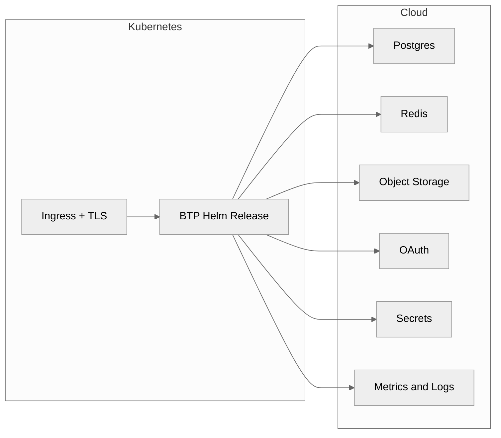

# Overview

**BTP Universal Terraform deploys the BTP Helm release on Kubernetes with all required dependencies.**

## Dependencies can run in three modes

Each dependency (Postgres, Redis, Object Storage, OAuth, Secrets, Ingress/TLS, Metrics/Logs) supports:
- **Managed** – Cloud provider services (RDS, ElastiCache, S3, Cognito on AWS)
- **Kubernetes** – In-cluster Helm charts (Zalando Postgres, Bitnami Redis, MinIO, Keycloak)
- **Bring-your-own** – External endpoints you provide

**Mix modes freely.** Use AWS RDS for Postgres and in-cluster Redis in the same deployment.

## AWS has complete managed support today

AWS managed modes are fully implemented. Azure and GCP use bring-your-own mode until native support ships.

## Next steps

- [Getting Started](getting-started.md) – Install and verify
- [Concepts](concepts.md) – How dependency modes work
- [AWS Provider](providers/aws.md) – AWS-specific details

## Supported surface
- Providers today: AWS (managed) plus generic Kubernetes. Azure and GCP modes exist as BYO placeholders until their managed modules are implemented.
- Modes: `aws`, `k8s`, and `byo` per dependency, with additional provider implementations on the roadmap.
- Outputs: normalized objects consumed directly by `/btp` without provider branching.

## Next steps
- Pick a profile in `examples/*.tfvars`.
- Follow the verification checks in [docs/getting-started.md](getting-started.md).
