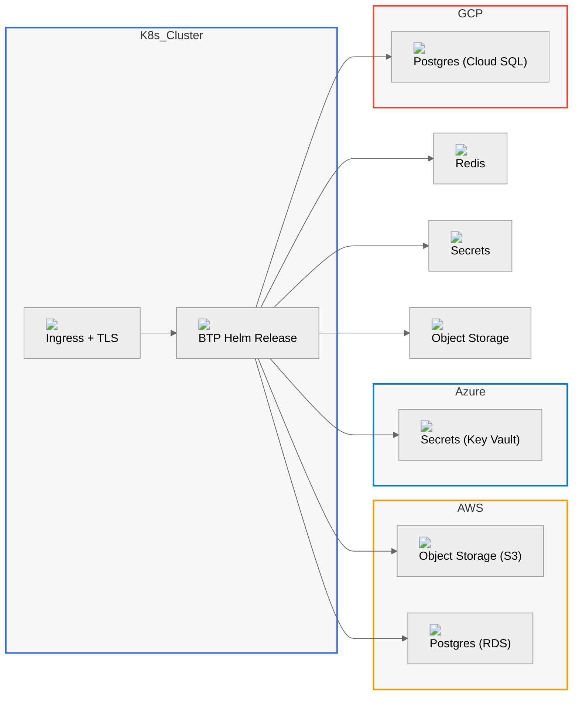

# Overview

The BTP Universal Terraform stack runs BTP on Kubernetes and wires in cloud services (or self-hosted charts) through a single, stable contract. Every dependency — Postgres, Redis, Object Storage, OAuth, Secrets, Ingress/TLS, Metrics/Logs — supports managed | k8s | byo, and you can mix providers freely.

Why this is different
- One interface, many providers: switch modes without touching app config
- Secure by default: TLS-first, least-privilege, external secrets by design
- Fast local iteration: one cluster, Helm dependencies, ship in minutes
- Consistent outputs: `/btp` reads unified outputs and “just works”

Supported matrix
- Providers: AWS, Azure, GCP, Generic (local)
- Modes (per dependency): managed | k8s | byo

## Key Capabilities
- Mix providers per dependency (e.g., AKS + S3 + Cloud SQL)
- Stable outputs contract across modes/providers for `/btp`
- Preflight checks, environment profiles, and example `*.tfvars`

Next steps
- Get running locally: docs/quickstart/local.md
- Plan and apply a cloud profile: docs/quickstart/cloud.md
- Explore full architectures:
  - AWS (managed): docs/architecture/aws-full.md
  - Azure (managed): docs/architecture/azure-full.md
  - GCP (managed): docs/architecture/gcp-full.md
  - Kubernetes only: docs/architecture/k8s-full.md
