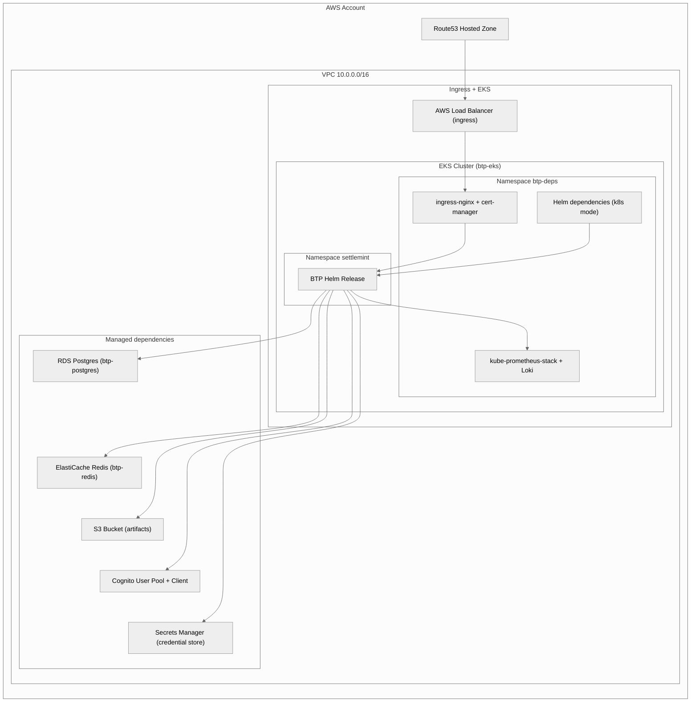

# AWS Provider Guide

## Scope
- `cloud/aws` scaffolding module provisions VPC networking, subnets, security groups, and IAM roles consumed by dependency modules.
- Managed dependency modes ship for RDS (Postgres), ElastiCache (Redis), S3 (object storage), and Cognito (OAuth). Other dependencies (secrets, ingress, metrics/logs) currently run via Kubernetes or bring-your-own endpoints.

## Prerequisites
- IAM user or role with permissions for VPC, EC2, IAM, RDS, ElastiCache, S3, Cognito, and Route53 resources.
- Route53 hosted zone if you plan to terminate ingress with a custom domain.
- Remote state backend (S3 + DynamoDB) recommended for shared environments.

## Managed mode notes
- RDS: defaults to Multi-AZ with automated backups; provide subnet group IDs in the `config` block to reuse existing networking.
- ElastiCache: deploys a replication group with TLS if the subnet group supports it.
- Cognito: creates a user pool and app client; use `callback_urls` to align with your BTP hostname.
- Object storage: S3 buckets can be auto-generated with versioning and encryption defaults or you can point to an existing bucket.
- Ingress/TLS: the `ingress_tls` module installs ingress-nginx + cert-manager; provide AWS credentials and a Route53 zone ID to enable DNS-01 automation.

## Architecture (example: `examples/aws-config.tfvars`)

> **Note:** The `secrets` module still uses Vault (k8s) or BYO in the current implementation; the diagram highlights the intended Secrets Manager integration referenced in the example profile.

## Kubernetes mode integration
- Helm deployments (e.g., Zalando Postgres, Bitnami Redis) run inside your cluster; ensure the cluster has enough capacity and storage classes that support ReadWriteOnce.
- Security groups created by `cloud/aws` can be reused by AWS Load Balancer Controller if you adopt it for ingress.

## Bring-your-own tips
- Supply existing endpoints via the dependency `config.endpoint` blocks; include TLS certificates or CA bundles for verification.
- Store credentials in AWS Secrets Manager and reference ARNs to avoid committing passwords in tfvars.
