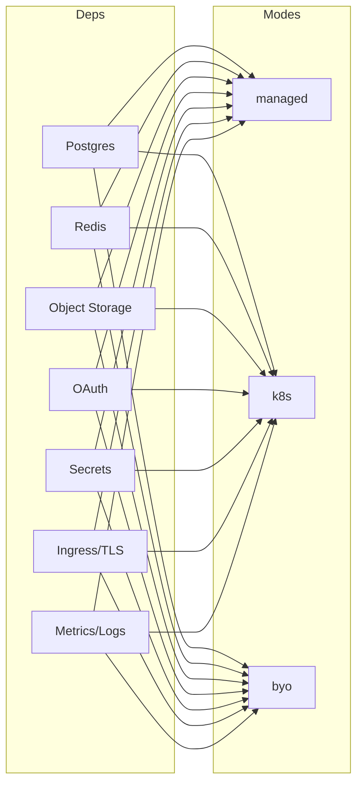

# Compatibility & Mix Matrix

Supported combinations of dependencies, modes, and providers.

At a glance
- Postgres: managed (RDS | Azure Flexible Server | Cloud SQL), k8s (Zalando), byo.
- Redis: managed (ElastiCache | Azure Cache | Memorystore), k8s (Bitnami), byo.
- Object Storage: managed (S3 | Blob | GCS), k8s (MinIO), byo.
- OAuth: managed (Cognito | Entra ID | Identity Platform), k8s (Keycloak), byo.
- Secrets: managed (Secrets Manager/SSM | Key Vault | Secret Manager), k8s (Vault/Sealed Secrets), byo (Vault).
- Ingress/TLS: managed (ALB+ACM | AppGW+KV | HTTPS LB+Managed Certs), k8s (ingress-nginx+cert-manager), byo.
- Metrics/Logs: managed (CloudWatch/AMP | Log Analytics | Cloud Logging/Monitoring), k8s (kube-prometheus-stack + loki), byo (Datadog/New Relic).

Mermaid overview

Profiles
- See example profiles in `docs/examples/` for concrete combinations.
