# BTP Universal Terraform - Overview

## What is BTP Universal Terraform?

BTP Universal Terraform is a standardized, auditable Terraform solution designed to provision platform dependencies and deploy the SettleMint Blockchain Transaction Platform (BTP) across multiple cloud providers and deployment scenarios. It provides a unified approach to deploying complex blockchain infrastructure with consistent patterns and best practices.

## Key Features

### 🌐 Multi-Cloud Support
- **AWS**: Full integration with AWS services (RDS, ElastiCache, S3, Cognito, EKS)
- **Azure**: Native Azure services (Database for PostgreSQL, Cache for Redis, Blob Storage, AKS)
- **GCP**: Google Cloud services (Cloud SQL, Memorystore, Cloud Storage, GKE)
- **Generic**: Works with any Kubernetes cluster (on-premises, hybrid, or other clouds)

### 🔧 Flexible Deployment Modes
Each dependency supports three deployment modes:

| Mode | Description | Use Case |
|------|-------------|----------|
| **k8s** | Kubernetes-native (Helm charts) | Development, testing, or when you want full control |
| **managed** | Cloud provider managed services | Production environments requiring high availability |
| **byo** | Bring Your Own (existing infrastructure) | Enterprise environments with existing infrastructure |

### 🏗️ Unified Architecture
- **Consistent Module Layout**: All dependencies follow the same three-mode pattern
- **Normalized Outputs**: Standardized connection details across all providers
- **One-Command Deploy**: Single `terraform apply` command for complete infrastructure
- **Secure Defaults**: Random passwords, TLS certificates, and sensitive output handling

### 📊 Built-in Observability
- **Prometheus & Grafana**: Comprehensive metrics collection and visualization
- **Loki**: Centralized log aggregation and analysis
- **Alerting**: Pre-configured alerts for critical system events

## Architecture Overview

```mermaid
%%{init: {'theme':'neutral','securityLevel':'loose','flowchart':{'htmlLabels':true,'curve':'basis'}}}%%
graph TB
    subgraph "Root Module"
        RM[Root Terraform Module]
    end
    
    subgraph "Infrastructure Layer"
        VPC[VPC Module]
        K8S[K8s Cluster Module]
    end
    
    subgraph "Dependency Modules"
        PG[PostgreSQL]
        REDIS[Redis]
        STORAGE[Object Storage]
        OAUTH[OAuth/Identity]
        SECRETS[Secrets Manager]
        INGRESS[Ingress & TLS]
        OBS[Observability]
    end
    
    subgraph "Platform Layer"
        BTP[SettleMint BTP Platform]
    end
    
    subgraph "Cloud Providers"
        AWS[<img src="assets/icons/aws/aws.svg" width="20"/> AWS]
        AZURE[<img src="assets/icons/azure/azure.svg" width="20"/> Azure]
        GCP[<img src="assets/icons/gcp/gcp.svg" width="20"/> GCP]
        GENERIC[<img src="assets/icons/k8s/kubernetes.svg" width="20"/> Generic K8s]
    end
    
    RM --> VPC
    RM --> K8S
    RM --> PG
    RM --> REDIS
    RM --> STORAGE
    RM --> OAUTH
    RM --> SECRETS
    RM --> INGRESS
    RM --> OBS
    RM --> BTP
    
    VPC --> AWS
    VPC --> AZURE
    VPC --> GCP
    
    K8S --> AWS
    K8S --> AZURE
    K8S --> GCP
    K8S --> GENERIC
    
    PG --> AWS
    PG --> AZURE
    PG --> GCP
    PG --> GENERIC
    
    REDIS --> AWS
    REDIS --> AZURE
    REDIS --> GCP
    REDIS --> GENERIC
    
    STORAGE --> AWS
    STORAGE --> AZURE
    STORAGE --> GCP
    STORAGE --> GENERIC
    
    OAUTH --> AWS
    OAUTH --> AZURE
    OAUTH --> GCP
    OAUTH --> GENERIC
    
    SECRETS --> AWS
    SECRETS --> AZURE
    SECRETS --> GCP
    SECRETS --> GENERIC
    
    classDef aws fill:#FF9900,stroke:#232F3E,color:#fff
    classDef azure fill:#0078D4,stroke:#005A9E,color:#fff
    classDef gcp fill:#EA4335,stroke:#4285F4,color:#fff
    classDef k8s fill:#326CE5,stroke:#fff,color:#fff
    classDef module fill:#f9f9f9,stroke:#333,color:#333
    
    class AWS aws
    class AZURE azure
    class GCP gcp
    class GENERIC k8s
    class RM,VPC,K8S,PG,REDIS,STORAGE,OAUTH,SECRETS,INGRESS,OBS,BTP module
```



## Supported Dependencies

| Dependency | AWS | Azure | GCP | K8s | BYO |
|------------|-----|-------|-----|-----|-----|
| **PostgreSQL** | RDS | Database for PostgreSQL | Cloud SQL | Zalando Postgres Operator | External DB |
| **Redis** | ElastiCache | Cache for Redis | Memorystore | Redis Helm Chart | External Redis |
| **Object Storage** | S3 | Blob Storage | Cloud Storage | MinIO | S3-compatible |
| **OAuth/Identity** | Cognito | AD B2C | Identity Platform | Keycloak | OIDC Provider |
| **Secrets** | Secrets Manager | Key Vault | Secret Manager | Vault | External Vault |
| **Ingress/TLS** | ALB + cert-manager | ALB + cert-manager | GCLB + cert-manager | nginx + cert-manager | Existing Ingress |
| **Observability** | CloudWatch + K8s | Monitor + K8s | Cloud Ops + K8s | Prometheus + Grafana + Loki | External Stack |

## Deployment Scenarios

### 1. Development Environment
```hcl
# All services in Kubernetes
platform = "generic"
postgres = { mode = "k8s" }
redis = { mode = "k8s" }
object_storage = { mode = "k8s" }
oauth = { mode = "disabled" }
secrets = { mode = "k8s", dev_mode = true }
```

### 2. Production AWS Environment
```hcl
# Managed AWS services for production
platform = "aws"
postgres = { mode = "aws" }  # RDS
redis = { mode = "aws" }     # ElastiCache
object_storage = { mode = "aws" }  # S3
oauth = { mode = "aws" }     # Cognito
secrets = { mode = "aws" }   # Secrets Manager
```

### 3. Hybrid Environment
```hcl
# Mix of managed and Kubernetes services
platform = "aws"
postgres = { mode = "aws" }        # RDS for data persistence
redis = { mode = "k8s" }           # Redis in K8s for flexibility
object_storage = { mode = "aws" }  # S3 for scalability
oauth = { mode = "byo" }           # Existing identity provider
secrets = { mode = "aws" }         # AWS Secrets Manager
```

## Key Benefits

### 🚀 **Rapid Deployment**
- Deploy complete blockchain infrastructure in minutes
- Consistent deployment patterns across all environments
- Automated dependency resolution and configuration

### 🔒 **Security First**
- Secure defaults with random password generation
- TLS encryption for all communications
- Secrets management integration
- Network isolation and security groups

### 📈 **Scalability**
- Auto-scaling capabilities for all components
- Load balancer integration
- Multi-AZ deployment support
- Horizontal scaling for Kubernetes workloads

### 🔧 **Operational Excellence**
- Comprehensive monitoring and logging
- Automated backup and recovery
- Health checks and alerting
- Easy maintenance and updates

### 💰 **Cost Optimization**
- Right-sized resources for each environment
- Efficient resource utilization
- Pay-as-you-scale pricing models
- Resource tagging and cost allocation

## What You Get

After successful deployment, you'll have:

1. **Complete Blockchain Platform**: Fully functional SettleMint BTP platform
2. **Managed Dependencies**: All required services (database, cache, storage, etc.)
3. **Security Layer**: TLS certificates, secrets management, and network security
4. **Observability Stack**: Monitoring, logging, and alerting capabilities
5. **Access URLs**: Ready-to-use endpoints for all services
6. **Credentials**: Secure access to all deployed services

## Next Steps

- [Getting Started Guide](02-getting-started.md) - Prerequisites and initial setup
- [AWS Deployment](05-aws-deployment.md) - Complete AWS deployment guide
- [Azure Deployment](06-azure-deployment.md) - Complete Azure deployment guide
- [GCP Deployment](07-gcp-deployment.md) - Complete GCP deployment guide
- [Architecture Overview](09-architecture-overview.md) - Detailed architecture documentation

## Support and Resources

- **Documentation**: Complete guides and references in this documentation
- **Examples**: Pre-configured examples for different scenarios
- **Community**: GitHub issues and discussions
- **Support**: Enterprise support available through SettleMint

---

*This documentation is designed for solution architects and DevOps teams deploying the SettleMint platform. For specific implementation details, refer to the platform-specific deployment guides.*
