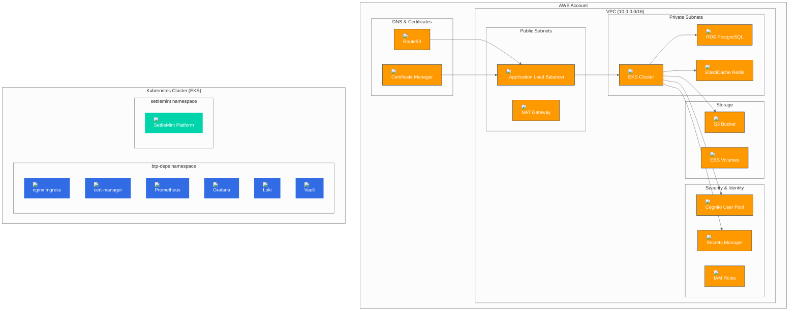

# AWS Deployment Guide

## Overview

This guide provides comprehensive instructions for deploying BTP Universal Terraform on Amazon Web Services (AWS) using managed AWS services for production-ready infrastructure.

## Architecture Overview



## Prerequisites

### AWS Account Requirements
- AWS Account with appropriate permissions
- IAM user or role with required policies
- AWS CLI configured with credentials

### Required AWS Permissions

The deployment requires the following IAM permissions:

```json
{
  "Version": "2012-10-17",
  "Statement": [
    {
      "Effect": "Allow",
      "Action": [
        "ec2:*",
        "eks:*",
        "rds:*",
        "elasticache:*",
        "s3:*",
        "cognito-idp:*",
        "secretsmanager:*",
        "route53:*",
        "acm:*",
        "iam:*",
        "autoscaling:*",
        "cloudformation:*"
      ],
      "Resource": "*"
    }
  ]
}
```

### Cost Estimation

| Component | Service | Estimated Monthly Cost |
|-----------|---------|------------------------|
| **EKS Cluster** | EKS Control Plane | $73 |
| **Worker Nodes** | EC2 (3x t3.medium) | $90 |
| **RDS PostgreSQL** | db.t3.small | $25 |
| **ElastiCache Redis** | cache.t3.micro | $15 |
| **S3 Storage** | 100GB | $3 |
| **Application Load Balancer** | ALB | $18 |
| **Data Transfer** | Various | $10 |
| **Route53** | Hosted Zone | $0.50 |
| **Total** | | **~$235/month** |

*Costs may vary based on region, usage, and instance types.*

## Configuration

### 1. AWS Credentials Setup

```bash
# Configure AWS CLI
aws configure

# Verify access
aws sts get-caller-identity

# Set default region
export AWS_DEFAULT_REGION=eu-central-1
```

### 2. Environment Configuration

Create your AWS-specific environment file:

```bash
# Copy AWS example
cp examples/aws-config.tfvars my-aws-config.tfvars

# Edit configuration
vim my-aws-config.tfvars
```

### 3. AWS Configuration File

```hcl
# AWS configuration example
platform = "aws"

base_domain = "btp.yourdomain.com"

# VPC Configuration
vpc = {
  aws = {
    create_vpc         = true
    vpc_name           = "btp-vpc"
    vpc_cidr           = "10.0.0.0/16"
    region             = "eu-central-1"
    availability_zones = ["eu-central-1a", "eu-central-1b", "eu-central-1c"]
    enable_nat_gateway = true
    single_nat_gateway = true  # Set to false for HA across AZs
    enable_s3_endpoint = true  # Reduces data transfer costs
  }
}

# Kubernetes Cluster Configuration
k8s_cluster = {
  mode = "aws"
  aws = {
    cluster_name    = "btp-eks"
    cluster_version = "1.33"
    region          = "eu-central-1"
    
    # Node groups
    node_groups = {
      default = {
        desired_size   = 3
        min_size       = 1
        max_size       = 10
        instance_types = ["t3.medium"]
        capacity_type  = "ON_DEMAND"
        disk_size      = 50
      }
    }
    
    # Cluster features
    enable_irsa                         = true
    enable_ebs_csi_driver               = true
    enable_aws_load_balancer_controller = true
    enable_cluster_autoscaler           = true
    
    # Access configuration
    endpoint_private_access = true
    endpoint_public_access  = true
    public_access_cidrs     = ["0.0.0.0/0"]  # Restrict in production
    
    # Security
    enable_secrets_encryption = true
  }
}

# PostgreSQL via AWS RDS
postgres = {
  mode = "aws"
  aws = {
    identifier        = "btp-postgres"
    instance_class    = "db.t3.small"
    allocated_storage = 100
    engine_version    = "15.14"
    database          = "btp"
    username          = "postgres"
    skip_final_snapshot = false  # Set to true for dev
    backup_retention_period = 7
    backup_window          = "03:00-04:00"
    maintenance_window     = "sun:04:00-sun:05:00"
  }
}

# Redis via AWS ElastiCache
redis = {
  mode = "aws"
  aws = {
    cluster_id     = "btp-redis"
    node_type      = "cache.t3.micro"
    engine_version = "7.0"
    num_cache_nodes = 1
    parameter_group_name = "default.redis7"
  }
}

# Object Storage via AWS S3
object_storage = {
  mode = "aws"
  aws = {
    region             = "eu-central-1"
    versioning_enabled = true
    bucket_name        = "btp-artifacts-your-unique-name"
    # Access credentials will be auto-generated
  }
}

# DNS automation via Route53
dns = {
  mode                    = "aws"
  domain                  = "btp.yourdomain.com"
  enable_wildcard         = true
  include_wildcard_in_tls = true
  cert_manager_issuer     = "letsencrypt-prod"
  ssl_redirect            = true
  aws = {
    zone_name             = "yourdomain.com"
    main_record_type      = "A"
    main_record_value     = "ALIAS_TO_ALB"  # Will be auto-populated
    main_ttl              = 300
    wildcard_record_type  = "A"
    wildcard_record_value = "ALIAS_TO_ALB"  # Will be auto-populated
  }
}

# OAuth via AWS Cognito
oauth = {
  mode = "aws"
  aws = {
    region         = "eu-central-1"
    user_pool_name = "btp-users"
    client_name    = "btp-client"
    domain_prefix  = "btp-your-unique-prefix"
    callback_urls = [
      "https://btp.yourdomain.com/api/auth/callback/cognito"
    ]
  }
}

# Secrets via AWS Secrets Manager
secrets = {
  mode = "aws"
  aws = {
    region = "eu-central-1"
  }
}

# BTP Platform deployment
btp = {
  enabled       = true
  chart         = "oci://harbor.settlemint.com/settlemint/settlemint"
  namespace     = "settlemint"
  release_name  = "settlemint-platform"
  chart_version = "v7.32.10"
}
```

## Deployment Steps

### 1. Pre-deployment Setup

```bash
# Verify AWS access
aws sts get-caller-identity

# Check available regions
aws ec2 describe-regions --query 'Regions[].RegionName'

# Verify Route53 hosted zone exists
aws route53 list-hosted-zones-by-name --dns-name yourdomain.com
```

### 2. Deploy Infrastructure

```bash
# One-command deployment
bash scripts/install.sh my-aws-config.tfvars

# Or manual deployment
terraform init
terraform plan -var-file my-aws-config.tfvars
terraform apply -var-file my-aws-config.tfvars
```

### 3. Verify Deployment

```bash
# Check AWS resources
aws eks describe-cluster --name btp-eks --region eu-central-1
aws rds describe-db-instances --db-instance-identifier btp-postgres
aws elasticache describe-cache-clusters --cache-cluster-id btp-redis

# Check Kubernetes cluster
kubectl get nodes
kubectl get pods -n btp-deps
```

## AWS-Specific Features

### 1. EKS Cluster Features

#### IRSA (IAM Roles for Service Accounts)
```hcl
k8s_cluster = {
  aws = {
    enable_irsa = true  # Enables IAM roles for service accounts
  }
}
```

#### EBS CSI Driver
```hcl
k8s_cluster = {
  aws = {
    enable_ebs_csi_driver = true  # Required for persistent volumes
  }
}
```

#### AWS Load Balancer Controller
```hcl
k8s_cluster = {
  aws = {
    enable_aws_load_balancer_controller = true  # For ALB integration
  }
}
```

### 2. RDS Configuration

#### High Availability Setup
```hcl
postgres = {
  aws = {
    multi_az               = true
    backup_retention_period = 7
    backup_window          = "03:00-04:00"
    maintenance_window     = "sun:04:00-sun:05:00"
    skip_final_snapshot   = false
    deletion_protection   = true
  }
}
```

#### Performance Optimization
```hcl
postgres = {
  aws = {
    instance_class    = "db.t3.medium"  # Larger instance for production
    allocated_storage = 200
    storage_encrypted = true
    performance_insights_enabled = true
  }
}
```

### 3. ElastiCache Configuration

#### Redis Cluster Mode
```hcl
redis = {
  aws = {
    cluster_mode_enabled = true
    num_cache_nodes     = 2
    node_type           = "cache.t3.micro"
    parameter_group_name = "default.redis7.cluster.on"
  }
}
```

### 4. S3 Configuration

#### Security and Compliance
```hcl
object_storage = {
  aws = {
    versioning_enabled = true
    server_side_encryption_configuration = {
      rule = {
        apply_server_side_encryption_by_default = {
          sse_algorithm = "AES256"
        }
      }
    }
    public_access_block_configuration = {
      block_public_acls       = true
      block_public_policy     = true
      ignore_public_acls      = true
      restrict_public_buckets = true
    }
  }
}
```

## Security Configuration

### 1. Network Security

#### VPC Configuration
```hcl
vpc = {
  aws = {
    enable_nat_gateway = true
    single_nat_gateway = false  # For HA across AZs
    enable_vpn_gateway = true   # For secure access
    enable_s3_endpoint = true   # Reduces data transfer costs
  }
}
```

#### Security Groups
The deployment automatically creates security groups for:
- EKS cluster communication
- RDS database access
- ElastiCache access
- Load balancer access

### 2. IAM Configuration

#### Service Account Roles
```bash
# Check IRSA configuration
kubectl get serviceaccounts -n btp-deps -o yaml

# Verify IAM roles
aws iam list-roles --query 'Roles[?contains(RoleName, `btp-eks`)].RoleName'
```

### 3. Secrets Management

#### AWS Secrets Manager Integration
```bash
# List secrets created by Terraform
aws secretsmanager list-secrets --region eu-central-1

# Retrieve secret value (example)
aws secretsmanager get-secret-value \
  --secret-id btp-postgres-credentials \
  --region eu-central-1
```

## Monitoring and Observability

### 1. CloudWatch Integration

#### EKS Cluster Monitoring
```bash
# Check CloudWatch logs
aws logs describe-log-groups --log-group-name-prefix "/aws/eks/btp-eks"

# View cluster logs
aws logs tail /aws/eks/btp-eks/cluster --follow
```

#### RDS Monitoring
```bash
# Check RDS metrics
aws cloudwatch get-metric-statistics \
  --namespace AWS/RDS \
  --metric-name CPUUtilization \
  --dimensions Name=DBInstanceIdentifier,Value=btp-postgres \
  --start-time 2024-01-01T00:00:00Z \
  --end-time 2024-01-01T23:59:59Z \
  --period 3600 \
  --statistics Average
```

### 2. Grafana Dashboards

Access Grafana for comprehensive monitoring:
```bash
# Get Grafana URL
terraform output post_deploy_urls

# Access Grafana (admin credentials in outputs)
open https://grafana.btp.yourdomain.com
```

## Backup and Disaster Recovery

### 1. RDS Backups

```bash
# Create manual snapshot
aws rds create-db-snapshot \
  --db-instance-identifier btp-postgres \
  --db-snapshot-identifier btp-postgres-backup-$(date +%Y%m%d)

# List snapshots
aws rds describe-db-snapshots \
  --db-instance-identifier btp-postgres
```

### 2. S3 Backup

```bash
# Enable S3 versioning (already configured)
aws s3api put-bucket-versioning \
  --bucket btp-artifacts-your-unique-name \
  --versioning-configuration Status=Enabled

# Configure lifecycle policy
aws s3api put-bucket-lifecycle-configuration \
  --bucket btp-artifacts-your-unique-name \
  --lifecycle-configuration file://lifecycle.json
```

### 3. EKS Backup

```bash
# Backup cluster configuration
kubectl get all -A -o yaml > cluster-backup.yaml

# Backup persistent volumes
kubectl get pv -o yaml > pv-backup.yaml
```

## Cost Optimization

### 1. Resource Right-sizing

```bash
# Check resource utilization
kubectl top nodes
kubectl top pods -n btp-deps

# Scale down if underutilized
kubectl scale deployment your-deployment --replicas=1 -n btp-deps
```

### 2. Spot Instances

```hcl
k8s_cluster = {
  aws = {
    node_groups = {
      spot = {
        capacity_type  = "SPOT"
        instance_types = ["t3.medium", "t3.large"]
        desired_size   = 2
        min_size       = 1
        max_size       = 5
      }
    }
  }
}
```

### 3. Reserved Instances

Consider purchasing Reserved Instances for predictable workloads:
```bash
# Check current instance usage
aws ec2 describe-instances --query 'Reservations[].Instances[?State.Name==`running`].[InstanceType,Placement.AvailabilityZone]'
```

## Troubleshooting

### Common Issues

#### Issue: EKS Cluster Not Accessible
```bash
# Update kubeconfig
aws eks update-kubeconfig --region eu-central-1 --name btp-eks

# Verify cluster access
kubectl get nodes
```

#### Issue: RDS Connection Failed
```bash
# Check security groups
aws ec2 describe-security-groups --group-ids sg-xxxxx

# Check RDS status
aws rds describe-db-instances --db-instance-identifier btp-postgres
```

#### Issue: Load Balancer Not Working
```bash
# Check ALB status
aws elbv2 describe-load-balancers --names btp-alb

# Check target group health
aws elbv2 describe-target-health --target-group-arn arn:aws:elasticloadbalancing:...
```

### Debug Commands

```bash
# Check EKS cluster logs
aws logs tail /aws/eks/btp-eks/cluster --follow

# Check RDS logs
aws rds describe-db-log-files --db-instance-identifier btp-postgres

# Check ElastiCache logs
aws elasticache describe-events --source-identifier btp-redis
```

## Production Checklist

- [ ] **Security**: Enable encryption, private subnets, restricted access
- [ ] **High Availability**: Multi-AZ deployment, backup strategies
- [ ] **Monitoring**: CloudWatch alarms, Grafana dashboards
- [ ] **Backup**: Automated RDS snapshots, S3 lifecycle policies
- [ ] **Scaling**: Auto-scaling groups, cluster autoscaler
- [ ] **Cost Optimization**: Right-sized instances, Reserved Instances
- [ ] **Compliance**: Security groups, IAM policies, audit logs
- [ ] **Documentation**: Runbooks, incident response procedures

## Next Steps

- [Security Best Practices](19-security.md) - Secure your AWS deployment
- [Operations Guide](18-operations.md) - Day-to-day operations
- [Monitoring Setup](17-observability-module.md) - Comprehensive monitoring
- [Backup Strategies](20-troubleshooting.md) - Backup and recovery procedures

---

*This AWS deployment guide provides a production-ready foundation for deploying BTP Universal Terraform on AWS. Customize the configuration based on your specific requirements and security policies.*
