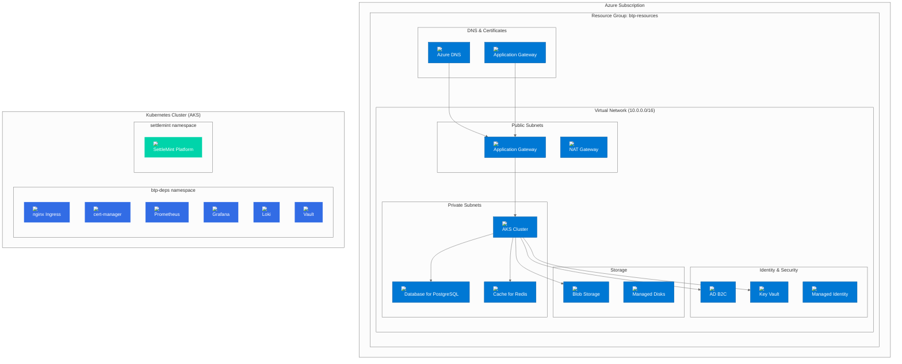

# Azure Deployment Guide

## Overview

This guide provides comprehensive instructions for deploying BTP Universal Terraform on Microsoft Azure using managed Azure services for production-ready infrastructure.

## Architecture Overview



## Prerequisites

### Azure Account Requirements
- Azure subscription with appropriate permissions
- Service principal or user with Contributor role
- Azure CLI configured with credentials

### Required Azure Permissions

The deployment requires the following Azure RBAC permissions:

```json
{
  "permissions": [
    "Microsoft.Resources/subscriptions/resourceGroups/read",
    "Microsoft.Resources/subscriptions/resourceGroups/write",
    "Microsoft.Resources/subscriptions/resourceGroups/delete",
    "Microsoft.ContainerService/managedClusters/read",
    "Microsoft.ContainerService/managedClusters/write",
    "Microsoft.ContainerService/managedClusters/delete",
    "Microsoft.DBforPostgreSQL/servers/read",
    "Microsoft.DBforPostgreSQL/servers/write",
    "Microsoft.DBforPostgreSQL/servers/delete",
    "Microsoft.Cache/Redis/read",
    "Microsoft.Cache/Redis/write",
    "Microsoft.Cache/Redis/delete",
    "Microsoft.Storage/storageAccounts/read",
    "Microsoft.Storage/storageAccounts/write",
    "Microsoft.Storage/storageAccounts/delete",
    "Microsoft.KeyVault/vaults/read",
    "Microsoft.KeyVault/vaults/write",
    "Microsoft.KeyVault/vaults/delete",
    "Microsoft.Network/virtualNetworks/read",
    "Microsoft.Network/virtualNetworks/write",
    "Microsoft.Network/virtualNetworks/delete",
    "Microsoft.Network/applicationGateways/read",
    "Microsoft.Network/applicationGateways/write",
    "Microsoft.Network/applicationGateways/delete"
  ]
}
```

### Cost Estimation

| Component | Service | Estimated Monthly Cost (USD) |
|-----------|---------|------------------------------|
| **AKS Cluster** | Managed Kubernetes | $73 |
| **Worker Nodes** | VM (3x Standard_D2s_v3) | $120 |
| **Database for PostgreSQL** | B_Standard_B1ms | $25 |
| **Cache for Redis** | Basic C0 | $15 |
| **Blob Storage** | 100GB LRS | $2 |
| **Application Gateway** | Standard_v2 | $40 |
| **Load Balancer** | Standard | $18 |
| **Virtual Network** | Basic | $0 |
| **Key Vault** | Standard | $1 |
| **Total** | | **~$295/month** |

*Costs may vary based on region, usage, and instance types.*

## Configuration

### 1. Azure Credentials Setup

```bash
# Login to Azure
az login

# Set subscription
az account set --subscription "Your Subscription ID"

# Verify access
az account show

# Create service principal (optional)
az ad sp create-for-rbac --role="Contributor" --scopes="/subscriptions/YOUR_SUBSCRIPTION_ID"
```

### 2. Environment Configuration

Create your Azure-specific environment file:

```bash
# Copy Azure example
cp examples/azure-config.tfvars my-azure-config.tfvars

# Edit configuration
vim my-azure-config.tfvars
```

### 3. Azure Configuration File

```hcl
# Azure configuration example
platform = "azure"

base_domain = "btp.yourdomain.com"

# Kubernetes Cluster Configuration
k8s_cluster = {
  mode = "azure"
  azure = {
    cluster_name        = "btp-aks"
    resource_group_name = "btp-resources"
    location            = "East US"
    kubernetes_version  = "1.31"
    dns_prefix          = "btp-aks"
    
    # Network configuration
    network_plugin = "azure"
    network_policy = "azure"
    service_cidr   = "10.1.0.0/16"
    dns_service_ip = "10.1.0.10"
    
    # Default node pool
    default_node_pool = {
      name                = "default"
      node_count          = null  # Use auto-scaling
      min_count           = 1
      max_count           = 10
      enable_auto_scaling = true
      vm_size             = "Standard_D2s_v3"
      availability_zones  = ["1", "2", "3"]
      os_disk_size_gb     = 50
      os_disk_type        = "Premium_LRS"
    }
    
    # Additional node pools
    node_pools = {
      spot = {
        name                = "spot"
        node_count          = null
        min_count           = 0
        max_count           = 5
        enable_auto_scaling = true
        vm_size             = "Standard_D2s_v3"
        priority            = "Spot"
        eviction_policy     = "Delete"
        spot_max_price      = 0.1
        availability_zones  = ["1", "2", "3"]
      }
    }
    
    # RBAC and security
    enable_rbac       = true
    enable_azure_rbac = true
    
    # Monitoring
    enable_log_analytics_workspace = true
    log_analytics_workspace_name   = "btp-logs"
    
    # Auto-scaling
    enable_cluster_autoscaler = true
    
    # Security features
    enable_pod_security_policy = false
    enable_azure_policy        = true
  }
}

# PostgreSQL via Azure Database for PostgreSQL
postgres = {
  mode = "azure"
  azure = {
    server_name         = "btp-postgres"
    resource_group_name = "btp-resources"
    location            = "East US"
    version             = "15"
    sku_name            = "B_Standard_B1ms"
    storage_mb          = 32768
    database            = "btp"
    admin_username      = "postgres"
    
    # Backup configuration
    backup_retention_days = 7
    geo_redundant_backup_enabled = false
    
    # Security
    ssl_enforcement_enabled = true
    ssl_minimal_tls_version_enforced = "TLS1_2"
    
    # Performance
    auto_grow_enabled = true
    public_network_access_enabled = false  # Private access only
  }
}

# Redis via Azure Cache for Redis
redis = {
  mode = "azure"
  azure = {
    cache_name          = "btp-redis"
    location            = "East US"
    resource_group_name = "btp-resources"
    capacity            = 0  # Basic tier
    family              = "C"
    sku_name            = "Basic"
    ssl_enabled         = true
    
    # Redis configuration
    redis_configuration = {
      maxmemory_reserved = "2"
      maxmemory_delta    = "2"
      maxmemory_policy   = "allkeys-lru"
    }
    
    # Security
    enable_non_ssl_port = false
    minimum_tls_version = "1.2"
  }
}

# Object Storage via Azure Blob Storage
object_storage = {
  mode = "azure"
  azure = {
    storage_account_name = "btpstorage"
    resource_group_name  = "btp-resources"
    location             = "East US"
    account_tier         = "Standard"
    replication_type     = "LRS"
    
    # Container configuration
    container_name = "btp-artifacts"
    container_access_type = "private"
    
    # Security
    allow_nested_items_to_be_public = false
    shared_access_key_enabled       = true
    
    # Performance
    account_kind = "StorageV2"
    access_tier  = "Hot"
  }
}

# DNS automation via Azure DNS
dns = {
  mode                    = "azure"
  domain                  = "btp.yourdomain.com"
  enable_wildcard         = true
  include_wildcard_in_tls = true
  cert_manager_issuer     = "letsencrypt-prod"
  ssl_redirect            = true
  azure = {
    resource_group_name   = "btp-resources"
    zone_name             = "yourdomain.com"
    main_record_type      = "A"
    main_record_value     = "APPLICATION_GATEWAY_IP"  # Will be auto-populated
    main_ttl              = 300
    wildcard_record_type  = "A"
    wildcard_record_value = "APPLICATION_GATEWAY_IP"  # Will be auto-populated
  }
}

# OAuth via Azure AD B2C
oauth = {
  mode = "azure"
  azure = {
    tenant_name         = "btptenant"
    resource_group_name = "btp-resources"
    location            = "United States"
    domain_name         = "btptenant.onmicrosoft.com"
    sku_name            = "B2"
    
    # Application configuration
    callback_urls = [
      "https://btp.yourdomain.com/auth/callback"
    ]
    
    # User flows
    user_flows = {
      sign_up_sign_in = "B2C_1_signupsignin1"
      password_reset  = "B2C_1_passwordreset1"
      profile_edit    = "B2C_1_profileediting1"
    }
  }
}

# Secrets via Azure Key Vault
secrets = {
  mode = "azure"
  azure = {
    key_vault_name      = "btp-keyvault"
    resource_group_name = "btp-resources"
    location            = "East US"
    sku_name            = "standard"
    
    # Access policies
    access_policy = {
      tenant_id = "YOUR_TENANT_ID"
      object_id = "YOUR_OBJECT_ID"  # Service principal or user
      key_permissions = [
        "Get", "List", "Update", "Create", "Import", "Delete", "Recover", "Backup", "Restore"
      ]
      secret_permissions = [
        "Get", "List", "Set", "Delete", "Recover", "Backup", "Restore"
      ]
      storage_permissions = [
        "Get", "List", "Delete", "Set", "Update", "RegenerateKey", "Recover", "Purge", "Backup", "Restore"
      ]
    }
    
    # Security
    enabled_for_disk_encryption = true
    enabled_for_deployment      = true
    enabled_for_template_deployment = true
    purge_protection_enabled    = false  # Set to true for production
    soft_delete_retention_days  = 7
  }
}

# BTP Platform deployment
btp = {
  enabled       = true
  chart         = "oci://registry.settlemint.com/settlemint-platform/SettleMint"
  namespace     = "settlemint"
  release_name  = "settlemint-platform"
  chart_version = "7.0.0"
}
```

## Deployment Steps

### 1. Pre-deployment Setup

```bash
# Verify Azure access
az account show

# Check available regions
az account list-locations --output table

# Create resource group
az group create \
  --name btp-resources \
  --location "East US"

# Verify DNS zone exists
az network dns zone list --query "[?name=='yourdomain.com']"
```

### 2. Deploy Infrastructure

```bash
# One-command deployment
bash scripts/install.sh my-azure-config.tfvars

# Or manual deployment
terraform init
terraform plan -var-file my-azure-config.tfvars
terraform apply -var-file my-azure-config.tfvars
```

### 3. Verify Deployment

```bash
# Check Azure resources
az aks list --resource-group btp-resources
az postgres server list --resource-group btp-resources
az redis list --resource-group btp-resources

# Check Kubernetes cluster
az aks get-credentials --resource-group btp-resources --name btp-aks
kubectl get nodes
kubectl get pods -n btp-deps
```

## Azure-Specific Features

### 1. AKS Cluster Features

#### Azure RBAC Integration
```hcl
k8s_cluster = {
  azure = {
    enable_rbac       = true
    enable_azure_rbac = true  # Integrates with Azure AD
  }
}
```

#### Managed Identity
```hcl
k8s_cluster = {
  azure = {
    identity_type = "SystemAssigned"  # Automatic managed identity
  }
}
```

#### Azure CNI Networking
```hcl
k8s_cluster = {
  azure = {
    network_plugin = "azure"     # Uses Azure CNI
    network_policy = "azure"     # Azure network policies
    service_cidr   = "10.1.0.0/16"
    dns_service_ip = "10.1.0.10"
  }
}
```

### 2. Database Configuration

#### High Availability Setup
```hcl
postgres = {
  azure = {
    sku_name                  = "GP_Standard_D2s_v3"  # General Purpose
    storage_mb                = 102400
    backup_retention_days     = 7
    geo_redundant_backup_enabled = true
    auto_grow_enabled         = true
    public_network_access_enabled = false  # Private access only
  }
}
```

#### Performance Optimization
```hcl
postgres = {
  azure = {
    sku_name = "GP_Standard_D4s_v3"  # Larger instance for production
    storage_mb = 204800
    performance_insights_enabled = true
    performance_insights_retention_days = 7
  }
}
```

### 3. Redis Configuration

#### Premium Tier with Clustering
```hcl
redis = {
  azure = {
    capacity            = 1
    family              = "P"
    sku_name            = "Premium"
    redis_configuration = {
      maxmemory_reserved = "50"
      maxmemory_delta    = "50"
      maxmemory_policy   = "allkeys-lru"
    }
    enable_clustering = true
    shard_count      = 3
  }
}
```

### 4. Blob Storage Configuration

#### Security and Compliance
```hcl
object_storage = {
  azure = {
    account_tier = "Standard"
    replication_type = "GRS"  # Geo-redundant storage
    
    # Security
    allow_nested_items_to_be_public = false
    shared_access_key_enabled       = true
    
    # Lifecycle management
    lifecycle_rule = {
      name    = "archive_old_data"
      enabled = true
      expiration = {
        days = 365
      }
    }
  }
}
```

## Security Configuration

### 1. Network Security

#### Private Endpoints
```bash
# Create private endpoint for PostgreSQL
az postgres server update \
  --resource-group btp-resources \
  --name btp-postgres \
  --public-network-access Disabled

# Create private endpoint for Redis
az redis update \
  --resource-group btp-resources \
  --name btp-redis \
  --public-network-access Disabled
```

#### Network Security Groups
```bash
# Check NSG rules
az network nsg list --resource-group btp-resources

# Create custom NSG rules
az network nsg rule create \
  --resource-group btp-resources \
  --nsg-name btp-nsg \
  --name AllowPostgres \
  --priority 100 \
  --source-address-prefixes 10.0.0.0/16 \
  --destination-port-ranges 5432 \
  --access Allow \
  --protocol Tcp
```

### 2. Identity and Access Management

#### Azure AD Integration
```bash
# Enable Azure AD integration for AKS
az aks update \
  --resource-group btp-resources \
  --name btp-aks \
  --enable-aad \
  --enable-azure-rbac

# Check AAD integration
az aks show \
  --resource-group btp-resources \
  --name btp-aks \
  --query "aadProfile"
```

#### Managed Identity Configuration
```bash
# List managed identities
az identity list --resource-group btp-resources

# Assign permissions to managed identity
az role assignment create \
  --assignee <managed-identity-principal-id> \
  --role "Reader" \
  --scope "/subscriptions/<subscription-id>/resourceGroups/btp-resources"
```

### 3. Key Vault Integration

#### Access Policies
```bash
# List Key Vault access policies
az keyvault show \
  --name btp-keyvault \
  --resource-group btp-resources \
  --query "properties.accessPolicies"

# Create access policy for AKS
az keyvault set-policy \
  --name btp-keyvault \
  --resource-group btp-resources \
  --object-id <aks-managed-identity-id> \
  --secret-permissions get list
```

## Monitoring and Observability

### 1. Azure Monitor Integration

#### Log Analytics Workspace
```bash
# Check Log Analytics workspace
az monitor log-analytics workspace list --resource-group btp-resources

# Query logs
az monitor log-analytics query \
  --workspace <workspace-id> \
  --analytics-query "KubePodInventory | where Namespace == 'btp-deps'"
```

#### Application Insights
```bash
# Create Application Insights
az monitor app-insights component create \
  --app btp-insights \
  --location "East US" \
  --resource-group btp-resources
```

### 2. Grafana Dashboards

Access Grafana for comprehensive monitoring:
```bash
# Get Grafana URL
terraform output post_deploy_urls

# Access Grafana (admin credentials in outputs)
open https://grafana.btp.yourdomain.com
```

## Backup and Disaster Recovery

### 1. Database Backups

```bash
# Create manual backup
az postgres server-backup create \
  --resource-group btp-resources \
  --server-name btp-postgres \
  --backup-name "manual-backup-$(date +%Y%m%d)"

# List backups
az postgres server-backup list \
  --resource-group btp-resources \
  --server-name btp-postgres
```

### 2. Blob Storage Backup

```bash
# Enable soft delete
az storage blob service-properties update \
  --account-name btpstorage \
  --enable-delete-retention true \
  --delete-retention-days 7

# Configure lifecycle management
az storage blob service-properties update \
  --account-name btpstorage \
  --lifecycle-policy @lifecycle.json
```

### 3. AKS Backup

```bash
# Backup cluster configuration
kubectl get all -A -o yaml > cluster-backup.yaml

# Backup persistent volumes
kubectl get pv -o yaml > pv-backup.yaml

# Export Key Vault secrets
az keyvault secret list --vault-name btp-keyvault --query "[].name" -o tsv | \
  xargs -I {} az keyvault secret show --vault-name btp-keyvault --name {} --query "value" -o tsv > secrets-backup.txt
```

## Cost Optimization

### 1. Resource Right-sizing

```bash
# Check resource utilization
kubectl top nodes
kubectl top pods -n btp-deps

# Scale down if underutilized
kubectl scale deployment your-deployment --replicas=1 -n btp-deps
```

### 2. Spot Instances

```hcl
k8s_cluster = {
  azure = {
    node_pools = {
      spot = {
        name                = "spot"
        vm_size             = "Standard_D2s_v3"
        priority            = "Spot"
        eviction_policy     = "Delete"
        spot_max_price      = 0.1
        enable_auto_scaling = true
        min_count           = 0
        max_count           = 5
      }
    }
  }
}
```

### 3. Reserved Instances

Consider purchasing Reserved Instances for predictable workloads:
```bash
# Check current VM usage
az vm list --resource-group btp-resources --query "[].hardwareProfile.vmSize"

# Purchase reserved instances via Azure Portal or CLI
az reservations reservation-order purchase \
  --reservation-order-id <order-id> \
  --sku <sku-name>
```

## Troubleshooting

### Common Issues

#### Issue: AKS Cluster Not Accessible
```bash
# Get cluster credentials
az aks get-credentials --resource-group btp-resources --name btp-aks

# Verify cluster access
kubectl get nodes

# Check cluster status
az aks show --resource-group btp-resources --name btp-aks
```

#### Issue: PostgreSQL Connection Failed
```bash
# Check firewall rules
az postgres server firewall-rule list \
  --resource-group btp-resources \
  --server-name btp-postgres

# Check server status
az postgres server show \
  --resource-group btp-resources \
  --name btp-postgres
```

#### Issue: Application Gateway Not Working
```bash
# Check Application Gateway status
az network application-gateway show \
  --resource-group btp-resources \
  --name btp-appgw

# Check backend health
az network application-gateway show-backend-health \
  --resource-group btp-resources \
  --name btp-appgw
```

### Debug Commands

```bash
# Check AKS cluster logs
az aks show --resource-group btp-resources --name btp-aks --query "diagnosticProfile"

# Check PostgreSQL logs
az postgres server-logs list \
  --resource-group btp-resources \
  --server-name btp-postgres

# Check Redis logs
az redis export \
  --resource-group btp-resources \
  --name btp-redis \
  --prefix "btp-redis-logs"
```

## Production Checklist

- [ ] **Security**: Enable encryption, private endpoints, restricted access
- [ ] **High Availability**: Multi-AZ deployment, backup strategies
- [ ] **Monitoring**: Azure Monitor, Application Insights, Grafana dashboards
- [ ] **Backup**: Automated database backups, blob storage lifecycle
- [ ] **Scaling**: Auto-scaling groups, cluster autoscaler
- [ ] **Cost Optimization**: Right-sized instances, Reserved Instances, Spot instances
- [ ] **Compliance**: RBAC policies, network security groups, audit logs
- [ ] **Documentation**: Runbooks, incident response procedures

## Next Steps

- [Security Best Practices](19-security.md) - Secure your Azure deployment
- [Operations Guide](18-operations.md) - Day-to-day operations
- [Monitoring Setup](17-observability-module.md) - Comprehensive monitoring
- [Backup Strategies](20-troubleshooting.md) - Backup and recovery procedures

---

*This Azure deployment guide provides a production-ready foundation for deploying BTP Universal Terraform on Azure. Customize the configuration based on your specific requirements and security policies.*
