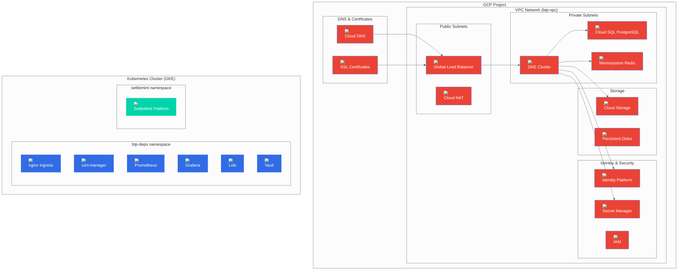

# GCP Deployment Guide

## Overview

This guide provides comprehensive instructions for deploying BTP Universal Terraform on Google Cloud Platform (GCP) using managed GCP services for production-ready infrastructure.

## Architecture Overview



## Prerequisites

### GCP Account Requirements
- Google Cloud Project with billing enabled
- Service account with required roles
- gcloud CLI configured with credentials

### Required GCP Roles

The deployment requires the following IAM roles:

```bash
# Required roles for the service account
roles/compute.admin
roles/container.admin
roles/cloudsql.admin
roles/redis.admin
roles/storage.admin
roles/iam.serviceAccountAdmin
roles/secretmanager.admin
roles/dns.admin
roles/cloudkms.admin
roles/monitoring.admin
roles/logging.admin
```

### Cost Estimation

| Component | Service | Estimated Monthly Cost (USD) |
|-----------|---------|------------------------------|
| **GKE Cluster** | Managed Kubernetes | $73 |
| **Worker Nodes** | VM (3x e2-medium) | $90 |
| **Cloud SQL PostgreSQL** | db-f1-micro | $25 |
| **Memorystore Redis** | Basic 1GB | $15 |
| **Cloud Storage** | 100GB Standard | $3 |
| **Global Load Balancer** | Standard | $25 |
| **Cloud NAT** | Standard | $45 |
| **Cloud DNS** | Managed Zone | $0.20 |
| **Secret Manager** | Standard | $1.50 |
| **Total** | | **~$278/month** |

*Costs may vary based on region, usage, and instance types.*

## Configuration

### 1. GCP Credentials Setup

```bash
# Login to GCP
gcloud auth login

# Set project
gcloud config set project YOUR_PROJECT_ID

# Create service account
gcloud iam service-accounts create btp-terraform \
  --display-name="BTP Terraform Service Account" \
  --description="Service account for BTP Universal Terraform deployment"

# Grant required roles
gcloud projects add-iam-policy-binding YOUR_PROJECT_ID \
  --member="serviceAccount:btp-terraform@YOUR_PROJECT_ID.iam.gserviceaccount.com" \
  --role="roles/compute.admin"

gcloud projects add-iam-policy-binding YOUR_PROJECT_ID \
  --member="serviceAccount:btp-terraform@YOUR_PROJECT_ID.iam.gserviceaccount.com" \
  --role="roles/container.admin"

# Create and download key
gcloud iam service-accounts keys create btp-terraform-key.json \
  --iam-account=btp-terraform@YOUR_PROJECT_ID.iam.gserviceaccount.com

# Set environment variable
export GOOGLE_APPLICATION_CREDENTIALS="$(pwd)/btp-terraform-key.json"

# Verify access
gcloud auth application-default login
```

### 2. Environment Configuration

Create your GCP-specific environment file:

```bash
# Copy GCP example
cp examples/gcp-config.tfvars my-gcp-config.tfvars

# Edit configuration
vim my-gcp-config.tfvars
```

### 3. GCP Configuration File

```hcl
# GCP configuration example
platform = "gcp"

base_domain = "btp.yourdomain.com"

# Kubernetes Cluster Configuration
k8s_cluster = {
  mode = "gcp"
  gcp = {
    cluster_name       = "btp-gke"
    project_id         = "your-gcp-project-id"
    region             = "us-central1"
    kubernetes_version = "1.31"
    
    # Network configuration
    network            = "btp-vpc"
    subnetwork         = "btp-private-subnet"
    ip_range_pods      = "btp-pods-range"
    ip_range_services  = "btp-services-range"
    
    # Node pools
    node_pools = {
      default = {
        node_count     = null  # Use auto-scaling
        min_node_count = 1
        max_node_count = 10
        auto_scaling   = true
        machine_type   = "e2-medium"
        disk_size_gb   = 50
        disk_type      = "pd-standard"
        
        # Security
        service_account = "btp-gke-sa@your-project.iam.gserviceaccount.com"
        oauth_scopes = [
          "https://www.googleapis.com/auth/cloud-platform"
        ]
        
        # Features
        preemptible = false
        auto_repair = true
        auto_upgrade = true
      }
      
      # Spot instances for cost optimization
      spot = {
        node_count     = null
        min_node_count = 0
        max_node_count = 5
        auto_scaling   = true
        machine_type   = "e2-medium"
        disk_size_gb   = 50
        preemptible    = true  # Spot instances
        
        # Taints for spot instances
        taints = [{
          key    = "cloud.google.com/gke-preemptible"
          value  = "true"
          effect = "NO_SCHEDULE"
        }]
      }
    }
    
    # Cluster features
    enable_workload_identity          = true
    enable_http_load_balancing        = true
    enable_horizontal_pod_autoscaling = true
    enable_network_policy             = true
    enable_cloud_logging              = true
    enable_cloud_monitoring           = true
    enable_managed_prometheus         = true
    
    # Security
    enable_shielded_nodes = true
    enable_binary_authorization = true
    
    # Networking
    master_authorized_networks_config = [{
      cidr_blocks = [{
        cidr_block   = "0.0.0.0/0"
        display_name = "All"
      }]
    }]
  }
}

# PostgreSQL via GCP Cloud SQL
postgres = {
  mode = "gcp"
  gcp = {
    instance_name    = "btp-postgres"
    database_version = "POSTGRES_15"
    region           = "us-central1"
    zone             = "us-central1-a"
    tier             = "db-f1-micro"
    database         = "btp"
    username         = "postgres"
    
    # Backup configuration
    backup_enabled             = true
    backup_start_time          = "03:00"
    backup_location            = "us-central1"
    point_in_time_recovery_enabled = true
    
    # High availability
    availability_type = "REGIONAL"  # Zonal or Regional
    disk_type         = "PD_SSD"
    disk_size         = 100
    disk_autoresize   = true
    
    # Security
    ip_configuration = {
      ipv4_enabled    = false  # Private IP only
      require_ssl     = true
      authorized_networks = []
    }
    
    # Maintenance
    maintenance_window = {
      day          = 7  # Sunday
      hour         = 4
      update_track = "stable"
    }
  }
}

# Redis via GCP Memorystore
redis = {
  mode = "gcp"
  gcp = {
    instance_name  = "btp-redis"
    tier           = "BASIC"
    memory_size_gb = 1
    region         = "us-central1"
    redis_version  = "REDIS_7_0"
    
    # Network configuration
    authorized_network = "btp-vpc"
    
    # Security
    auth_enabled = true
    
    # Maintenance
    maintenance_policy = {
      weekly_maintenance_window = [{
        day = "SUNDAY"
        start_time = {
          hours   = 4
          minutes = 0
        }
      }]
    }
  }
}

# Object Storage via GCP Cloud Storage
object_storage = {
  mode = "gcp"
  gcp = {
    bucket_name   = "btp-artifacts-your-unique-name"
    location      = "US"
    storage_class = "STANDARD"
    
    # Security
    uniform_bucket_level_access = true
    public_access_prevention    = "enforced"
    
    # Versioning and lifecycle
    versioning_enabled = true
    lifecycle_rule = [{
      action = {
        type = "Delete"
      }
      condition = {
        age = 365
      }
    }]
    
    # CORS configuration
    cors = [{
      origin          = ["https://btp.yourdomain.com"]
      method          = ["GET", "HEAD", "PUT", "POST", "DELETE"]
      response_header = ["*"]
      max_age_seconds = 3600
    }]
  }
}

# DNS automation via Cloud DNS
dns = {
  mode                    = "gcp"
  domain                  = "btp.yourdomain.com"
  enable_wildcard         = true
  include_wildcard_in_tls = true
  cert_manager_issuer     = "letsencrypt-prod"
  ssl_redirect            = true
  gcp = {
    managed_zone          = "btp-zone"
    project               = "your-gcp-project-id"
    main_record_type      = "A"
    main_record_value     = "LOAD_BALANCER_IP"  # Will be auto-populated
    main_ttl              = 300
    wildcard_record_type  = "A"
    wildcard_record_value = "LOAD_BALANCER_IP"  # Will be auto-populated
  }
}

# OAuth via GCP Identity Platform
oauth = {
  mode = "gcp"
  gcp = {
    project_id = "your-gcp-project-id"
    
    # Identity Platform configuration
    enable_identity_platform = true
    
    # OAuth providers
    oauth_providers = {
      google = {
        enabled = true
        client_id = "your-google-client-id"
        client_secret = "your-google-client-secret"
      }
    }
    
    # Callback URLs
    callback_urls = [
      "https://btp.yourdomain.com/auth/callback"
    ]
  }
}

# Secrets via GCP Secret Manager
secrets = {
  mode = "gcp"
  gcp = {
    project_id = "your-gcp-project-id"
    
    # Secret configuration
    secrets = {
      postgres_password = {
        secret_id = "btp-postgres-password"
        replication = {
          automatic = true
        }
      }
      redis_password = {
        secret_id = "btp-redis-password"
        replication = {
          automatic = true
        }
      }
      jwt_signing_key = {
        secret_id = "btp-jwt-signing-key"
        replication = {
          automatic = true
        }
      }
    }
  }
}

# BTP Platform deployment
btp = {
  enabled       = true
  chart         = "oci://registry.settlemint.com/settlemint-platform/SettleMint"
  namespace     = "settlemint"
  release_name  = "settlemint-platform"
  chart_version = "7.0.0"
}
```

## Deployment Steps

### 1. Pre-deployment Setup

```bash
# Verify GCP access
gcloud auth list
gcloud config get-value project

# Enable required APIs
gcloud services enable compute.googleapis.com
gcloud services enable container.googleapis.com
gcloud services enable sqladmin.googleapis.com
gcloud services enable redis.googleapis.com
gcloud services enable storage.googleapis.com
gcloud services enable secretmanager.googleapis.com
gcloud services enable dns.googleapis.com
gcloud services enable identitytoolkit.googleapis.com

# Create VPC network
gcloud compute networks create btp-vpc \
  --subnet-mode=custom

# Create subnets
gcloud compute networks subnets create btp-private-subnet \
  --network=btp-vpc \
  --range=10.0.1.0/24 \
  --region=us-central1 \
  --enable-private-ip-google-access

gcloud compute networks subnets create btp-public-subnet \
  --network=btp-vpc \
  --range=10.0.2.0/24 \
  --region=us-central1

# Create IP ranges for GKE
gcloud compute addresses create btp-pods-range \
  --global \
  --purpose=VPC_PEERING \
  --prefix-length=16 \
  --network=btp-vpc

gcloud compute addresses create btp-services-range \
  --global \
  --purpose=VPC_PEERING \
  --prefix-length=16 \
  --network=btp-vpc

# Create private connection
gcloud services vpc-peerings connect \
  --service=servicenetworking.googleapis.com \
  --ranges=btp-pods-range,btp-services-range \
  --network=btp-vpc
```

### 2. Deploy Infrastructure

```bash
# One-command deployment
bash scripts/install.sh my-gcp-config.tfvars

# Or manual deployment
terraform init
terraform plan -var-file my-gcp-config.tfvars
terraform apply -var-file my-gcp-config.tfvars
```

### 3. Verify Deployment

```bash
# Check GCP resources
gcloud container clusters list
gcloud sql instances list
gcloud redis instances list
gcloud storage buckets list

# Check Kubernetes cluster
gcloud container clusters get-credentials btp-gke --region us-central1
kubectl get nodes
kubectl get pods -n btp-deps
```

## GCP-Specific Features

### 1. GKE Cluster Features

#### Workload Identity
```hcl
k8s_cluster = {
  gcp = {
    enable_workload_identity = true  # Integrates with IAM
  }
}
```

#### Managed Prometheus
```hcl
k8s_cluster = {
  gcp = {
    enable_managed_prometheus = true  # GCP-managed Prometheus
  }
}
```

#### Binary Authorization
```hcl
k8s_cluster = {
  gcp = {
    enable_binary_authorization = true  # Container image validation
  }
}
```

### 2. Cloud SQL Configuration

#### High Availability Setup
```hcl
postgres = {
  gcp = {
    availability_type = "REGIONAL"  # Regional HA
    tier             = "db-standard-2"
    disk_type        = "PD_SSD"
    disk_size        = 100
    disk_autoresize  = true
  }
}
```

#### Performance Optimization
```hcl
postgres = {
  gcp = {
    tier = "db-standard-4"  # Larger instance for production
    database_flags = [{
      name  = "max_connections"
      value = "200"
    }]
  }
}
```

### 3. Memorystore Configuration

#### Redis Cluster Mode
```hcl
redis = {
  gcp = {
    tier           = "STANDARD_HA"
    memory_size_gb = 5
    redis_configs = {
      "maxmemory-policy" = "allkeys-lru"
    }
  }
}
```

### 4. Cloud Storage Configuration

#### Security and Compliance
```hcl
object_storage = {
  gcp = {
    storage_class = "COLDLINE"  # For long-term storage
    
    # Security
    uniform_bucket_level_access = true
    public_access_prevention    = "enforced"
    
    # Encryption
    encryption = {
      default_kms_key_name = "projects/your-project/locations/us-central1/keyRings/btp-ring/cryptoKeys/btp-key"
    }
  }
}
```

## Security Configuration

### 1. Network Security

#### Private Google Access
```bash
# Enable private Google access for subnets
gcloud compute networks subnets update btp-private-subnet \
  --region=us-central1 \
  --enable-private-ip-google-access
```

#### Firewall Rules
```bash
# Create custom firewall rules
gcloud compute firewall-rules create btp-allow-postgres \
  --network=btp-vpc \
  --allow=tcp:5432 \
  --source-ranges=10.0.1.0/24 \
  --target-tags=postgres

gcloud compute firewall-rules create btp-allow-redis \
  --network=btp-vpc \
  --allow=tcp:6379 \
  --source-ranges=10.0.1.0/24 \
  --target-tags=redis
```

### 2. Identity and Access Management

#### Workload Identity Configuration
```bash
# Bind Kubernetes service account to GCP service account
gcloud iam service-accounts add-iam-policy-binding \
  --role roles/iam.workloadIdentityUser \
  --member "serviceAccount:your-project.svc.id.goog[btp-deps/your-service-account]" \
  btp-gke-sa@your-project.iam.gserviceaccount.com

# Annotate Kubernetes service account
kubectl annotate serviceaccount your-service-account \
  --namespace btp-deps \
  iam.gke.io/gcp-service-account=btp-gke-sa@your-project.iam.gserviceaccount.com
```

#### IAM Policies
```bash
# Grant Cloud SQL access
gcloud projects add-iam-policy-binding your-project \
  --member="serviceAccount:btp-gke-sa@your-project.iam.gserviceaccount.com" \
  --role="roles/cloudsql.client"

# Grant Secret Manager access
gcloud projects add-iam-policy-binding your-project \
  --member="serviceAccount:btp-gke-sa@your-project.iam.gserviceaccount.com" \
  --role="roles/secretmanager.secretAccessor"
```

### 3. Secret Manager Integration

#### Secret Creation
```bash
# Create secrets
echo -n "your-postgres-password" | gcloud secrets create btp-postgres-password --data-file=-

echo -n "your-redis-password" | gcloud secrets create btp-redis-password --data-file=-

echo -n "your-jwt-signing-key" | gcloud secrets create btp-jwt-signing-key --data-file=-
```

#### Secret Access
```bash
# Grant access to secrets
gcloud secrets add-iam-policy-binding btp-postgres-password \
  --member="serviceAccount:btp-gke-sa@your-project.iam.gserviceaccount.com" \
  --role="roles/secretmanager.secretAccessor"
```

## Monitoring and Observability

### 1. Cloud Monitoring Integration

#### Managed Prometheus
```bash
# Check managed Prometheus status
gcloud alpha monitoring metrics-scopes list

# Query metrics
gcloud alpha monitoring metrics list --filter="metric.type:kubernetes.io/container/cpu/core_usage_time"
```

#### Logging
```bash
# Check cluster logs
gcloud logging read "resource.type=gke_cluster" --limit=50

# Check application logs
gcloud logging read "resource.type=k8s_container" --limit=50
```

### 2. Grafana Dashboards

Access Grafana for comprehensive monitoring:
```bash
# Get Grafana URL
terraform output post_deploy_urls

# Access Grafana (admin credentials in outputs)
open https://grafana.btp.yourdomain.com
```

## Backup and Disaster Recovery

### 1. Cloud SQL Backups

```bash
# Create manual backup
gcloud sql backups create \
  --instance=btp-postgres \
  --description="Manual backup $(date)"

# List backups
gcloud sql backups list --instance=btp-postgres
```

### 2. Cloud Storage Backup

```bash
# Enable versioning (already configured)
gsutil versioning set on gs://btp-artifacts-your-unique-name

# Configure lifecycle management
gsutil lifecycle set lifecycle.json gs://btp-artifacts-your-unique-name
```

### 3. GKE Backup

```bash
# Backup cluster configuration
kubectl get all -A -o yaml > cluster-backup.yaml

# Backup persistent volumes
kubectl get pv -o yaml > pv-backup.yaml

# Export secrets from Secret Manager
gcloud secrets versions list btp-postgres-password --format="value(name)" | \
  xargs -I {} gcloud secrets versions access {} --secret="btp-postgres-password" > postgres-password.txt
```

## Cost Optimization

### 1. Resource Right-sizing

```bash
# Check resource utilization
kubectl top nodes
kubectl top pods -n btp-deps

# Scale down if underutilized
kubectl scale deployment your-deployment --replicas=1 -n btp-deps
```

### 2. Preemptible Instances

```hcl
k8s_cluster = {
  gcp = {
    node_pools = {
      spot = {
        preemptible = true  # Use preemptible instances
        machine_type = "e2-medium"
        auto_scaling = true
        min_node_count = 0
        max_node_count = 5
      }
    }
  }
}
```

### 3. Committed Use Discounts

Consider purchasing Committed Use Discounts for predictable workloads:
```bash
# Check current instance usage
gcloud compute instances list --filter="status=RUNNING"

# Purchase committed use discounts via Cloud Console
# or use gcloud compute commitments create
```

## Troubleshooting

### Common Issues

#### Issue: GKE Cluster Not Accessible
```bash
# Get cluster credentials
gcloud container clusters get-credentials btp-gke --region us-central1

# Verify cluster access
kubectl get nodes

# Check cluster status
gcloud container clusters describe btp-gke --region us-central1
```

#### Issue: Cloud SQL Connection Failed
```bash
# Check authorized networks
gcloud sql instances describe btp-postgres

# Check connection from GKE
kubectl run postgres-client --rm -i --tty --image postgres:16-alpine -- \
  psql -h 10.0.1.3 -U postgres -d btp
```

#### Issue: Load Balancer Not Working
```bash
# Check load balancer status
gcloud compute forwarding-rules list

# Check backend health
gcloud compute backend-services get-health btp-backend-service \
  --global
```

### Debug Commands

```bash
# Check GKE cluster logs
gcloud logging read "resource.type=gke_cluster" --limit=50

# Check Cloud SQL logs
gcloud sql operations list --instance=btp-postgres

# Check Memorystore logs
gcloud redis instances describe btp-redis --region=us-central1
```

## Production Checklist

- [ ] **Security**: Enable encryption, private IPs, restricted access
- [ ] **High Availability**: Regional deployment, backup strategies
- [ ] **Monitoring**: Cloud Monitoring, Managed Prometheus, Grafana dashboards
- [ ] **Backup**: Automated Cloud SQL backups, storage lifecycle policies
- [ ] **Scaling**: Auto-scaling node pools, cluster autoscaler
- [ ] **Cost Optimization**: Right-sized instances, Committed Use Discounts, preemptible instances
- [ ] **Compliance**: IAM policies, network security, audit logs
- [ ] **Documentation**: Runbooks, incident response procedures

## Next Steps

- [Security Best Practices](19-security.md) - Secure your GCP deployment
- [Operations Guide](18-operations.md) - Day-to-day operations
- [Monitoring Setup](17-observability-module.md) - Comprehensive monitoring
- [Backup Strategies](20-troubleshooting.md) - Backup and recovery procedures

---

*This GCP deployment guide provides a production-ready foundation for deploying BTP Universal Terraform on GCP. Customize the configuration based on your specific requirements and security policies.*
