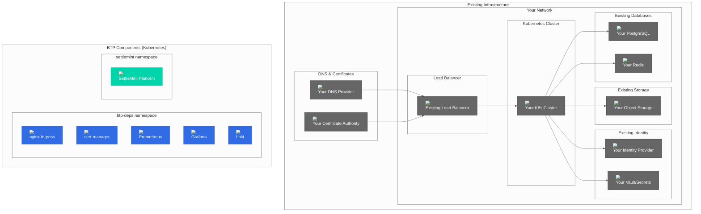

# Bring Your Own (BYO) Infrastructure Guide

## Overview

This guide provides comprehensive instructions for deploying BTP Universal Terraform using existing infrastructure (Bring Your Own). This approach is ideal for enterprises with established infrastructure, compliance requirements, or specific architectural constraints.

## Architecture Overview



## Prerequisites

### Infrastructure Requirements

| Component | Requirement | Example |
|-----------|-------------|---------|
| **Kubernetes Cluster** | Version >= 1.28 | Existing EKS, AKS, GKE, or on-premises |
| **PostgreSQL** | Version >= 13 | RDS, Cloud SQL, or self-managed |
| **Redis** | Version >= 6.0 | ElastiCache, Memorystore, or self-managed |
| **Object Storage** | S3-compatible | S3, MinIO, or other S3-compatible storage |
| **Identity Provider** | OIDC/OAuth2 | Keycloak, Okta, Auth0, or enterprise SSO |
| **Secrets Management** | KV store | HashiCorp Vault, AWS Secrets Manager, or K8s secrets |
| **DNS** | DNS management | Route53, CloudFlare, or enterprise DNS |
| **TLS Certificates** | Certificate management | Let's Encrypt, enterprise CA, or existing certificates |

### Network Requirements

```bash
# Required ports and protocols
PostgreSQL: 5432/tcp (from K8s cluster)
Redis: 6379/tcp (from K8s cluster)
Object Storage: 443/tcp, 80/tcp (from K8s cluster)
Identity Provider: 443/tcp (from K8s cluster)
Secrets Management: 8200/tcp (from K8s cluster)
```

### Kubernetes Cluster Requirements

```bash
# Check cluster version
kubectl version --short

# Check available resources
kubectl top nodes
kubectl describe nodes

# Check storage classes
kubectl get storageclass

# Check ingress controller (if existing)
kubectl get ingressclass
```

## Configuration

### 1. BYO Configuration File

Create your BYO-specific configuration:

```bash
# Copy BYO example
cp examples/byo-config.tfvars my-byo-config.tfvars

# Edit configuration
vim my-byo-config.tfvars
```

### 2. BYO Configuration Example

```hcl
# BYO configuration example
platform = "generic"

base_domain = "btp.yourcompany.com"

# Kubernetes Cluster - Use existing cluster
k8s_cluster = {
  mode = "byo"
  byo = {
    # Option 1: Path to kubeconfig file
    kubeconfig_path = "~/.kube/config"
    
    # Option 2: Base64 encoded kubeconfig content (useful for CI/CD)
    # kubeconfig_content = "base64_encoded_kubeconfig_here"
    
    # Optional: Specify which context to use
    context_name = "production-cluster"
  }
}

namespaces = {
  ingress_tls    = "btp-deps"
  postgres       = "btp-deps"
  redis          = "btp-deps"
  object_storage = "btp-deps"
  metrics_logs   = "btp-deps"
  oauth          = "btp-deps"
  secrets        = "btp-deps"
}

# PostgreSQL - Use existing database
postgres = {
  mode = "byo"
  byo = {
    host     = "postgres.yourcompany.com"
    port     = 5432
    database = "btp_production"
    username = "btp_user"
    # Password via TF_VAR_postgres_password env var
    ssl_mode = "require"
  }
}

# Redis - Use existing Redis instance
redis = {
  mode = "byo"
  byo = {
    host = "redis.yourcompany.com"
    port = 6379
    # Password via TF_VAR_redis_password if auth is enabled
    scheme      = "rediss"  # Use TLS
    tls_enabled = true
  }
}

# Object Storage - Use existing S3-compatible storage
object_storage = {
  mode = "byo"
  byo = {
    endpoint = "https://s3.yourcompany.com"  # Or AWS: "https://s3.us-east-1.amazonaws.com"
    bucket   = "btp-artifacts"
    region   = "us-east-1"  # For AWS S3
    # Credentials via TF_VAR_object_storage_access_key and TF_VAR_object_storage_secret_key
    use_path_style = false  # true for MinIO/Ceph, false for AWS S3
  }
}

# DNS - Use existing DNS provider
dns = {
  mode = "byo"
  byo = {
    # Configure ingress annotations for your environment
    ingress_annotations = {
      "nginx.ingress.kubernetes.io/ssl-redirect" = "true"
      "nginx.ingress.kubernetes.io/force-ssl-redirect" = "true"
    }
    tls_secret_name = "btp-tls"
    tls_hosts       = ["btp.yourcompany.com", "*.btp.yourcompany.com"]
    ssl_redirect    = true
  }
}

# Ingress/TLS - Deploy in Kubernetes
ingress_tls = {
  mode = "k8s"
  k8s = {
    release_name_nginx         = "ingress"
    release_name_cert_manager  = "cert-manager"
    nginx_chart_version        = "4.10.1"
    cert_manager_chart_version = "v1.14.4"
    issuer_name                = "letsencrypt-prod"  # or your enterprise CA
    
    # Customize for your environment
    values_nginx = {
      controller = {
        service = {
          type = "LoadBalancer"
          # Or use NodePort if you have external load balancer
          # type = "NodePort"
          # nodePorts = {
          #   http = 30080
          #   https = 30443
          # }
        }
        # Configure for your load balancer
        config = {
          "use-forwarded-headers" = "true"
          "compute-full-forwarded-for" = "true"
          "use-proxy-protocol" = "false"
        }
      }
    }
    
    # Customize cert-manager for your CA
    values_cert_manager = {
      # For Let's Encrypt
      # global = {
      #   leaderElection = {
      #     namespace = "cert-manager"
      #   }
      # }
      
      # For enterprise CA
      # global = {
      #   leaderElection = {
      #     namespace = "cert-manager"
      #   }
      # }
      # webhook = {
      #   securePort = 10250
      # }
    }
  }
}

# Metrics/Logs - Deploy in K8s or use existing
metrics_logs = {
  mode = "k8s"
  k8s = {
    release_name_kps         = "kps"
    release_name_loki        = "loki"
    kp_stack_chart_version   = "55.8.2"
    loki_stack_chart_version = "2.9.11"
    
    # Customize for your environment
    values = {
      # If you have existing Prometheus/Grafana, you can disable them
      # prometheus = {
      #   enabled = false
      # }
      # grafana = {
      #   enabled = false
      # }
    }
  }
}

# Alternative: Use existing monitoring stack
# metrics_logs = {
#   mode = "byo"
#   byo = {
#     prometheus_url = "https://prometheus.yourcompany.com"
#     grafana_url    = "https://grafana.yourcompany.com"
#     loki_url       = "https://loki.yourcompany.com"
#   }
# }

# OAuth - Use existing identity provider
oauth = {
  mode = "byo"
  byo = {
    # OIDC configuration for existing identity provider
    issuer    = "https://auth.yourcompany.com/realms/production"
    client_id = "btp-production"
    # Client secret via TF_VAR_oauth_client_secret
    scopes        = ["openid", "email", "profile"]
    callback_urls = ["https://btp.yourcompany.com/auth/callback"]
    
    # Optional: Admin URL for user management
    admin_url = "https://auth.yourcompany.com/admin"
  }
}

# Alternative: Disable OAuth if not needed
# oauth = {
#   mode = "disabled"
# }

# Secrets - Use existing HashiCorp Vault
secrets = {
  mode = "byo"
  byo = {
    vault_addr = "https://vault.yourcompany.com:8200"
    # Token via TF_VAR_secrets_vault_token
    # For production, use Kubernetes auth or AppRole instead
    kv_mount = "secret"
    paths = [
      "btp/database",
      "btp/redis",
      "btp/storage",
      "btp/oauth"
    ]
  }
}

# Alternative: Use Kubernetes secrets (not recommended for production)
# secrets = {
#   mode = "k8s"
#   k8s = {
#     # Secrets will be stored as K8s secrets
#     # Consider using external-secrets operator for production
#   }
# }

# BTP Platform deployment
btp = {
  enabled       = true
  chart         = "oci://registry.settlemint.com/settlemint-platform/SettleMint"
  namespace     = "settlemint-production"
  release_name  = "settlemint-platform"
  chart_version = "7.0.0"
}
```

## Deployment Steps

### 1. Pre-deployment Verification

```bash
# Verify Kubernetes cluster access
kubectl cluster-info
kubectl get nodes

# Test database connectivity
kubectl run postgres-test --rm -i --tty --image postgres:16-alpine -- \
  psql -h postgres.yourcompany.com -U btp_user -d btp_production

# Test Redis connectivity
kubectl run redis-test --rm -i --tty --image redis:7-alpine -- \
  redis-cli -h redis.yourcompany.com -p 6379 ping

# Test object storage access
kubectl run s3-test --rm -i --tty --image amazon/aws-cli -- \
  aws s3 ls s3://btp-artifacts

# Test identity provider
curl -s https://auth.yourcompany.com/realms/production/.well-known/openid-configuration

# Test Vault connectivity
kubectl run vault-test --rm -i --tty --image vault:1.15 -- \
  vault status -address=https://vault.yourcompany.com:8200
```

### 2. Configure Environment Variables

```bash
# Set required environment variables
export TF_VAR_postgres_password="your-postgres-password"
export TF_VAR_redis_password="your-redis-password"
export TF_VAR_object_storage_access_key="your-s3-access-key"
export TF_VAR_object_storage_secret_key="your-s3-secret-key"
export TF_VAR_oauth_client_secret="your-oauth-client-secret"
export TF_VAR_secrets_vault_token="your-vault-token"

# Platform secrets
export BTP_JWT_SIGNING_KEY="your-64-character-jwt-signing-key"
export BTP_IPFS_CLUSTER_SECRET="your-64-character-hex-secret"
export BTP_STATE_ENCRYPTION_KEY="your-base64-encoded-encryption-key"

# License credentials
export BTP_LICENSE_USERNAME="your-license-username"
export BTP_LICENSE_PASSWORD="your-license-password"
```

### 3. Deploy Infrastructure

```bash
# One-command deployment
bash scripts/install.sh my-byo-config.tfvars

# Or manual deployment
terraform init
terraform plan -var-file my-byo-config.tfvars
terraform apply -var-file my-byo-config.tfvars
```

### 4. Verify Deployment

```bash
# Check Kubernetes resources
kubectl get pods -n btp-deps
kubectl get services -n btp-deps
kubectl get ingress -n btp-deps

# Verify connectivity to existing services
kubectl exec -n btp-deps deployment/postgres-test -- psql -h postgres.yourcompany.com -U btp_user -d btp_production -c "SELECT 1;"
kubectl exec -n btp-deps deployment/redis-test -- redis-cli -h redis.yourcompany.com ping
```

## BYO-Specific Configurations

### 1. Database Integration

#### PostgreSQL with SSL
```hcl
postgres = {
  mode = "byo"
  byo = {
    host     = "postgres.yourcompany.com"
    port     = 5432
    database = "btp_production"
    username = "btp_user"
    ssl_mode = "require"
    
    # For custom SSL certificates
    ssl_cert = "/path/to/client-cert.pem"
    ssl_key  = "/path/to/client-key.pem"
    ssl_root_cert = "/path/to/ca-cert.pem"
  }
}
```

#### Connection Pooling
```hcl
postgres = {
  mode = "byo"
  byo = {
    # Use connection pooling service
    host = "pgbouncer.yourcompany.com"
    port = 6432
    database = "btp_production"
    username = "btp_user"
  }
}
```

### 2. Redis Integration

#### Redis Cluster
```hcl
redis = {
  mode = "byo"
  byo = {
    # Redis Cluster configuration
    cluster_mode = true
    nodes = [
      "redis-node1.yourcompany.com:6379",
      "redis-node2.yourcompany.com:6379",
      "redis-node3.yourcompany.com:6379"
    ]
    password = "your-redis-password"
    tls_enabled = true
  }
}
```

#### Redis Sentinel
```hcl
redis = {
  mode = "byo"
  byo = {
    # Redis Sentinel configuration
    sentinel_mode = true
    sentinel_hosts = [
      "sentinel1.yourcompany.com:26379",
      "sentinel2.yourcompany.com:26379",
      "sentinel3.yourcompany.com:26379"
    ]
    master_name = "mymaster"
    password = "your-redis-password"
  }
}
```

### 3. Object Storage Integration

#### MinIO Configuration
```hcl
object_storage = {
  mode = "byo"
  byo = {
    endpoint = "https://minio.yourcompany.com"
    bucket   = "btp-artifacts"
    access_key = "your-minio-access-key"
    secret_key = "your-minio-secret-key"
    region   = "us-east-1"
    use_path_style = true  # Required for MinIO
  }
}
```

#### Ceph RGW Configuration
```hcl
object_storage = {
  mode = "byo"
  byo = {
    endpoint = "https://ceph-rgw.yourcompany.com"
    bucket   = "btp-artifacts"
    access_key = "your-ceph-access-key"
    secret_key = "your-ceph-secret-key"
    region   = "default"
    use_path_style = true
  }
}
```

### 4. Identity Provider Integration

#### Keycloak Configuration
```hcl
oauth = {
  mode = "byo"
  byo = {
    issuer = "https://keycloak.yourcompany.com/realms/production"
    client_id = "btp-production"
    client_secret = "your-client-secret"
    scopes = ["openid", "email", "profile"]
    callback_urls = ["https://btp.yourcompany.com/auth/callback"]
    admin_url = "https://keycloak.yourcompany.com/admin"
  }
}
```

#### Okta Configuration
```hcl
oauth = {
  mode = "byo"
  byo = {
    issuer = "https://yourcompany.okta.com/oauth2/default"
    client_id = "your-okta-client-id"
    client_secret = "your-okta-client-secret"
    scopes = ["openid", "email", "profile"]
    callback_urls = ["https://btp.yourcompany.com/auth/callback"]
  }
}
```

#### Auth0 Configuration
```hcl
oauth = {
  mode = "byo"
  byo = {
    issuer = "https://yourcompany.auth0.com/"
    client_id = "your-auth0-client-id"
    client_secret = "your-auth0-client-secret"
    scopes = ["openid", "email", "profile"]
    callback_urls = ["https://btp.yourcompany.com/auth/callback"]
  }
}
```

### 5. Secrets Management Integration

#### HashiCorp Vault Configuration
```hcl
secrets = {
  mode = "byo"
  byo = {
    vault_addr = "https://vault.yourcompany.com:8200"
    token = "your-vault-token"
    kv_mount = "secret"
    paths = [
      "btp/database",
      "btp/redis",
      "btp/storage",
      "btp/oauth"
    ]
  }
}
```

#### Vault with Kubernetes Auth
```hcl
secrets = {
  mode = "byo"
  byo = {
    vault_addr = "https://vault.yourcompany.com:8200"
    # No token needed - uses Kubernetes auth
    auth_method = "kubernetes"
    kubernetes_auth_path = "auth/kubernetes"
    kubernetes_role = "btp-role"
    kv_mount = "secret"
    paths = [
      "btp/database",
      "btp/redis",
      "btp/storage",
      "btp/oauth"
    ]
  }
}
```

## Security Considerations

### 1. Network Security

#### Firewall Rules
```bash
# Ensure required ports are open
# PostgreSQL: 5432/tcp (from K8s cluster)
# Redis: 6379/tcp (from K8s cluster)
# Object Storage: 443/tcp, 80/tcp (from K8s cluster)
# Identity Provider: 443/tcp (from K8s cluster)
# Vault: 8200/tcp (from K8s cluster)

# Example iptables rules
iptables -A INPUT -p tcp --dport 5432 -s 10.0.0.0/16 -j ACCEPT
iptables -A INPUT -p tcp --dport 6379 -s 10.0.0.0/16 -j ACCEPT
```

#### TLS Configuration
```bash
# Ensure all external connections use TLS
# PostgreSQL: SSL mode = require
# Redis: TLS enabled
# Object Storage: HTTPS only
# Identity Provider: HTTPS only
# Vault: HTTPS only
```

### 2. Authentication and Authorization

#### Database Users
```sql
-- Create dedicated user for BTP
CREATE USER btp_user WITH PASSWORD 'secure-password';
GRANT CONNECT ON DATABASE btp_production TO btp_user;
GRANT USAGE ON SCHEMA public TO btp_user;
GRANT CREATE ON SCHEMA public TO btp_user;
GRANT ALL PRIVILEGES ON ALL TABLES IN SCHEMA public TO btp_user;
GRANT ALL PRIVILEGES ON ALL SEQUENCES IN SCHEMA public TO btp_user;
```

#### Redis Security
```bash
# Enable Redis AUTH
redis-cli CONFIG SET requirepass "secure-redis-password"

# Configure Redis ACLs
redis-cli ACL SETUSER btp-user on >secure-password ~* &* +@all -@dangerous
```

### 3. Secrets Management

#### Vault Policies
```hcl
# Vault policy for BTP
path "secret/btp/*" {
  capabilities = ["read", "list"]
}

path "secret/data/btp/*" {
  capabilities = ["read", "list"]
}
```

#### Kubernetes Service Account
```yaml
# Service account for Vault integration
apiVersion: v1
kind: ServiceAccount
metadata:
  name: btp-vault-auth
  namespace: btp-deps
---
apiVersion: rbac.authorization.k8s.io/v1
kind: ClusterRoleBinding
metadata:
  name: btp-vault-auth
roleRef:
  apiGroup: rbac.authorization.k8s.io
  kind: ClusterRole
  name: system:auth-delegator
subjects:
- kind: ServiceAccount
  name: btp-vault-auth
  namespace: btp-deps
```

## Monitoring and Observability

### 1. Integration with Existing Monitoring

#### Prometheus Federation
```yaml
# prometheus-federation.yml
- job_name: 'btp-federation'
  scrape_interval: 15s
  honor_labels: true
  metrics_path: '/federate'
  params:
    'match[]':
      - '{job=~"btp-.*"}'
      - '{namespace="btp-deps"}'
  static_configs:
    - targets:
      - 'prometheus.btp-deps.svc.cluster.local:9090'
```

#### Grafana Data Sources
```yaml
# Add BTP Prometheus as data source
apiVersion: v1
kind: ConfigMap
metadata:
  name: grafana-datasources
data:
  datasources.yaml: |
    datasources:
    - name: BTP Prometheus
      type: prometheus
      url: http://prometheus.btp-deps.svc.cluster.local:9090
      access: proxy
      isDefault: false
```

### 2. Log Aggregation

#### Loki Integration
```yaml
# Configure Loki to forward to existing log aggregation
loki:
  config:
    limits_config:
      enforce_metric_name: false
      reject_old_samples: true
      reject_old_samples_max_age: 168h
    schema_config:
      configs:
      - from: 2020-10-24
        store: boltdb-shipper
        object_store: filesystem
        schema: v11
        index:
          prefix: index_
          period: 24h
```

## Troubleshooting

### Common Issues

#### Issue: Database Connection Failed
```bash
# Test connectivity
kubectl run postgres-test --rm -i --tty --image postgres:16-alpine -- \
  psql -h postgres.yourcompany.com -U btp_user -d btp_production -c "SELECT 1;"

# Check network connectivity
kubectl run network-test --rm -i --tty --image busybox -- \
  nc -zv postgres.yourcompany.com 5432

# Check DNS resolution
kubectl run dns-test --rm -i --tty --image busybox -- \
  nslookup postgres.yourcompany.com
```

#### Issue: Redis Connection Failed
```bash
# Test Redis connectivity
kubectl run redis-test --rm -i --tty --image redis:7-alpine -- \
  redis-cli -h redis.yourcompany.com -p 6379 ping

# Test with authentication
kubectl run redis-auth-test --rm -i --tty --image redis:7-alpine -- \
  redis-cli -h redis.yourcompany.com -p 6379 -a "your-password" ping
```

#### Issue: Object Storage Access Failed
```bash
# Test S3 connectivity
kubectl run s3-test --rm -i --tty --image amazon/aws-cli -- \
  aws s3 ls s3://btp-artifacts --endpoint-url=https://s3.yourcompany.com

# Test MinIO connectivity
kubectl run minio-test --rm -i --tty --image minio/mc -- \
  mc alias set local https://minio.yourcompany.com your-access-key your-secret-key && \
  mc ls local/btp-artifacts
```

#### Issue: Identity Provider Integration Failed
```bash
# Test OIDC discovery
kubectl run oidc-test --rm -i --tty --image curlimages/curl -- \
  curl -s https://auth.yourcompany.com/realms/production/.well-known/openid-configuration

# Test token exchange
kubectl run token-test --rm -i --tty --image curlimages/curl -- \
  curl -X POST https://auth.yourcompany.com/realms/production/protocol/openid-connect/token \
    -H "Content-Type: application/x-www-form-urlencoded" \
    -d "grant_type=client_credentials&client_id=btp-production&client_secret=your-secret"
```

### Debug Commands

```bash
# Check pod logs
kubectl logs -n btp-deps deployment/your-deployment

# Check service endpoints
kubectl get endpoints -n btp-deps

# Check ingress status
kubectl describe ingress -n btp-deps

# Check certificate status
kubectl get certificate -n btp-deps
kubectl describe certificate -n btp-deps

# Check secret status
kubectl get secret -n btp-deps
kubectl describe secret -n btp-deps
```

## Production Checklist

- [ ] **Network Connectivity**: All required ports accessible from K8s cluster
- [ ] **TLS Configuration**: All external connections use TLS/SSL
- [ ] **Authentication**: Dedicated users with minimal required permissions
- [ ] **Secrets Management**: Secure storage and access to credentials
- [ ] **Monitoring Integration**: Integration with existing monitoring stack
- [ ] **Backup Strategy**: Backup procedures for existing infrastructure
- [ ] **High Availability**: Redundancy and failover for critical components
- [ ] **Security Policies**: Network policies, RBAC, and compliance requirements
- [ ] **Documentation**: Integration documentation and runbooks
- [ ] **Testing**: Comprehensive testing of all integrations

## Next Steps

- [Security Best Practices](19-security.md) - Secure your BYO deployment
- [Operations Guide](18-operations.md) - Day-to-day operations
- [Monitoring Setup](17-observability-module.md) - Comprehensive monitoring
- [Backup Strategies](20-troubleshooting.md) - Backup and recovery procedures

---

*This BYO deployment guide provides a comprehensive foundation for integrating BTP Universal Terraform with existing enterprise infrastructure. Customize the configuration based on your specific infrastructure and security requirements.*
