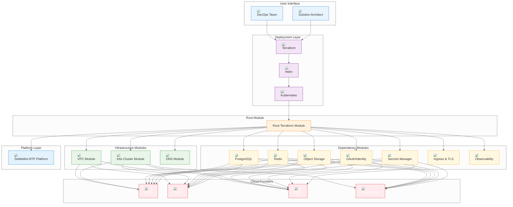
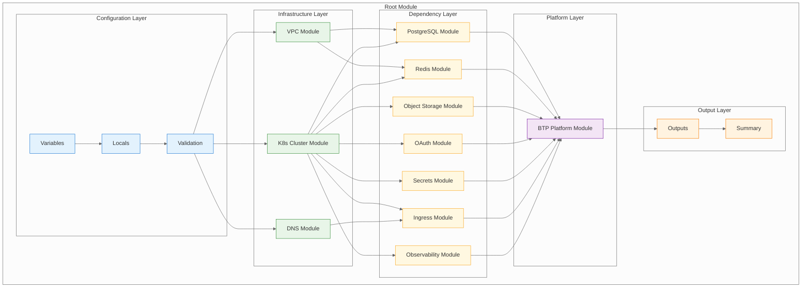
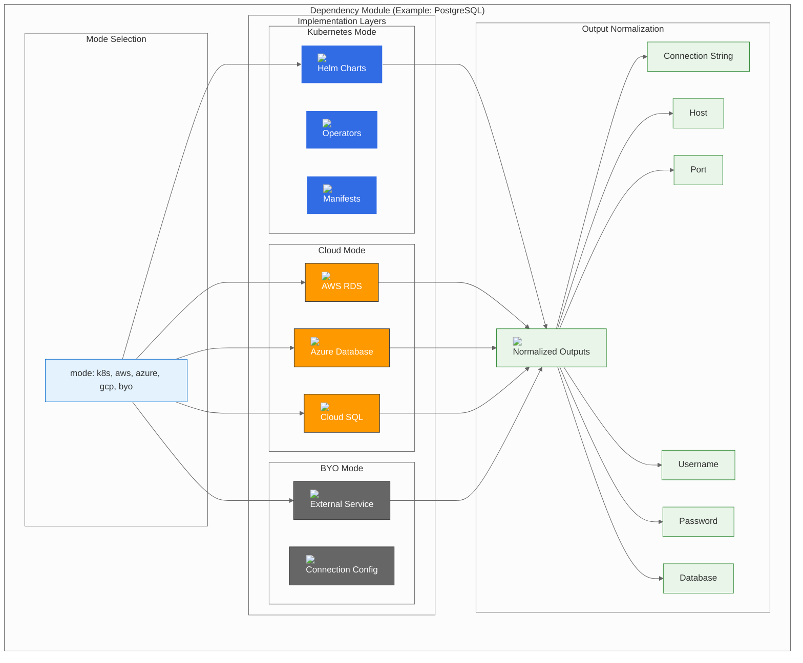
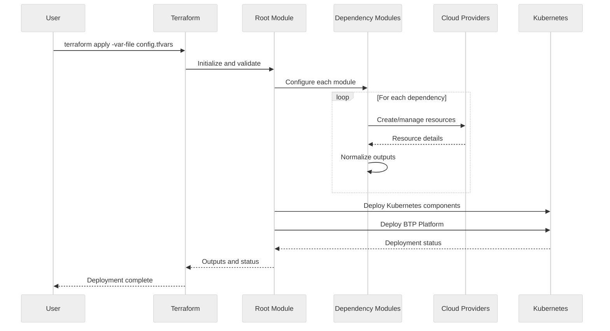
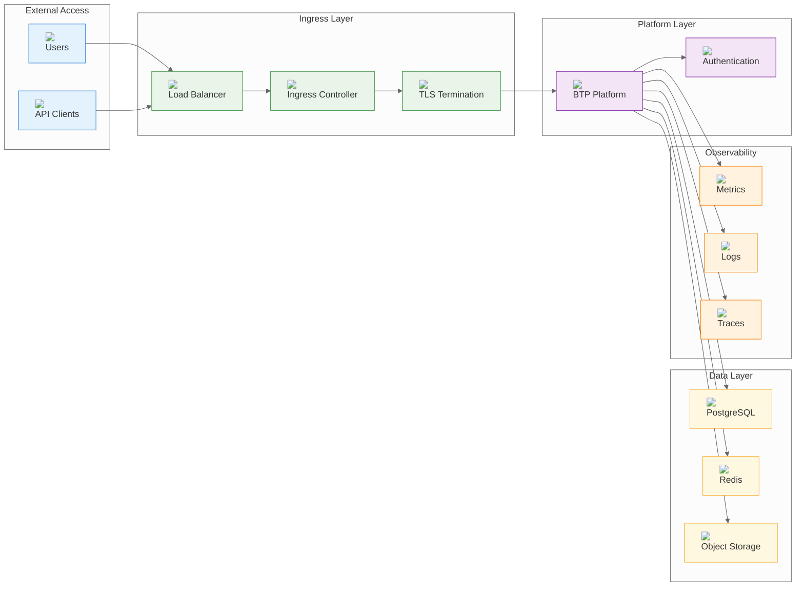
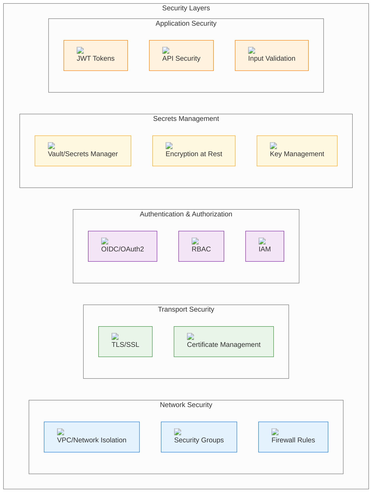
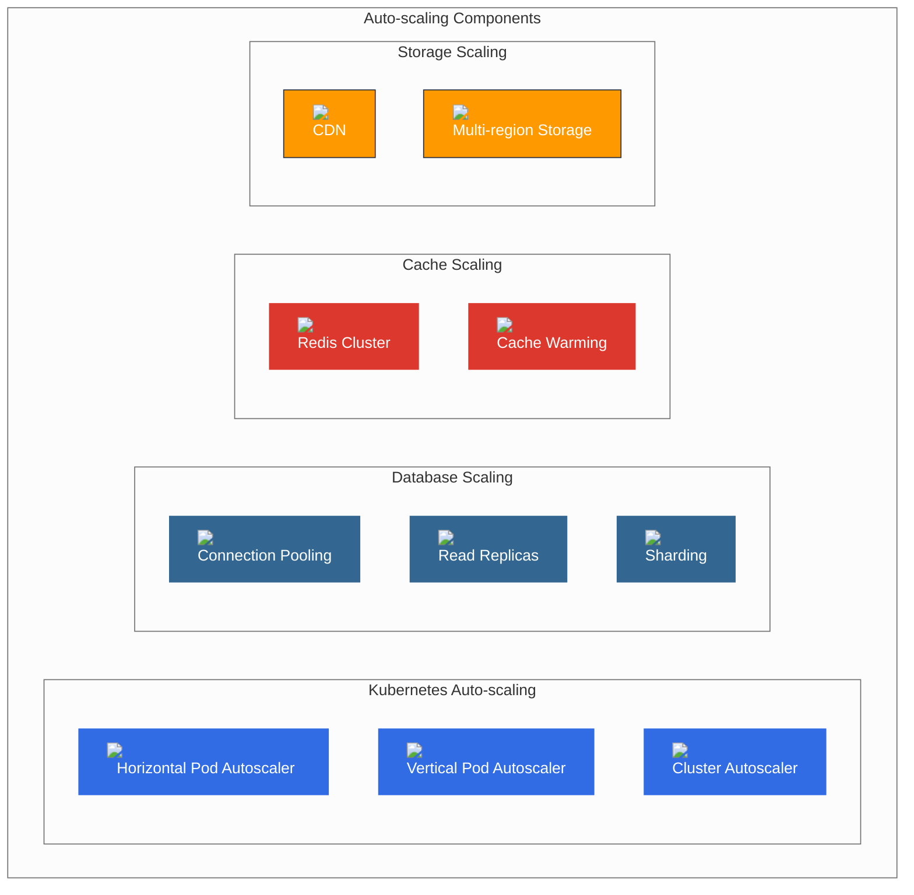
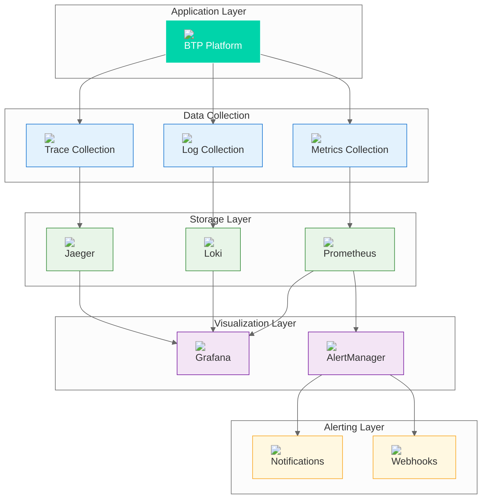
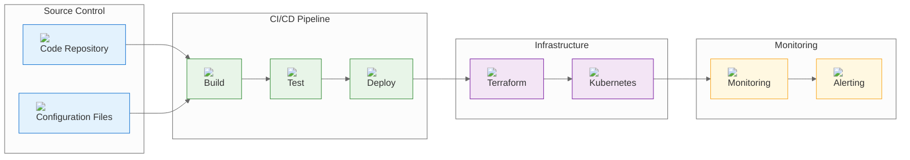

# Architecture Overview

## System Architecture

BTP Universal Terraform follows a modular, cloud-agnostic architecture that provides consistent deployment patterns across multiple cloud providers and deployment scenarios.

## High-Level Architecture

## Module Architecture

### Root Module Structure

The root module orchestrates all dependency modules and provides a unified interface for deployment configuration.

## Dependency Module Architecture

Each dependency module follows a consistent three-mode pattern that supports multiple deployment scenarios.

### Three-Mode Pattern

## Data Flow Architecture

### Configuration Flow

### Runtime Data Flow

## Security Architecture

### Security Layers

## Scalability Architecture

### Horizontal Scaling

## Monitoring Architecture

### Observability Stack

## Deployment Patterns

### Infrastructure as Code Pattern

## Design Principles

### 1. Modularity
- **Single Responsibility**: Each module has a clear, focused purpose
- **Loose Coupling**: Modules interact through well-defined interfaces
- **High Cohesion**: Related functionality is grouped together

### 2. Consistency
- **Unified Interface**: All modules follow the same three-mode pattern
- **Standardized Outputs**: Normalized outputs across all deployment modes
- **Consistent Naming**: Clear, descriptive naming conventions

### 3. Flexibility
- **Multi-Cloud Support**: Works across AWS, Azure, GCP, and generic Kubernetes
- **Deployment Modes**: Supports managed, Kubernetes, and BYO deployment modes
- **Configuration Options**: Extensive customization through variables

### 4. Security
- **Defense in Depth**: Multiple security layers
- **Least Privilege**: Minimal required permissions
- **Secure Defaults**: Security-first default configurations

### 5. Observability
- **Comprehensive Monitoring**: Metrics, logs, and traces
- **Health Checks**: Built-in health monitoring
- **Alerting**: Proactive alerting on issues

### 6. Scalability
- **Horizontal Scaling**: Auto-scaling capabilities
- **Resource Optimization**: Efficient resource utilization
- **Performance Tuning**: Optimized for performance

## Architecture Benefits

### 1. **Consistency**
- Same deployment patterns across all cloud providers
- Unified configuration interface
- Standardized operational procedures

### 2. **Flexibility**
- Multiple deployment options per dependency
- Easy migration between cloud providers
- Support for hybrid and multi-cloud scenarios

### 3. **Maintainability**
- Modular design enables independent updates
- Clear separation of concerns
- Well-documented interfaces

### 4. **Scalability**
- Auto-scaling capabilities built-in
- Resource optimization features
- Performance monitoring and tuning

### 5. **Security**
- Security-first design principles
- Comprehensive security controls
- Regular security updates and patches

### 6. **Observability**
- Built-in monitoring and logging
- Health checks and alerting
- Performance metrics and dashboards

## Next Steps

- [Deployment Flow](10-deployment-flow.md) - Detailed deployment process
- [Module Structure](11-module-structure.md) - Module organization and dependencies
- [Security Architecture](19-security.md) - Security design and implementation
- [Operations Architecture](18-operations.md) - Operational procedures and best practices

---

*This architecture overview provides the foundation for understanding BTP Universal Terraform's design and implementation. The modular, cloud-agnostic approach ensures consistency and flexibility across different deployment scenarios.*
