# Deployment Flow

## Deployment Process Overview

The BTP Universal Terraform deployment follows a structured, multi-stage process designed to ensure reliable and consistent deployments across all supported platforms and deployment modes.

## High-Level Deployment Flow

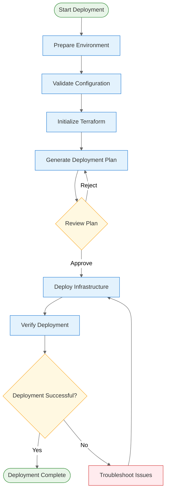

## Detailed Deployment Stages

### Stage 1: Environment Preparation

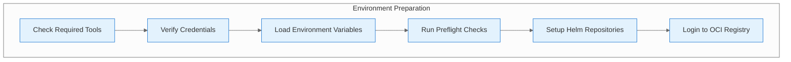

#### 1.1 Tool Verification
```bash
# Check required tools
terraform version    # >= 1.0
kubectl version      # >= 1.28
helm version         # >= 3.8

# Verify cloud provider CLI (if applicable)
aws --version        # For AWS deployments
az --version         # For Azure deployments
gcloud --version     # For GCP deployments
```

#### 1.2 Credential Verification
```bash
# Verify Kubernetes access
kubectl cluster-info
kubectl get nodes

# Verify cloud provider access (if applicable)
aws sts get-caller-identity        # AWS
az account show                    # Azure
gcloud auth list                   # GCP
```

#### 1.3 Environment Variables
```bash
# Load environment file
source .env

# Verify required variables
echo $TF_VAR_postgres_password
echo $BTP_LICENSE_USERNAME
echo $BTP_JWT_SIGNING_KEY
```

#### 1.4 Preflight Checks
```bash
# Run comprehensive preflight checks
./scripts/preflight.sh

# Checks include:
# - Tool availability
# - Cluster connectivity
# - Helm repository access
# - OCI registry authentication
# - Storage class availability
```

### Stage 2: Terraform Initialization

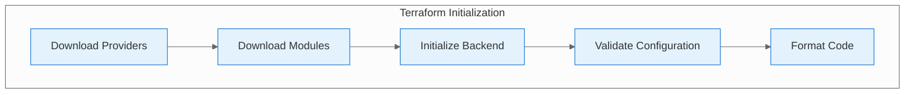

#### 2.1 Provider and Module Download
```bash
# Initialize Terraform
terraform init

# Upgrade providers if needed
terraform init -upgrade

# Expected providers:
# - hashicorp/aws
# - hashicorp/azurerm
# - hashicorp/google
# - hashicorp/kubernetes
# - hashicorp/helm
```

#### 2.2 Configuration Validation
```bash
# Validate Terraform configuration
terraform validate

# Format code
terraform fmt -recursive

# Check for security issues (optional)
checkov -d .
```

### Stage 3: Deployment Planning

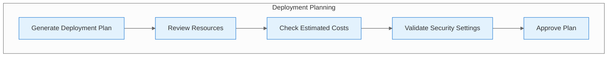

#### 3.1 Plan Generation
```bash
# Generate deployment plan
terraform plan -var-file examples/k8s-config.tfvars

# Save plan to file
terraform plan -var-file examples/k8s-config.tfvars -out deployment.tfplan
```

#### 3.2 Resource Review
```bash
# Review planned resources
terraform show deployment.tfplan

# Check for:
# - Correct resource types
# - Appropriate resource sizes
# - Network configuration
# - Security settings
```

### Stage 4: Staged Deployment

The deployment is executed in stages to prevent race conditions and ensure proper dependency resolution.

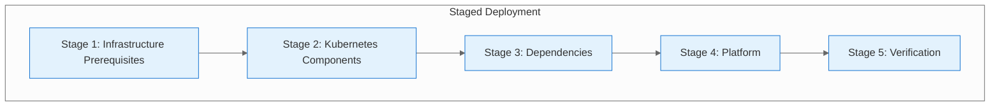

#### 4.1 Stage 1: Infrastructure Prerequisites
```bash
# Deploy VPC and networking (if applicable)
terraform apply -target module.vpc

# Deploy Kubernetes cluster (if applicable)
terraform apply -target module.k8s_cluster

# Deploy namespaces
terraform apply -target kubernetes_namespace.deps
```

#### 4.2 Stage 2: Kubernetes Components
```bash
# Deploy cert-manager CRDs first
terraform apply -target module.ingress_tls.helm_release.cert_manager

# Wait for CRD registration
kubectl wait --for=condition=Established crd/clusterissuers.cert-manager.io --timeout=180s
kubectl wait --for=condition=Established crd/issuers.cert-manager.io --timeout=180s

# Deploy ingress controller
terraform apply -target module.ingress_tls.helm_release.ingress
```

#### 4.3 Stage 3: Dependencies
```bash
# Deploy database
terraform apply -target module.postgres

# Deploy cache
terraform apply -target module.redis

# Deploy object storage
terraform apply -target module.object_storage

# Deploy secrets management
terraform apply -target module.secrets

# Deploy observability
terraform apply -target module.metrics_logs
```

#### 4.4 Stage 4: Platform
```bash
# Deploy BTP platform
terraform apply -target module.btp
```

#### 4.5 Stage 5: Verification
```bash
# Run verification script
bash scripts/verify.sh

# Check deployment status
kubectl get pods -n btp-deps
kubectl get pods -n settlemint
```

## Deployment Modes

### Automated Deployment (Recommended)

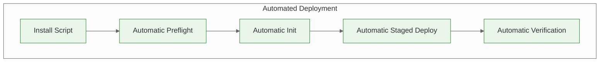

```bash
# One-command deployment
bash scripts/install.sh examples/k8s-config.tfvars
```

### Manual Deployment

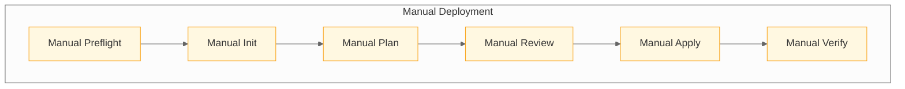

```bash
# Manual step-by-step deployment
./scripts/preflight.sh
terraform init
terraform plan -var-file examples/k8s-config.tfvars
terraform apply -var-file examples/k8s-config.tfvars
bash scripts/verify.sh
```

### CI/CD Deployment

```mermaid
%%{init: {'theme':'neutral','securityLevel':'loose','flowchart':{'htmlLabels':true,'curve':'basis'}}}%%
graph TD
    subgraph "CI/CD Pipeline"
        TRIGGER[Code Commit/PR]
        BUILD[Build Pipeline]
        TEST[Run Tests]
        PLAN_CI[Generate Plan]
        APPROVE_CI[Manual Approval]
        DEPLOY_CI[Deploy to Environment]
        VERIFY_CI[Verify Deployment]
        NOTIFY[Send Notifications]
    end
    
    TRIGGER --> BUILD
    BUILD --> TEST
    TEST --> PLAN_CI
    PLAN_CI --> APPROVE_CI
    APPROVE_CI --> DEPLOY_CI
    DEPLOY_CI --> VERIFY_CI
    VERIFY_CI --> NOTIFY
    
    classDef cicd fill:#F3E5F5,stroke:#7B1FA2,color:#333
    class TRIGGER,BUILD,TEST,PLAN_CI,APPROVE_CI,DEPLOY_CI,VERIFY_CI,NOTIFY cicd
```

## Platform-Specific Deployment Flows

### AWS Deployment Flow

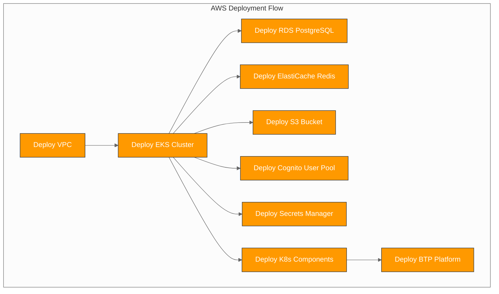

### Azure Deployment Flow

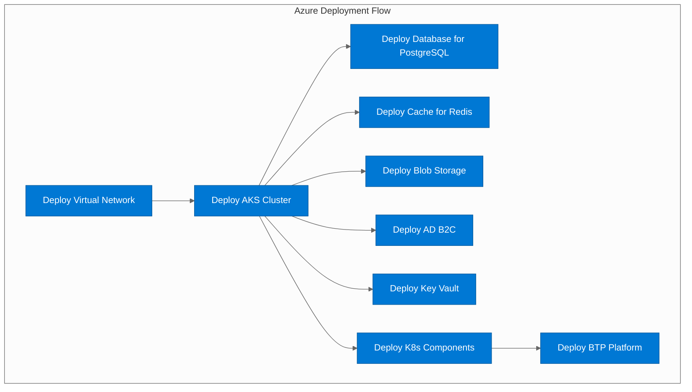

### GCP Deployment Flow

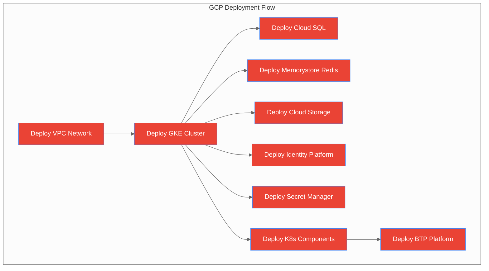

### BYO Deployment Flow

```mermaid
%%{init: {'theme':'neutral','securityLevel':'loose','flowchart':{'htmlLabels':true,'curve':'basis'}}}%%
graph TD
    subgraph "BYO Deployment Flow"
        VERIFY_K8S[Verify K8s Cluster]
        VERIFY_DB[Verify Database]
        VERIFY_REDIS[Verify Redis]
        VERIFY_STORAGE[Verify Object Storage]
        VERIFY_IDENTITY[Verify Identity Provider]
        VERIFY_SECRETS[Verify Secrets Management]
        DEPLOY_K8S_COMPONENTS[Deploy K8s Components]
        CONFIGURE_CONNECTIONS[Configure Connections]
        DEPLOY_BTP[Deploy BTP Platform]
    end
    
    VERIFY_K8S --> VERIFY_DB
    VERIFY_DB --> VERIFY_REDIS
    VERIFY_REDIS --> VERIFY_STORAGE
    VERIFY_STORAGE --> VERIFY_IDENTITY
    VERIFY_IDENTITY --> VERIFY_SECRETS
    VERIFY_SECRETS --> DEPLOY_K8S_COMPONENTS
    DEPLOY_K8S_COMPONENTS --> CONFIGURE_CONNECTIONS
    CONFIGURE_CONNECTIONS --> DEPLOY_BTP
    
    classDef byo fill:#666,stroke:#333,color:#fff
    class VERIFY_K8S,VERIFY_DB,VERIFY_REDIS,VERIFY_STORAGE,VERIFY_IDENTITY,VERIFY_SECRETS,DEPLOY_K8S_COMPONENTS,CONFIGURE_CONNECTIONS,DEPLOY_BTP byo
```

## Deployment Validation

### Health Checks

```mermaid
%%{init: {'theme':'neutral','securityLevel':'loose','flowchart':{'htmlLabels':true,'curve':'basis'}}}%%
graph TD
    subgraph "Deployment Validation"
        CHECK_PODS[Check Pod Status]
        CHECK_SERVICES[Check Service Endpoints]
        CHECK_INGRESS[Check Ingress Status]
        CHECK_CERTS[Check Certificate Status]
        CHECK_DB[Check Database Connectivity]
        CHECK_REDIS[Check Redis Connectivity]
        CHECK_STORAGE[Check Storage Connectivity]
        CHECK_AUTH[Check Authentication]
        CHECK_MONITORING[Check Monitoring]
    end
    
    CHECK_PODS --> CHECK_SERVICES
    CHECK_SERVICES --> CHECK_INGRESS
    CHECK_INGRESS --> CHECK_CERTS
    CHECK_CERTS --> CHECK_DB
    CHECK_DB --> CHECK_REDIS
    CHECK_REDIS --> CHECK_STORAGE
    CHECK_STORAGE --> CHECK_AUTH
    CHECK_AUTH --> CHECK_MONITORING
    
    classDef validation fill:#E8F5E8,stroke:#388E3C,color:#333
    class CHECK_PODS,CHECK_SERVICES,CHECK_INGRESS,CHECK_CERTS,CHECK_DB,CHECK_REDIS,CHECK_STORAGE,CHECK_AUTH,CHECK_MONITORING validation
```

### Verification Commands

```bash
# Check pod status
kubectl get pods -n btp-deps
kubectl get pods -n settlemint

# Check service endpoints
kubectl get services -n btp-deps
kubectl get endpoints -n btp-deps

# Check ingress status
kubectl get ingress -n btp-deps
kubectl describe ingress -n btp-deps

# Check certificate status
kubectl get certificate -n btp-deps
kubectl describe certificate -n btp-deps

# Test database connectivity
kubectl run postgres-test --rm -i --tty --image postgres:16-alpine -- \
  psql -h postgres.btp-deps.svc.cluster.local -U postgres -d btp

# Test Redis connectivity
kubectl run redis-test --rm -i --tty --image redis:7-alpine -- \
  redis-cli -h redis-master.btp-deps.svc.cluster.local ping

# Test object storage
kubectl run s3-test --rm -i --tty --image amazon/aws-cli -- \
  aws s3 ls s3://btp-artifacts
```

## Rollback Procedures

### Automated Rollback

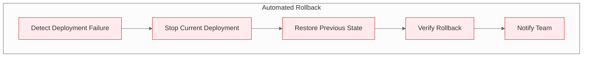

### Manual Rollback

```bash
# Rollback to previous Terraform state
terraform plan -destroy -var-file examples/k8s-config.tfvars
terraform apply -destroy -var-file examples/k8s-config.tfvars

# Rollback specific components
kubectl rollout undo deployment/component-name -n btp-deps

# Rollback Helm releases
helm rollback release-name revision-number -n btp-deps
```

## Best Practices

### 1. **Pre-deployment**
- Always run preflight checks
- Verify credentials and permissions
- Review and approve deployment plans
- Test in non-production environments first

### 2. **During Deployment**
- Use staged deployments for complex environments
- Monitor deployment progress
- Have rollback procedures ready
- Document any custom configurations

### 3. **Post-deployment**
- Run comprehensive verification
- Test all critical functionality
- Update monitoring and alerting
- Document the deployed configuration

### 4. **Security**
- Use least privilege principles
- Encrypt sensitive data
- Enable audit logging
- Regular security updates

### 5. **Monitoring**
- Set up comprehensive monitoring
- Configure alerting for critical issues
- Regular health checks
- Performance monitoring

## Troubleshooting

### Common Issues

#### Issue: Terraform Provider Download Failed
```bash
# Clear cache and retry
rm -rf .terraform
terraform init
```

#### Issue: Kubernetes Cluster Not Accessible
```bash
# Verify cluster access
kubectl cluster-info
kubectl get nodes

# Check kubeconfig
kubectl config current-context
kubectl config get-contexts
```

#### Issue: Helm Chart Download Failed
```bash
# Update Helm repositories
helm repo update

# Check repository status
helm repo list
```

#### Issue: OCI Registry Authentication Failed
```bash
# Manual registry login
echo "password" | helm registry login registry.settlemint.com \
  --username "username" --password-stdin
```

### Debug Mode

```bash
# Enable Terraform debug logging
export TF_LOG=DEBUG
export TF_LOG_PATH=terraform.log

# Enable kubectl verbose output
kubectl get pods -v=8

# Enable Helm debug mode
helm install --debug --dry-run release-name chart-name
```

## Next Steps

- [Module Structure](11-module-structure.md) - Understanding module organization
- [Operations Guide](18-operations.md) - Day-to-day operations
- [Troubleshooting Guide](20-troubleshooting.md) - Common issues and solutions

---

*This deployment flow guide provides a comprehensive understanding of the BTP Universal Terraform deployment process. Following these procedures ensures reliable and consistent deployments across all supported platforms.*
