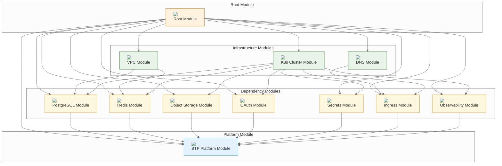
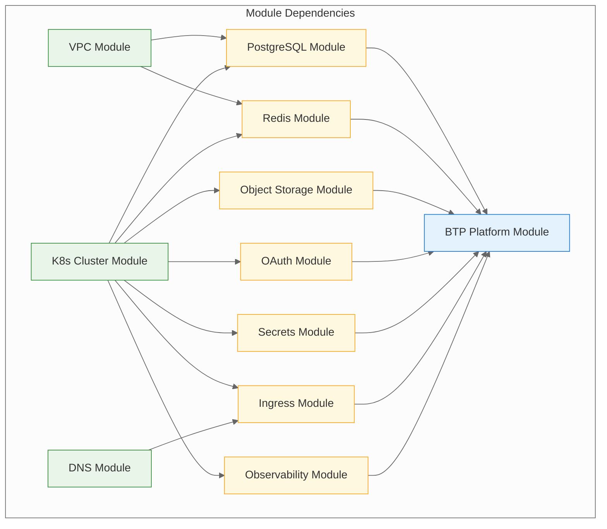
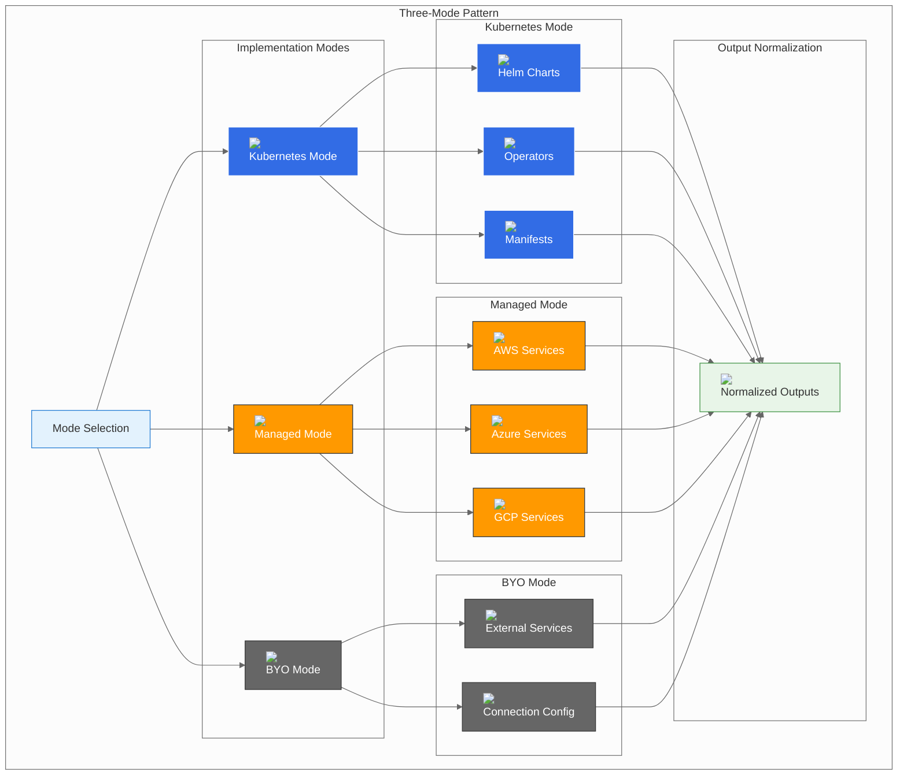

# Module Structure

## Module Organization

BTP Universal Terraform follows a hierarchical module structure that promotes reusability, maintainability, and consistency across different deployment scenarios.

## Directory Structure

```
btp-universal-terraform/
├── main.tf                          # Root module configuration
├── outputs.tf                       # Root module outputs
├── variables-*.tf                   # Variable definitions
├── providers.tf                     # Provider configurations
├── versions.tf                      # Version constraints
├── btp/                            # BTP Platform module
│   ├── main.tf
│   ├── outputs.tf
│   └── variables.tf
├── deps/                           # Dependency modules
│   ├── dns/                        # DNS management
│   ├── ingress_tls/                # Ingress and TLS
│   ├── k8s_cluster/                # Kubernetes cluster
│   ├── metrics_logs/               # Observability stack
│   ├── oauth/                      # OAuth/Identity provider
│   ├── object_storage/             # Object storage
│   ├── postgres/                   # PostgreSQL database
│   ├── redis/                      # Redis cache
│   ├── secrets/                    # Secrets management
│   └── vpc/                        # Virtual Private Cloud
├── examples/                       # Configuration examples
├── scripts/                        # Utility scripts
└── documentation/                  # Documentation
```

## Module Hierarchy



## Module Dependencies

### Dependency Graph



### Dependency Table

| Module | Depends On | Provides To |
|--------|------------|-------------|
| **VPC** | - | PostgreSQL, Redis, K8s Cluster |
| **K8s Cluster** | VPC | All dependency modules |
| **DNS** | - | Ingress |
| **PostgreSQL** | VPC, K8s Cluster | BTP Platform |
| **Redis** | VPC, K8s Cluster | BTP Platform |
| **Object Storage** | K8s Cluster | BTP Platform |
| **OAuth** | K8s Cluster | BTP Platform |
| **Secrets** | K8s Cluster | BTP Platform |
| **Ingress** | K8s Cluster, DNS | BTP Platform |
| **Observability** | K8s Cluster | BTP Platform |
| **BTP Platform** | All dependency modules | - |

## Module Interfaces

### Standard Module Interface

Each dependency module follows a consistent interface pattern:

```hcl
# Input Variables
variable "mode" {
  description = "Deployment mode: k8s | aws | azure | gcp | byo"
  type        = string
}

variable "namespace" {
  description = "Kubernetes namespace"
  type        = string
}

variable "manage_namespace" {
  description = "Whether to manage the namespace"
  type        = bool
  default     = true
}

# Provider-specific configurations
variable "k8s" {
  description = "Kubernetes-specific configuration"
  type        = object({...})
  default     = {}
}

variable "aws" {
  description = "AWS-specific configuration"
  type        = object({...})
  default     = {}
}

variable "azure" {
  description = "Azure-specific configuration"
  type        = object({...})
  default     = {}
}

variable "gcp" {
  description = "GCP-specific configuration"
  type        = object({...})
  default     = {}
}

variable "byo" {
  description = "Bring Your Own configuration"
  type        = object({...})
  default     = null
}

# Output Variables
output "host" {
  description = "Service host"
  value       = local.host
}

output "port" {
  description = "Service port"
  value       = local.port
}

output "username" {
  description = "Service username"
  value       = local.username
  sensitive   = true
}

output "password" {
  description = "Service password"
  value       = local.password
  sensitive   = true
}
```

### Module Output Normalization

Each module normalizes its outputs to provide a consistent interface regardless of the deployment mode:

```hcl
# Example: PostgreSQL Module Output Normalization
locals {
  # Map-based approach for cleaner conditional logic
  outputs_by_mode = {
    k8s = {
      host     = local.k8s_host
      port     = local.k8s_port
      username = local.k8s_user
      password = local.k8s_password
      database = local.k8s_database
    }
    aws = {
      host     = local.aws_host
      port     = local.aws_port
      username = local.aws_user
      password = local.aws_password
      database = local.aws_database
    }
    azure = {
      host     = local.azure_host
      port     = local.azure_port
      username = local.azure_user
      password = local.azure_password
      database = local.azure_database
    }
    gcp = {
      host     = local.gcp_host
      port     = local.gcp_port
      username = local.gcp_user
      password = local.gcp_password
      database = local.gcp_database
    }
    byo = {
      host     = local.byo_host
      port     = local.byo_port
      username = local.byo_user
      password = local.byo_password
      database = local.byo_database
    }
  }
  
  # Normalize outputs from whichever provider is active
  outputs  = lookup(local.outputs_by_mode, local.mode, {})
  host     = try(local.outputs.host, null)
  port     = try(local.outputs.port, null)
  username = try(local.outputs.username, null)
  password = try(local.outputs.password, null)
  database = try(local.outputs.database, null)
}
```

## Module Implementation Patterns

### Three-Mode Pattern

Each dependency module implements the three-mode pattern:



### Mode-Specific Implementations

#### Kubernetes Mode
```hcl
# Example: PostgreSQL Kubernetes Mode
module "postgres_k8s" {
  count  = var.mode == "k8s" ? 1 : 0
  source = "./deps/postgres"
  
  mode             = "k8s"
  namespace        = var.namespace
  manage_namespace = var.manage_namespace
  k8s              = var.k8s
}

locals {
  k8s_host     = var.mode == "k8s" ? module.postgres_k8s[0].host : null
  k8s_port     = var.mode == "k8s" ? module.postgres_k8s[0].port : null
  k8s_user     = var.mode == "k8s" ? module.postgres_k8s[0].username : null
  k8s_password = var.mode == "k8s" ? module.postgres_k8s[0].password : null
  k8s_database = var.mode == "k8s" ? module.postgres_k8s[0].database : null
}
```

#### Managed Mode
```hcl
# Example: PostgreSQL AWS Mode
module "postgres_aws" {
  count  = var.mode == "aws" ? 1 : 0
  source = "./deps/postgres"
  
  mode             = "aws"
  namespace        = var.namespace
  manage_namespace = var.manage_namespace
  aws              = var.aws
}

locals {
  aws_host     = var.mode == "aws" ? module.postgres_aws[0].host : null
  aws_port     = var.mode == "aws" ? module.postgres_aws[0].port : null
  aws_user     = var.mode == "aws" ? module.postgres_aws[0].username : null
  aws_password = var.mode == "aws" ? module.postgres_aws[0].password : null
  aws_database = var.mode == "aws" ? module.postgres_aws[0].database : null
}
```

#### BYO Mode
```hcl
# Example: PostgreSQL BYO Mode
locals {
  byo_host     = var.mode == "byo" ? var.byo.host : null
  byo_port     = var.mode == "byo" ? var.byo.port : null
  byo_user     = var.mode == "byo" ? var.byo.username : null
  byo_password = var.mode == "byo" ? var.byo.password : null
  byo_database = var.mode == "byo" ? var.byo.database : null
}
```

## Module Configuration

### Variable Organization

Variables are organized by category in separate files:

```
variables-core.tf          # Core platform variables
variables-dependencies.tf  # Dependency configuration variables
variables-btp.tf          # BTP platform variables
variables-secrets.tf      # Secret and credential variables
```

### Variable Categories

#### Core Variables
```hcl
variable "platform" {
  description = "Target platform: aws | azure | gcp | generic"
  type        = string
  default     = "generic"
}

variable "base_domain" {
  description = "Base domain for local ingress"
  type        = string
  default     = "127.0.0.1.nip.io"
}

variable "namespaces" {
  description = "Namespaces per dependency"
  type        = object({...})
  default     = {...}
}
```

#### Dependency Variables
```hcl
variable "postgres" {
  description = "PostgreSQL configuration"
  type = object({
    mode = optional(string, "k8s")
    k8s  = optional(object({...}), {})
    aws  = optional(object({...}), {})
    azure = optional(object({...}), {})
    gcp  = optional(object({...}), {})
    byo  = optional(object({...}), null)
  })
  default = {}
}
```

#### Secret Variables
```hcl
variable "postgres_password" {
  description = "PostgreSQL password"
  type        = string
  sensitive   = true
  validation {
    condition     = length(var.postgres_password) >= 8
    error_message = "Password must be at least 8 characters."
  }
}
```

## Module Outputs

### Root Module Outputs

The root module provides comprehensive outputs for all deployed components:

```hcl
output "postgres" {
  description = "PostgreSQL connection details"
  value = {
    connection_string = module.postgres.connection_string
    host              = module.postgres.host
    port              = module.postgres.port
    username          = module.postgres.username
    password          = module.postgres.password
    database          = module.postgres.database
  }
  sensitive = true
}

output "post_deploy_urls" {
  description = "Key endpoints to verify after deployment"
  value = {
    platform_url = local.summary_platform_url
    grafana_url  = local.summary_grafana_url
    # ... other endpoints
  }
}

output "post_deploy_message" {
  description = "Human-readable summary of endpoints"
  value       = join("\n", local.summary_lines)
}
```

### Dependency Module Outputs

Each dependency module provides normalized outputs:

```hcl
# Example: PostgreSQL Module Outputs
output "host" {
  description = "PostgreSQL host"
  value       = local.host
}

output "port" {
  description = "PostgreSQL port"
  value       = local.port
}

output "username" {
  description = "PostgreSQL username"
  value       = local.username
  sensitive   = true
}

output "password" {
  description = "PostgreSQL password"
  value       = local.password
  sensitive   = true
}

output "database" {
  description = "PostgreSQL database name"
  value       = local.database
}

output "connection_string" {
  description = "PostgreSQL connection string"
  value       = local.connection_string
  sensitive   = true
}
```

## Module Testing

### Test Structure

Each module includes comprehensive tests:

```
deps/postgres/
├── main.tf
├── outputs.tf
├── variables.tf
├── versions.tf
├── aws.tf
├── azure.tf
├── gcp.tf
├── k8s.tf
├── byo.tf
└── tests/
    ├── k8s_test.tf
    ├── aws_test.tf
    ├── azure_test.tf
    ├── gcp_test.tf
    └── byo_test.tf
```

### Test Categories

#### Unit Tests
```hcl
# Example: PostgreSQL Module Unit Test
module "postgres_test" {
  source = "../"
  
  mode      = "k8s"
  namespace = "test"
  k8s = {
    release_name = "postgres-test"
    values = {
      postgresql = {
        auth = {
          postgresPassword = "test-password"
        }
      }
    }
  }
}
```

#### Integration Tests
```hcl
# Example: Full Stack Integration Test
module "integration_test" {
  source = "../../"
  
  platform    = "generic"
  base_domain = "test.example.com"
  
  postgres = {
    mode = "k8s"
    k8s = {
      release_name = "postgres-test"
    }
  }
  
  redis = {
    mode = "k8s"
    k8s = {
      release_name = "redis-test"
    }
  }
  
  # ... other dependencies
}
```

## Module Documentation

### Documentation Structure

Each module includes comprehensive documentation:

```
deps/postgres/
├── README.md           # Module overview and usage
├── variables.md        # Variable documentation
├── outputs.md         # Output documentation
├── examples/          # Usage examples
│   ├── k8s.md
│   ├── aws.md
│   ├── azure.md
│   ├── gcp.md
│   └── byo.md
└── tests/             # Test documentation
    └── README.md
```

### Documentation Standards

#### Module README
```markdown
# PostgreSQL Module

## Overview
This module deploys PostgreSQL using the three-mode pattern.

## Usage
```hcl
module "postgres" {
  source = "./deps/postgres"
  
  mode      = "k8s"
  namespace = "btp-deps"
  k8s = {
    release_name = "postgres"
  }
}
```

## Modes
- **k8s**: Kubernetes-native deployment using Helm
- **aws**: AWS RDS PostgreSQL
- **azure**: Azure Database for PostgreSQL
- **gcp**: GCP Cloud SQL PostgreSQL
- **byo**: Bring Your Own PostgreSQL

## Examples
See the `examples/` directory for mode-specific examples.
```

## Module Maintenance

### Version Management

Modules use semantic versioning:

```
v1.0.0  # Major version
v1.1.0  # Minor version
v1.1.1  # Patch version
```

### Update Procedures

#### Minor Updates
```bash
# Update module version
terraform get -update

# Apply updates
terraform plan
terraform apply
```

#### Major Updates
```bash
# Review breaking changes
terraform plan -detailed-exitcode

# Apply with migration plan
terraform apply -auto-approve
```

### Backward Compatibility

Modules maintain backward compatibility through:

1. **Optional Variables**: New variables have default values
2. **Deprecated Variables**: Old variables are marked as deprecated
3. **Migration Guides**: Clear migration instructions
4. **Version Constraints**: Explicit version requirements

## Best Practices

### 1. **Module Design**
- Single responsibility principle
- Consistent interfaces
- Clear documentation
- Comprehensive testing

### 2. **Variable Design**
- Sensible defaults
- Validation rules
- Clear descriptions
- Type constraints

### 3. **Output Design**
- Normalized outputs
- Sensitive data handling
- Clear descriptions
- Consistent naming

### 4. **Testing**
- Unit tests for each mode
- Integration tests
- Performance tests
- Security tests

### 5. **Documentation**
- Clear usage examples
- Mode-specific guides
- Troubleshooting guides
- API documentation

## Next Steps

- [Dependency Modules](12-postgres-module.md) - Detailed dependency module documentation
- [Configuration Reference](22-api-reference.md) - Complete configuration options
- [API Reference](22-api-reference.md) - Module outputs and variables reference
- [Contributing Guide](25-contributing.md) - Module testing procedures

---

*This module structure guide provides a comprehensive understanding of BTP Universal Terraform's modular architecture. The consistent patterns and interfaces ensure maintainability and ease of use across all deployment scenarios.*
