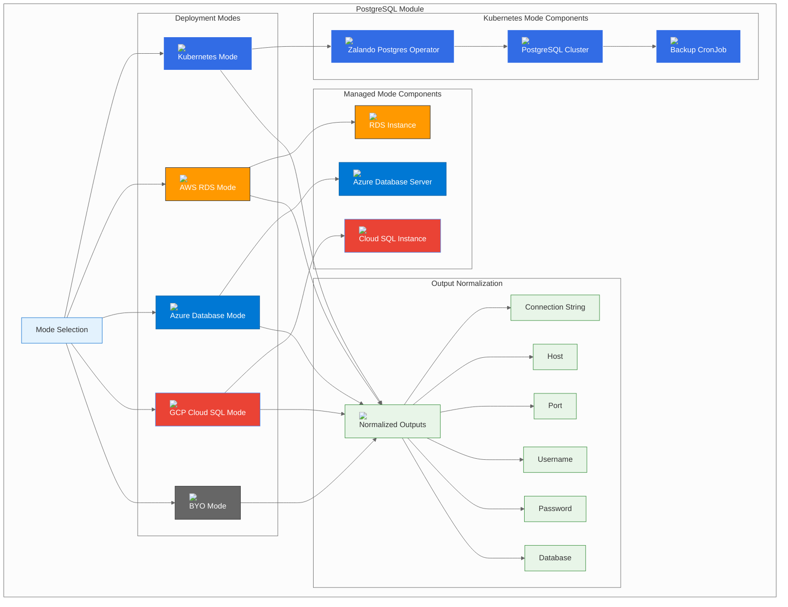

# PostgreSQL Module

## Overview

The PostgreSQL module provides a unified interface for deploying PostgreSQL across multiple platforms and deployment modes. It supports the three-mode pattern: Kubernetes-native (Helm), managed cloud services, and Bring Your Own (BYO) external databases.

## Module Architecture



## Configuration Options

### Mode Selection

The module supports five deployment modes:

| Mode | Description | Use Case |
|------|-------------|----------|
| **k8s** | Kubernetes-native deployment using Zalando Postgres Operator | Development, testing, or when you want full control |
| **aws** | AWS RDS PostgreSQL managed service | Production environments requiring high availability |
| **azure** | Azure Database for PostgreSQL managed service | Production environments on Azure |
| **gcp** | Google Cloud SQL PostgreSQL managed service | Production environments on GCP |
| **byo** | Bring Your Own external PostgreSQL database | Enterprise environments with existing infrastructure |

### Common Configuration

```hcl
module "postgres" {
  source = "./deps/postgres"
  
  mode             = "k8s"                    # Deployment mode
  namespace        = "btp-deps"              # Kubernetes namespace
  manage_namespace = true                    # Whether to manage the namespace
  
  # Provider-specific configurations
  k8s   = {...}   # Kubernetes configuration
  aws   = {...}   # AWS configuration
  azure = {...}   # Azure configuration
  gcp   = {...}   # GCP configuration
  byo   = {...}   # BYO configuration
}
```

## Deployment Modes

### Kubernetes Mode (k8s)

Deploys PostgreSQL using the Zalando Postgres Operator for Kubernetes-native database management.

#### Features
- **High Availability**: Multi-replica clusters with automatic failover
- **Backup Management**: Automated backups with point-in-time recovery
- **Connection Pooling**: Built-in connection pooling via PgBouncer
- **Monitoring**: Prometheus metrics and Grafana dashboards
- **Security**: TLS encryption, RBAC, and network policies

#### Configuration
```hcl
postgres = {
  mode = "k8s"
  k8s = {
    namespace                        = "btp-deps"
    operator_chart_version           = "1.12.2"
    postgresql_version               = "15"
    release_name                     = "postgres"
    database                         = "btp"
    
    # High Availability
    number_of_instances = 2
    volume_size        = "10Gi"
    
    # Backup configuration
    backup_retention_days = 7
    backup_schedule      = "0 2 * * *"  # Daily at 2 AM
    
    # Connection pooling
    enable_pgbouncer = true
    pgbouncer_pool_mode = "transaction"
    
    # Security
    enable_ssl = true
    ssl_mode   = "require"
    
    # Custom values
    values = {
      postgresql = {
        resources = {
          requests = {
            memory = "256Mi"
            cpu    = "250m"
          }
          limits = {
            memory = "512Mi"
            cpu    = "500m"
          }
        }
      }
    }
  }
}
```

#### Kubernetes Resources Created
- **Zalando Postgres Operator**: Manages PostgreSQL clusters
- **PostgreSQL Cluster**: Multi-replica PostgreSQL deployment
- **PgBouncer**: Connection pooling service
- **Backup CronJob**: Automated backup scheduling
- **Service**: Cluster IP service for internal access
- **Secret**: Database credentials and certificates

### AWS Mode (aws)

Deploys PostgreSQL using AWS RDS for managed database service.

#### Features
- **Managed Service**: Fully managed PostgreSQL with automated backups
- **High Availability**: Multi-AZ deployment with automatic failover
- **Security**: VPC isolation, encryption at rest and in transit
- **Monitoring**: CloudWatch integration with detailed metrics
- **Scaling**: Read replicas and vertical scaling capabilities

#### Configuration
```hcl
postgres = {
  mode = "aws"
  aws = {
    identifier          = "btp-postgres"
    engine_version      = "15.14"
    instance_class      = "db.t3.small"
    allocated_storage   = 100
    database            = "btp"
    username            = "postgres"
    
    # High Availability
    multi_az               = true
    backup_retention_period = 7
    backup_window          = "03:00-04:00"
    maintenance_window     = "sun:04:00-sun:05:00"
    
    # Security
    storage_encrypted = true
    skip_final_snapshot = false
    
    # Performance
    performance_insights_enabled = true
    performance_insights_retention_days = 7
    
    # Network
    subnet_ids         = ["subnet-12345", "subnet-67890"]
    security_group_ids = ["sg-12345"]
    
    # Custom parameters
    parameter_group_name = "btp-postgres-params"
    parameters = [
      {
        name  = "shared_preload_libraries"
        value = "pg_stat_statements"
      }
    ]
  }
}
```

#### AWS Resources Created
- **RDS Instance**: PostgreSQL database instance
- **DB Subnet Group**: Subnet configuration for RDS
- **Security Group**: Network access control
- **Parameter Group**: Database configuration parameters
- **Option Group**: Database options and extensions

### Azure Mode (azure)

Deploys PostgreSQL using Azure Database for PostgreSQL managed service.

#### Features
- **Managed Service**: Fully managed PostgreSQL with automated maintenance
- **High Availability**: Zone-redundant deployment with automatic failover
- **Security**: Azure AD integration, encryption, and network isolation
- **Monitoring**: Azure Monitor integration with comprehensive metrics
- **Scaling**: Flexible scaling options and read replicas

#### Configuration
```hcl
postgres = {
  mode = "azure"
  azure = {
    server_name         = "btp-postgres"
    resource_group_name = "btp-resources"
    location            = "East US"
    version             = "15"
    sku_name            = "GP_Standard_D2s_v3"
    storage_mb          = 102400
    database            = "btp"
    admin_username      = "postgres"
    
    # High Availability
    geo_redundant_backup_enabled = true
    backup_retention_days        = 7
    auto_grow_enabled           = true
    
    # Security
    ssl_enforcement_enabled          = true
    ssl_minimal_tls_version_enforced = "TLS1_2"
    public_network_access_enabled   = false  # Private access only
    
    # Performance
    performance_insights_enabled = true
    
    # Network
    vnet_rule = {
      name      = "btp-vnet-rule"
      subnet_id = "/subscriptions/.../resourceGroups/.../providers/Microsoft.Network/virtualNetworks/.../subnets/..."
    }
  }
}
```

#### Azure Resources Created
- **PostgreSQL Server**: Managed PostgreSQL server instance
- **Database**: PostgreSQL database
- **Virtual Network Rule**: Network access control
- **Firewall Rules**: IP-based access control
- **Private Endpoint**: Private network connectivity

### GCP Mode (gcp)

Deploys PostgreSQL using Google Cloud SQL managed service.

#### Features
- **Managed Service**: Fully managed PostgreSQL with automated backups
- **High Availability**: Regional deployment with automatic failover
- **Security**: VPC-native connectivity, encryption, and IAM integration
- **Monitoring**: Cloud Monitoring integration with detailed metrics
- **Scaling**: Automatic scaling and read replicas

#### Configuration
```hcl
postgres = {
  mode = "gcp"
  gcp = {
    instance_name    = "btp-postgres"
    database_version = "POSTGRES_15"
    region           = "us-central1"
    zone             = "us-central1-a"
    tier             = "db-f1-micro"
    database         = "btp"
    username         = "postgres"
    
    # High Availability
    availability_type = "REGIONAL"
    disk_type         = "PD_SSD"
    disk_size         = 100
    disk_autoresize   = true
    
    # Backup
    backup_enabled             = true
    backup_start_time          = "03:00"
    backup_location           = "us-central1"
    point_in_time_recovery_enabled = true
    
    # Security
    ip_configuration = {
      ipv4_enabled    = false  # Private IP only
      require_ssl     = true
      authorized_networks = []
    }
    
    # Performance
    database_flags = [
      {
        name  = "shared_preload_libraries"
        value = "pg_stat_statements"
      }
    ]
  }
}
```

#### GCP Resources Created
- **Cloud SQL Instance**: PostgreSQL database instance
- **Database**: PostgreSQL database
- **Private IP**: Private network connectivity
- **SSL Certificate**: Database SSL certificate
- **Backup Configuration**: Automated backup settings

### BYO Mode (byo)

Connects to an existing PostgreSQL database instance.

#### Features
- **External Database**: Connect to existing PostgreSQL instance
- **Flexible Configuration**: Support for various PostgreSQL setups
- **Network Integration**: Works with any network-accessible PostgreSQL
- **Security**: Supports SSL/TLS encryption and authentication

#### Configuration
```hcl
postgres = {
  mode = "byo"
  byo = {
    host     = "postgres.yourcompany.com"
    port     = 5432
    database = "btp_production"
    username = "btp_user"
    # Password via TF_VAR_postgres_password env var
    
    # SSL Configuration
    ssl_mode = "require"
    
    # Connection pooling (optional)
    connection_pooling = {
      enabled = true
      pool_size = 20
      max_connections = 100
    }
    
    # Custom connection parameters
    connection_parameters = {
      application_name = "btp-platform"
      connect_timeout  = 30
      statement_timeout = 30000
    }
  }
}
```

#### BYO Mode Considerations
- **Network Access**: Ensure PostgreSQL is accessible from Kubernetes cluster
- **Authentication**: Configure appropriate user permissions
- **SSL/TLS**: Enable SSL for secure connections
- **Backup Strategy**: Implement your own backup procedures
- **Monitoring**: Set up monitoring for the external database

## Output Variables

### Normalized Outputs

The module provides consistent outputs regardless of the deployment mode:

```hcl
output "host" {
  description = "PostgreSQL host"
  value       = local.host
}

output "port" {
  description = "PostgreSQL port"
  value       = local.port
}

output "username" {
  description = "PostgreSQL username"
  value       = local.username
  sensitive   = true
}

output "password" {
  description = "PostgreSQL password"
  value       = local.password
  sensitive   = true
}

output "database" {
  description = "PostgreSQL database name"
  value       = local.database
}

output "connection_string" {
  description = "PostgreSQL connection string"
  value       = local.connection_string
  sensitive   = true
}
```

### Output Values by Mode

| Mode | Host | Port | Username | Database |
|------|------|------|----------|----------|
| **k8s** | `postgres.btp-deps.svc.cluster.local` | `5432` | `postgres` | `btp` |
| **aws** | `btp-postgres.xyz.us-east-1.rds.amazonaws.com` | `5432` | `postgres` | `btp` |
| **azure** | `btp-postgres.postgres.database.azure.com` | `5432` | `postgres@btp-postgres` | `btp` |
| **gcp** | `btp-postgres.xyz.us-central1.c.gcp-project.internal` | `5432` | `postgres` | `btp` |
| **byo** | `postgres.yourcompany.com` | `5432` | `btp_user` | `btp_production` |

## Security Considerations

### Network Security

#### Kubernetes Mode
```yaml
# Network Policy Example
apiVersion: networking.k8s.io/v1
kind: NetworkPolicy
metadata:
  name: postgres-network-policy
  namespace: btp-deps
spec:
  podSelector:
    matchLabels:
      app: postgres
  policyTypes:
  - Ingress
  ingress:
  - from:
    - namespaceSelector:
        matchLabels:
          name: settlemint
    ports:
    - protocol: TCP
      port: 5432
```

#### Managed Services
- **AWS**: VPC isolation, security groups, encrypted storage
- **Azure**: VNet integration, private endpoints, encrypted storage
- **GCP**: VPC-native connectivity, private IP, encrypted storage

### Authentication and Authorization

#### User Management
```sql
-- Create dedicated user for BTP
CREATE USER btp_user WITH PASSWORD 'secure-password';

-- Grant necessary permissions
GRANT CONNECT ON DATABASE btp TO btp_user;
GRANT USAGE ON SCHEMA public TO btp_user;
GRANT CREATE ON SCHEMA public TO btp_user;
GRANT ALL PRIVILEGES ON ALL TABLES IN SCHEMA public TO btp_user;
GRANT ALL PRIVILEGES ON ALL SEQUENCES IN SCHEMA public TO btp_user;

-- Set default privileges for future objects
ALTER DEFAULT PRIVILEGES IN SCHEMA public GRANT ALL ON TABLES TO btp_user;
ALTER DEFAULT PRIVILEGES IN SCHEMA public GRANT ALL ON SEQUENCES TO btp_user;
```

#### SSL/TLS Configuration
```sql
-- Enable SSL
ALTER SYSTEM SET ssl = on;
ALTER SYSTEM SET ssl_cert_file = 'server.crt';
ALTER SYSTEM SET ssl_key_file = 'server.key';

-- Require SSL for all connections
ALTER SYSTEM SET ssl_require = on;
SELECT pg_reload_conf();
```

### Encryption

#### At Rest
- **Kubernetes**: Use encrypted storage classes
- **AWS**: RDS encryption at rest
- **Azure**: Transparent Data Encryption (TDE)
- **GCP**: Cloud SQL encryption at rest

#### In Transit
- **All Modes**: SSL/TLS encryption for all connections
- **Certificate Management**: Automated certificate rotation

## Backup and Recovery

### Backup Strategies

#### Kubernetes Mode
```yaml
# Backup CronJob
apiVersion: batch/v1
kind: CronJob
metadata:
  name: postgres-backup
  namespace: btp-deps
spec:
  schedule: "0 2 * * *"  # Daily at 2 AM
  jobTemplate:
    spec:
      template:
        spec:
          containers:
          - name: postgres-backup
            image: postgres:15-alpine
            command:
            - /bin/bash
            - -c
            - |
              pg_dump -h postgres -U postgres -d btp > /backup/btp-$(date +%Y%m%d).sql
            volumeMounts:
            - name: backup-volume
              mountPath: /backup
          volumes:
          - name: backup-volume
            persistentVolumeClaim:
              claimName: postgres-backup-pvc
```

#### Managed Services
- **AWS**: Automated backups with point-in-time recovery
- **Azure**: Automated backups with long-term retention
- **GCP**: Automated backups with point-in-time recovery

### Recovery Procedures

#### Point-in-Time Recovery
```bash
# AWS RDS
aws rds restore-db-instance-to-point-in-time \
  --source-db-instance-identifier btp-postgres \
  --target-db-instance-identifier btp-postgres-recovered \
  --restore-time 2024-01-01T12:00:00Z

# Azure Database
az postgres server restore \
  --resource-group btp-resources \
  --name btp-postgres-recovered \
  --source-server btp-postgres \
  --restore-time 2024-01-01T12:00:00Z

# GCP Cloud SQL
gcloud sql backups restore BACKUP_ID \
  --instance=btp-postgres-recovered \
  --restore-instance=btp-postgres
```

## Monitoring and Observability

### Metrics Collection

#### Kubernetes Mode
```yaml
# ServiceMonitor for Prometheus
apiVersion: monitoring.coreos.com/v1
kind: ServiceMonitor
metadata:
  name: postgres-monitor
  namespace: btp-deps
spec:
  selector:
    matchLabels:
      app: postgres
  endpoints:
  - port: postgres
    path: /metrics
```

#### Managed Services
- **AWS**: CloudWatch metrics and custom metrics
- **Azure**: Azure Monitor metrics and custom metrics
- **GCP**: Cloud Monitoring metrics and custom metrics

### Health Checks

#### Kubernetes Mode
```yaml
# Liveness and Readiness Probes
livenessProbe:
  exec:
    command:
    - /bin/bash
    - -c
    - "pg_isready -h localhost -p 5432 -U postgres"
  initialDelaySeconds: 30
  periodSeconds: 10

readinessProbe:
  exec:
    command:
    - /bin/bash
    - -c
    - "pg_isready -h localhost -p 5432 -U postgres"
  initialDelaySeconds: 5
  periodSeconds: 5
```

#### Managed Services
- **AWS**: RDS health checks and CloudWatch alarms
- **Azure**: Database health checks and Azure Monitor alerts
- **GCP**: Cloud SQL health checks and Cloud Monitoring alerts

## Performance Optimization

### Connection Pooling

#### Kubernetes Mode
```yaml
# PgBouncer Configuration
apiVersion: v1
kind: ConfigMap
metadata:
  name: pgbouncer-config
data:
  pgbouncer.ini: |
    [databases]
    btp = host=postgres port=5432 dbname=btp
    
    [pgbouncer]
    pool_mode = transaction
    max_client_conn = 100
    default_pool_size = 20
    reserve_pool_size = 5
    reserve_pool_timeout = 3
    max_db_connections = 25
```

#### Managed Services
- **AWS**: RDS Proxy for connection pooling
- **Azure**: Built-in connection pooling
- **GCP**: Cloud SQL Proxy for connection pooling

### Query Optimization

#### Index Management
```sql
-- Create indexes for common queries
CREATE INDEX CONCURRENTLY idx_btp_table_created_at ON btp_table(created_at);
CREATE INDEX CONCURRENTLY idx_btp_table_status ON btp_table(status);

-- Analyze tables for query optimization
ANALYZE btp_table;
```

#### Configuration Tuning
```sql
-- PostgreSQL configuration tuning
ALTER SYSTEM SET shared_buffers = '256MB';
ALTER SYSTEM SET effective_cache_size = '1GB';
ALTER SYSTEM SET maintenance_work_mem = '64MB';
ALTER SYSTEM SET checkpoint_completion_target = 0.9;
ALTER SYSTEM SET wal_buffers = '16MB';
ALTER SYSTEM SET default_statistics_target = 100;
SELECT pg_reload_conf();
```

## Troubleshooting

### Common Issues

#### Connection Issues
```bash
# Test database connectivity
kubectl run postgres-test --rm -i --tty --image postgres:15-alpine -- \
  psql -h postgres.btp-deps.svc.cluster.local -U postgres -d btp

# Check network connectivity
kubectl run network-test --rm -i --tty --image busybox -- \
  nc -zv postgres.btp-deps.svc.cluster.local 5432

# Check DNS resolution
kubectl run dns-test --rm -i --tty --image busybox -- \
  nslookup postgres.btp-deps.svc.cluster.local
```

#### Performance Issues
```sql
-- Check active connections
SELECT count(*) FROM pg_stat_activity;

-- Check slow queries
SELECT query, mean_time, calls, total_time 
FROM pg_stat_statements 
ORDER BY mean_time DESC 
LIMIT 10;

-- Check table sizes
SELECT schemaname, tablename, pg_size_pretty(pg_total_relation_size(schemaname||'.'||tablename)) as size
FROM pg_tables 
WHERE schemaname = 'public'
ORDER BY pg_total_relation_size(schemaname||'.'||tablename) DESC;
```

#### Backup Issues
```bash
# Check backup status (Kubernetes mode)
kubectl get cronjobs -n btp-deps
kubectl logs -n btp-deps job/postgres-backup-$(date +%Y%m%d)

# Check backup status (Managed services)
aws rds describe-db-instances --db-instance-identifier btp-postgres --query 'DBInstances[0].BackupRetentionPeriod'
az postgres server show --resource-group btp-resources --name btp-postgres --query 'backup.retentionDays'
gcloud sql instances describe btp-postgres --format="value(settings.backupConfiguration.enabled)"
```

### Debug Commands

#### Kubernetes Mode
```bash
# Check PostgreSQL logs
kubectl logs -n btp-deps deployment/postgres

# Check operator logs
kubectl logs -n btp-deps deployment/postgres-operator

# Check cluster status
kubectl get postgresql -n btp-deps
kubectl describe postgresql postgres -n btp-deps
```

#### Managed Services
```bash
# AWS RDS
aws rds describe-db-instances --db-instance-identifier btp-postgres
aws logs describe-log-groups --log-group-name-prefix "/aws/rds/instance/btp-postgres"

# Azure Database
az postgres server show --resource-group btp-resources --name btp-postgres
az monitor activity-log list --resource-group btp-resources

# GCP Cloud SQL
gcloud sql instances describe btp-postgres
gcloud logging read "resource.type=gce_instance AND resource.labels.instance_id=btp-postgres"
```

## Best Practices

### 1. **Security**
- Use dedicated database users with minimal required permissions
- Enable SSL/TLS encryption for all connections
- Implement network isolation and firewall rules
- Regular security updates and patches

### 2. **Performance**
- Implement connection pooling for high-traffic applications
- Create appropriate indexes for common queries
- Monitor and tune database configuration parameters
- Regular maintenance tasks (VACUUM, ANALYZE)

### 3. **Backup and Recovery**
- Implement automated backup strategies
- Test recovery procedures regularly
- Store backups in multiple locations
- Document recovery procedures

### 4. **Monitoring**
- Set up comprehensive monitoring and alerting
- Monitor key performance metrics
- Track database growth and resource usage
- Regular health checks

### 5. **Scaling**
- Plan for horizontal and vertical scaling
- Monitor resource utilization
- Implement read replicas for read-heavy workloads
- Consider partitioning for large tables

## Next Steps

- [Redis Module](13-redis-module.md) - Redis cache module documentation
- [Object Storage Module](14-object-storage-module.md) - Object storage module documentation
- [OAuth Module](15-oauth-module.md) - OAuth/Identity provider module documentation
- [Secrets Module](16-secrets-module.md) - Secrets management module documentation

---

*This PostgreSQL module documentation provides comprehensive guidance for deploying and managing PostgreSQL across all supported platforms and deployment modes. The three-mode pattern ensures consistency while providing flexibility for different deployment scenarios.*
