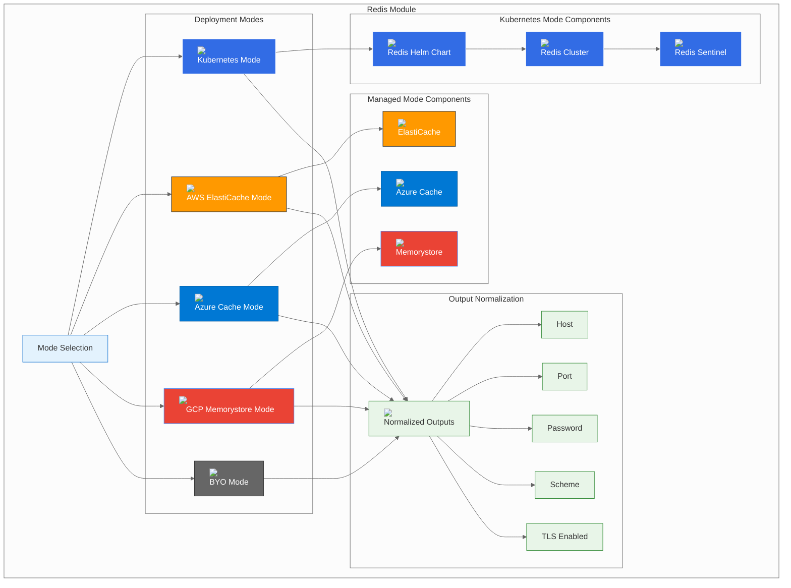

# Redis Module

## Overview

The Redis module provides a unified interface for deploying Redis across multiple platforms and deployment modes. It supports the three-mode pattern: Kubernetes-native (Helm), managed cloud services, and Bring Your Own (BYO) external Redis instances.

## Module Architecture



## Configuration Options

### Mode Selection

The module supports five deployment modes:

| Mode | Description | Use Case |
|------|-------------|----------|
| **k8s** | Kubernetes-native deployment using Redis Helm chart | Development, testing, or when you want full control |
| **aws** | AWS ElastiCache Redis managed service | Production environments requiring high availability |
| **azure** | Azure Cache for Redis managed service | Production environments on Azure |
| **gcp** | Google Cloud Memorystore Redis managed service | Production environments on GCP |
| **byo** | Bring Your Own external Redis instance | Enterprise environments with existing infrastructure |

### Common Configuration

```hcl
module "redis" {
  source = "./deps/redis"
  
  mode             = "k8s"                    # Deployment mode
  namespace        = "btp-deps"              # Kubernetes namespace
  manage_namespace = true                    # Whether to manage the namespace
  
  # Provider-specific configurations
  k8s   = {...}   # Kubernetes configuration
  aws   = {...}   # AWS configuration
  azure = {...}   # Azure configuration
  gcp   = {...}   # GCP configuration
  byo   = {...}   # BYO configuration
}
```

## Deployment Modes

### Kubernetes Mode (k8s)

Deploys Redis using the official Redis Helm chart for Kubernetes-native cache management.

#### Features
- **High Availability**: Redis Cluster or Sentinel mode
- **Persistence**: Configurable persistence options
- **Security**: Password authentication and TLS encryption
- **Monitoring**: Prometheus metrics and health checks
- **Scaling**: Horizontal scaling with Redis Cluster

#### Configuration
```hcl
redis = {
  mode = "k8s"
  k8s = {
    namespace     = "btp-deps"
    chart_version = "18.1.6"
    release_name  = "redis"
    password      = "secure-redis-password"
    
    # High Availability
    architecture = "replication"  # replication | cluster | standalone
    replica_count = 3
    
    # Persistence
    persistence = {
      enabled = true
      size    = "8Gi"
      storageClass = "gp2"
    }
    
    # Security
    auth = {
      enabled = true
      password = "secure-redis-password"
    }
    
    # TLS Configuration
    tls = {
      enabled = true
      authClients = true
    }
    
    # Custom values
    values = {
      master = {
        resources = {
          requests = {
            memory = "256Mi"
            cpu    = "250m"
          }
          limits = {
            memory = "512Mi"
            cpu    = "500m"
          }
        }
      }
      replica = {
        resources = {
          requests = {
            memory = "256Mi"
            cpu    = "250m"
          }
          limits = {
            memory = "512Mi"
            cpu    = "500m"
          }
        }
      }
    }
  }
}
```

#### Redis Cluster Mode
```hcl
redis = {
  mode = "k8s"
  k8s = {
    architecture = "cluster"
    cluster = {
      enabled = true
      nodes = 6  # 3 masters + 3 replicas
    }
    
    # Cluster configuration
    values = {
      cluster = {
        enabled = true
        slaveCount = 3
      }
    }
  }
}
```

#### Redis Sentinel Mode
```hcl
redis = {
  mode = "k8s"
  k8s = {
    architecture = "replication"
    sentinel = {
      enabled = true
      masterSet = "mymaster"
    }
    
    # Sentinel configuration
    values = {
      sentinel = {
        enabled = true
        masterSet = "mymaster"
        downAfterMilliseconds = 30000
        failoverTimeout = 180000
      }
    }
  }
}
```

### AWS Mode (aws)

Deploys Redis using AWS ElastiCache for managed Redis service.

#### Features
- **Managed Service**: Fully managed Redis with automated backups
- **High Availability**: Multi-AZ deployment with automatic failover
- **Security**: VPC isolation, encryption at rest and in transit
- **Monitoring**: CloudWatch integration with detailed metrics
- **Scaling**: Horizontal scaling with Redis Cluster mode

#### Configuration
```hcl
redis = {
  mode = "aws"
  aws = {
    cluster_id                 = "btp-redis"
    engine_version             = "7.0"
    node_type                  = "cache.t3.micro"
    num_cache_nodes            = 1
    parameter_group_name       = "default.redis7"
    
    # High Availability
    multi_az = true
    automatic_failover_enabled = true
    
    # Security
    auth_token                 = "secure-redis-token"
    transit_encryption_enabled = true
    at_rest_encryption_enabled = true
    
    # Network
    subnet_ids         = ["subnet-12345", "subnet-67890"]
    security_group_ids = ["sg-12345"]
    
    # Backup
    snapshot_retention_limit = 5
    snapshot_window         = "03:00-05:00"
    maintenance_window      = "sun:05:00-sun:09:00"
    
    # Cluster mode
    cluster_mode_enabled = false
    num_node_groups     = 1
    replicas_per_node_group = 2
  }
}
```

#### Redis Cluster Mode (AWS)
```hcl
redis = {
  mode = "aws"
  aws = {
    cluster_mode_enabled = true
    num_node_groups     = 2
    replicas_per_node_group = 1
    
    # Cluster configuration
    parameter_group_name = "default.redis7.cluster.on"
    
    # Node type for cluster
    node_type = "cache.t3.small"
  }
}
```

### Azure Mode (azure)

Deploys Redis using Azure Cache for Redis managed service.

#### Features
- **Managed Service**: Fully managed Redis with automated maintenance
- **High Availability**: Zone-redundant deployment with automatic failover
- **Security**: Azure AD integration, encryption, and network isolation
- **Monitoring**: Azure Monitor integration with comprehensive metrics
- **Scaling**: Flexible scaling options and clustering

#### Configuration
```hcl
redis = {
  mode = "azure"
  azure = {
    cache_name          = "btp-redis"
    location            = "East US"
    resource_group_name = "btp-resources"
    capacity            = 0
    family              = "C"
    sku_name            = "Basic"
    
    # High Availability
    enable_non_ssl_port = false
    minimum_tls_version = "1.2"
    
    # Redis configuration
    redis_configuration = {
      maxmemory_reserved = "2"
      maxmemory_delta    = "2"
      maxmemory_policy   = "allkeys-lru"
    }
    
    # Network
    subnet_id = "/subscriptions/.../resourceGroups/.../providers/Microsoft.Network/virtualNetworks/.../subnets/..."
    
    # Backup
    enable_backup = true
    backup_frequency = 15
    backup_max_count = 1
  }
}
```

#### Premium Tier with Clustering
```hcl
redis = {
  mode = "azure"
  azure = {
    capacity            = 1
    family              = "P"
    sku_name            = "Premium"
    
    # Clustering
    enable_clustering = true
    shard_count      = 3
    
    # Performance
    redis_configuration = {
      maxmemory_reserved = "50"
      maxmemory_delta    = "50"
      maxmemory_policy   = "allkeys-lru"
    }
  }
}
```

### GCP Mode (gcp)

Deploys Redis using Google Cloud Memorystore managed service.

#### Features
- **Managed Service**: Fully managed Redis with automated backups
- **High Availability**: Regional deployment with automatic failover
- **Security**: VPC-native connectivity, encryption, and IAM integration
- **Monitoring**: Cloud Monitoring integration with detailed metrics
- **Scaling**: Automatic scaling and clustering

#### Configuration
```hcl
redis = {
  mode = "gcp"
  gcp = {
    instance_name  = "btp-redis"
    tier           = "BASIC"
    memory_size_gb = 1
    region         = "us-central1"
    redis_version  = "REDIS_7_0"
    
    # Network configuration
    authorized_network = "btp-vpc"
    
    # Security
    auth_enabled = true
    
    # Maintenance
    maintenance_policy = {
      weekly_maintenance_window = [{
        day = "SUNDAY"
        start_time = {
          hours   = 4
          minutes = 0
        }
      }]
    }
    
    # Redis configuration
    redis_configs = {
      "maxmemory-policy" = "allkeys-lru"
    }
  }
}
```

#### Standard Tier with High Availability
```hcl
redis = {
  mode = "gcp"
  gcp = {
    tier           = "STANDARD_HA"
    memory_size_gb = 5
    
    # High availability
    redis_configs = {
      "maxmemory-policy" = "allkeys-lru"
    }
    
    # Network
    authorized_network = "btp-vpc"
  }
}
```

### BYO Mode (byo)

Connects to an existing Redis instance.

#### Features
- **External Redis**: Connect to existing Redis instance
- **Flexible Configuration**: Support for various Redis setups
- **Network Integration**: Works with any network-accessible Redis
- **Security**: Supports TLS encryption and authentication

#### Configuration
```hcl
redis = {
  mode = "byo"
  byo = {
    host = "redis.yourcompany.com"
    port = 6379
    # Password via TF_VAR_redis_password if auth is enabled
    
    # TLS Configuration
    scheme      = "rediss"  # rediss for TLS, redis for plain
    tls_enabled = true
    
    # Redis Cluster
    cluster_mode = false
    nodes = []  # For cluster mode: ["redis-node1:6379", "redis-node2:6379"]
    
    # Redis Sentinel
    sentinel_mode = false
    sentinel_hosts = []  # For sentinel mode: ["sentinel1:26379", "sentinel2:26379"]
    master_name = "mymaster"
  }
}
```

#### Redis Cluster Mode (BYO)
```hcl
redis = {
  mode = "byo"
  byo = {
    cluster_mode = true
    nodes = [
      "redis-node1.yourcompany.com:6379",
      "redis-node2.yourcompany.com:6379",
      "redis-node3.yourcompany.com:6379"
    ]
    password = "your-redis-password"
    tls_enabled = true
  }
}
```

#### Redis Sentinel Mode (BYO)
```hcl
redis = {
  mode = "byo"
  byo = {
    sentinel_mode = true
    sentinel_hosts = [
      "sentinel1.yourcompany.com:26379",
      "sentinel2.yourcompany.com:26379",
      "sentinel3.yourcompany.com:26379"
    ]
    master_name = "mymaster"
    password = "your-redis-password"
    tls_enabled = true
  }
}
```

## Output Variables

### Normalized Outputs

The module provides consistent outputs regardless of the deployment mode:

```hcl
output "host" {
  description = "Redis host"
  value       = local.host
}

output "port" {
  description = "Redis port"
  value       = local.port
}

output "password" {
  description = "Redis password"
  value       = local.password
  sensitive   = true
}

output "scheme" {
  description = "Redis connection scheme (redis/rediss)"
  value       = local.scheme
}

output "tls_enabled" {
  description = "Whether TLS is enabled"
  value       = local.tls_enabled
}
```

### Output Values by Mode

| Mode | Host | Port | Scheme | TLS Enabled |
|------|------|------|--------|-------------|
| **k8s** | `redis-master.btp-deps.svc.cluster.local` | `6379` | `redis` | `false` |
| **aws** | `btp-redis.xyz.cache.amazonaws.com` | `6379` | `rediss` | `true` |
| **azure** | `btp-redis.redis.cache.windows.net` | `6380` | `rediss` | `true` |
| **gcp** | `btp-redis.xyz.memorystore.googleapis.com` | `6379` | `redis` | `false` |
| **byo** | `redis.yourcompany.com` | `6379` | `rediss` | `true` |

## Security Considerations

### Network Security

#### Kubernetes Mode
```yaml
# Network Policy Example
apiVersion: networking.k8s.io/v1
kind: NetworkPolicy
metadata:
  name: redis-network-policy
  namespace: btp-deps
spec:
  podSelector:
    matchLabels:
      app: redis
  policyTypes:
  - Ingress
  ingress:
  - from:
    - namespaceSelector:
        matchLabels:
          name: settlemint
    ports:
    - protocol: TCP
      port: 6379
```

#### Managed Services
- **AWS**: VPC isolation, security groups, encrypted storage
- **Azure**: VNet integration, private endpoints, encrypted storage
- **GCP**: VPC-native connectivity, private IP, encrypted storage

### Authentication and Authorization

#### Password Authentication
```bash
# Set Redis password
redis-cli CONFIG SET requirepass "secure-redis-password"

# Configure Redis ACLs (Redis 6+)
redis-cli ACL SETUSER btp-user on >secure-password ~* &* +@all -@dangerous
```

#### TLS/SSL Configuration
```bash
# Configure TLS
redis-cli CONFIG SET tls-port 6380
redis-cli CONFIG SET tls-cert-file /path/to/server.crt
redis-cli CONFIG SET tls-key-file /path/to/server.key
redis-cli CONFIG SET tls-ca-cert-file /path/to/ca.crt
```

### Encryption

#### At Rest
- **Kubernetes**: Use encrypted storage classes
- **AWS**: ElastiCache encryption at rest
- **Azure**: Redis encryption at rest
- **GCP**: Memorystore encryption at rest

#### In Transit
- **All Modes**: TLS encryption for all connections
- **Certificate Management**: Automated certificate rotation

## Performance Optimization

### Memory Management

#### Memory Policies
```bash
# Configure memory eviction policy
redis-cli CONFIG SET maxmemory-policy allkeys-lru

# Set memory limit
redis-cli CONFIG SET maxmemory 2gb
```

#### Memory Optimization
```bash
# Enable memory optimization
redis-cli CONFIG SET hash-max-ziplist-entries 512
redis-cli CONFIG SET hash-max-ziplist-value 64
redis-cli CONFIG SET list-max-ziplist-size -2
redis-cli CONFIG SET set-max-intset-entries 512
```

### Connection Management

#### Connection Pooling
```python
# Python example with connection pooling
import redis
from redis.connection import ConnectionPool

pool = ConnectionPool(
    host='redis.btp-deps.svc.cluster.local',
    port=6379,
    password='secure-password',
    max_connections=20,
    retry_on_timeout=True
)

redis_client = redis.Redis(connection_pool=pool)
```

#### Connection Configuration
```bash
# Configure connection limits
redis-cli CONFIG SET maxclients 10000
redis-cli CONFIG SET timeout 300
redis-cli CONFIG SET tcp-keepalive 60
```

### Persistence Configuration

#### RDB Persistence
```bash
# Configure RDB snapshots
redis-cli CONFIG SET save "900 1 300 10 60 10000"
redis-cli CONFIG SET stop-writes-on-bgsave-error yes
redis-cli CONFIG SET rdbcompression yes
redis-cli CONFIG SET rdbchecksum yes
```

#### AOF Persistence
```bash
# Configure AOF
redis-cli CONFIG SET appendonly yes
redis-cli CONFIG SET appendfsync everysec
redis-cli CONFIG SET no-appendfsync-on-rewrite no
redis-cli CONFIG SET auto-aof-rewrite-percentage 100
redis-cli CONFIG SET auto-aof-rewrite-min-size 64mb
```

## Monitoring and Observability

### Metrics Collection

#### Kubernetes Mode
```yaml
# ServiceMonitor for Prometheus
apiVersion: monitoring.coreos.com/v1
kind: ServiceMonitor
metadata:
  name: redis-monitor
  namespace: btp-deps
spec:
  selector:
    matchLabels:
      app: redis
  endpoints:
  - port: redis
    path: /metrics
```

#### Key Metrics to Monitor
- **Memory Usage**: `redis_memory_used_bytes`
- **Connected Clients**: `redis_connected_clients`
- **Commands per Second**: `redis_commands_processed_total`
- **Cache Hit Ratio**: `redis_keyspace_hits_total / (redis_keyspace_hits_total + redis_keyspace_misses_total)`
- **Slow Log Entries**: `redis_slowlog_length`

### Health Checks

#### Kubernetes Mode
```yaml
# Liveness and Readiness Probes
livenessProbe:
  exec:
    command:
    - redis-cli
    - ping
  initialDelaySeconds: 30
  periodSeconds: 10

readinessProbe:
  exec:
    command:
    - redis-cli
    - ping
  initialDelaySeconds: 5
  periodSeconds: 5
```

#### Custom Health Checks
```bash
# Check Redis health
redis-cli ping
redis-cli info replication
redis-cli info memory
redis-cli slowlog get 10
```

## Backup and Recovery

### Backup Strategies

#### Kubernetes Mode
```yaml
# Backup CronJob
apiVersion: batch/v1
kind: CronJob
metadata:
  name: redis-backup
  namespace: btp-deps
spec:
  schedule: "0 2 * * *"  # Daily at 2 AM
  jobTemplate:
    spec:
      template:
        spec:
          containers:
          - name: redis-backup
            image: redis:7-alpine
            command:
            - /bin/bash
            - -c
            - |
              redis-cli -h redis-master -a $REDIS_PASSWORD --rdb /backup/redis-$(date +%Y%m%d).rdb
            env:
            - name: REDIS_PASSWORD
              valueFrom:
                secretKeyRef:
                  name: redis
                  key: redis-password
            volumeMounts:
            - name: backup-volume
              mountPath: /backup
          volumes:
          - name: backup-volume
            persistentVolumeClaim:
              claimName: redis-backup-pvc
```

#### Managed Services
- **AWS**: Automated backups with point-in-time recovery
- **Azure**: Automated backups with long-term retention
- **GCP**: Automated backups with point-in-time recovery

### Recovery Procedures

#### Point-in-Time Recovery
```bash
# AWS ElastiCache
aws elasticache restore-cache-cluster-from-snapshot \
  --cache-cluster-id btp-redis-recovered \
  --snapshot-name btp-redis-snapshot-20240101

# Azure Cache
az redis create \
  --resource-group btp-resources \
  --name btp-redis-recovered \
  --location "East US" \
  --sku Basic \
  --vm-size c0 \
  --redis-configuration "maxmemory-policy=allkeys-lru"

# GCP Memorystore
gcloud redis instances create btp-redis-recovered \
  --size=1 \
  --region=us-central1 \
  --redis-version=redis_7_0
```

## Troubleshooting

### Common Issues

#### Connection Issues
```bash
# Test Redis connectivity
kubectl run redis-test --rm -i --tty --image redis:7-alpine -- \
  redis-cli -h redis-master.btp-deps.svc.cluster.local -a $REDIS_PASSWORD ping

# Check network connectivity
kubectl run network-test --rm -i --tty --image busybox -- \
  nc -zv redis-master.btp-deps.svc.cluster.local 6379

# Check DNS resolution
kubectl run dns-test --rm -i --tty --image busybox -- \
  nslookup redis-master.btp-deps.svc.cluster.local
```

#### Performance Issues
```bash
# Check Redis info
redis-cli info memory
redis-cli info stats
redis-cli info replication

# Check slow queries
redis-cli slowlog get 10

# Check memory usage
redis-cli memory usage key-name
redis-cli memory stats
```

#### Memory Issues
```bash
# Check memory usage
redis-cli info memory

# Check key expiration
redis-cli config get "*expire*"

# Check memory fragmentation
redis-cli memory malloc-stats
```

### Debug Commands

#### Kubernetes Mode
```bash
# Check Redis logs
kubectl logs -n btp-deps deployment/redis

# Check Redis status
kubectl exec -n btp-deps deployment/redis -- redis-cli info

# Check Redis configuration
kubectl exec -n btp-deps deployment/redis -- redis-cli config get "*"
```

#### Managed Services
```bash
# AWS ElastiCache
aws elasticache describe-cache-clusters --cache-cluster-id btp-redis
aws logs describe-log-groups --log-group-name-prefix "/aws/elasticache/btp-redis"

# Azure Cache
az redis show --resource-group btp-resources --name btp-redis
az monitor activity-log list --resource-group btp-resources

# GCP Memorystore
gcloud redis instances describe btp-redis --region=us-central1
gcloud logging read "resource.type=gce_instance AND resource.labels.instance_id=btp-redis"
```

## Best Practices

### 1. **Security**
- Use strong passwords and enable authentication
- Enable TLS encryption for all connections
- Implement network isolation and firewall rules
- Regular security updates and patches

### 2. **Performance**
- Configure appropriate memory eviction policies
- Use connection pooling for high-traffic applications
- Monitor memory usage and optimize data structures
- Regular maintenance tasks (BGSAVE, AOF rewrite)

### 3. **High Availability**
- Use Redis Cluster or Sentinel for high availability
- Implement proper backup strategies
- Test failover procedures regularly
- Monitor replication lag and health

### 4. **Monitoring**
- Set up comprehensive monitoring and alerting
- Monitor key performance metrics
- Track memory usage and eviction rates
- Regular health checks

### 5. **Scaling**
- Plan for horizontal and vertical scaling
- Monitor memory utilization
- Use Redis Cluster for horizontal scaling
- Consider read replicas for read-heavy workloads

## Next Steps

- [Object Storage Module](14-object-storage-module.md) - Object storage module documentation
- [OAuth Module](15-oauth-module.md) - OAuth/Identity provider module documentation
- [Secrets Module](16-secrets-module.md) - Secrets management module documentation
- [Observability Module](17-observability-module.md) - Observability stack module documentation

---

*This Redis module documentation provides comprehensive guidance for deploying and managing Redis across all supported platforms and deployment modes. The three-mode pattern ensures consistency while providing flexibility for different deployment scenarios.*
