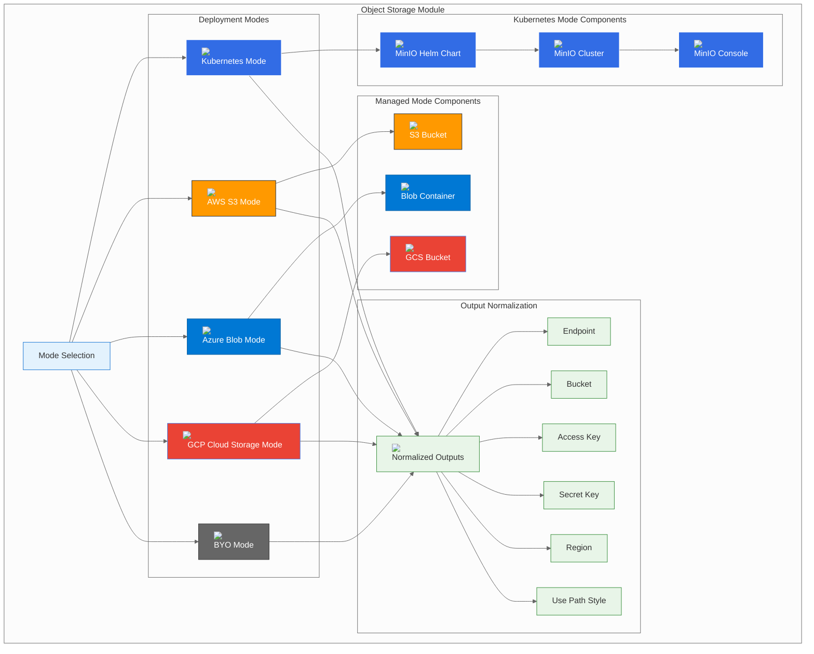

# Object Storage Module

## Overview

The Object Storage module provides a unified interface for deploying object storage across multiple platforms and deployment modes. It supports the three-mode pattern: Kubernetes-native (MinIO), managed cloud services, and Bring Your Own (BYO) external storage.

## Module Architecture



## Configuration Options

### Mode Selection

The module supports five deployment modes:

| Mode | Description | Use Case |
|------|-------------|----------|
| **k8s** | Kubernetes-native deployment using MinIO | Development, testing, or when you want full control |
| **aws** | AWS S3 managed service | Production environments requiring high availability |
| **azure** | Azure Blob Storage managed service | Production environments on Azure |
| **gcp** | Google Cloud Storage managed service | Production environments on GCP |
| **byo** | Bring Your Own S3-compatible storage | Enterprise environments with existing infrastructure |

### Common Configuration

```hcl
module "object_storage" {
  source = "./deps/object_storage"
  
  mode             = "k8s"                    # Deployment mode
  namespace        = "btp-deps"              # Kubernetes namespace
  manage_namespace = true                    # Whether to manage the namespace
  base_domain      = "btp.example.com"       # Base domain for ingress
  
  # Provider-specific configurations
  k8s   = {...}   # Kubernetes configuration
  aws   = {...}   # AWS configuration
  azure = {...}   # Azure configuration
  gcp   = {...}   # GCP configuration
  byo   = {...}   # BYO configuration
}
```

## Deployment Modes

### Kubernetes Mode (k8s)

Deploys MinIO using the official MinIO Helm chart for Kubernetes-native object storage.

#### Features
- **High Availability**: Multi-replica MinIO cluster with erasure coding
- **S3 Compatibility**: Full S3 API compatibility
- **Web Console**: Built-in web-based management console
- **Security**: Access keys, bucket policies, and TLS encryption
- **Monitoring**: Prometheus metrics and health checks

#### Configuration
```hcl
object_storage = {
  mode = "k8s"
  k8s = {
    namespace      = "btp-deps"
    chart_version  = "14.6.7"
    release_name   = "minio"
    default_bucket = "btp-artifacts"
    
    # Access credentials
    access_key = "minioadmin"
    secret_key = "minioadmin123456789012"
    
    # High Availability
    mode = "distributed"
    replicas = 4  # Minimum 4 for erasure coding
    
    # Persistence
    persistence = {
      enabled = true
      size    = "50Gi"
      storageClass = "gp2"
    }
    
    # Security
    auth = {
      rootUser     = "minioadmin"
      rootPassword = "minioadmin123456789012"
    }
    
    # TLS Configuration
    tls = {
      enabled = true
    }
    
    # Ingress configuration
    ingress = {
      enabled = true
      hosts = ["minio.btp.example.com"]
      tls = [{
        secretName = "minio-tls"
        hosts = ["minio.btp.example.com"]
      }]
    }
    
    # Custom values
    values = {
      resources = {
        requests = {
          memory = "256Mi"
          cpu    = "250m"
        }
        limits = {
          memory = "512Mi"
          cpu    = "500m"
        }
      }
      
      # MinIO configuration
      defaultBuckets = "btp-artifacts"
      defaultBucketPolicy = "download"
    }
  }
}
```

#### MinIO Distributed Mode
```hcl
object_storage = {
  mode = "k8s"
  k8s = {
    mode = "distributed"
    replicas = 6  # 6 nodes for better erasure coding
    
    # Storage configuration
    persistence = {
      enabled = true
      size    = "100Gi"
      storageClass = "gp2"
    }
    
    # Erasure coding
    values = {
      erasureSetDriveCount = 6
      erasureSetSize       = 6
    }
  }
}
```

### AWS Mode (aws)

Deploys object storage using AWS S3 managed service.

#### Features
- **Managed Service**: Fully managed S3 with 99.999999999% durability
- **High Availability**: Multi-AZ deployment with automatic replication
- **Security**: VPC isolation, encryption at rest and in transit, IAM policies
- **Monitoring**: CloudWatch integration with detailed metrics
- **Lifecycle Management**: Automated lifecycle policies and transitions

#### Configuration
```hcl
object_storage = {
  mode = "aws"
  aws = {
    bucket_name        = "btp-artifacts"
    region             = "us-east-1"
    versioning_enabled = true
    
    # Access credentials
    access_key = "AKIA..."  # IAM user access key
    secret_key = "..."      # IAM user secret key
    
    # Security
    server_side_encryption_configuration = {
      rule = {
        apply_server_side_encryption_by_default = {
          sse_algorithm = "AES256"
        }
      }
    }
    
    # Public access block
    public_access_block_configuration = {
      block_public_acls       = true
      block_public_policy     = true
      ignore_public_acls      = true
      restrict_public_buckets = true
    }
    
    # Lifecycle configuration
    lifecycle_rule = [{
      id     = "transition_to_ia"
      status = "Enabled"
      transition = [{
        days          = 30
        storage_class = "STANDARD_IA"
      }]
      expiration = {
        days = 365
      }
    }]
    
    # CORS configuration
    cors_rule = [{
      allowed_headers = ["*"]
      allowed_methods = ["GET", "PUT", "POST", "DELETE", "HEAD"]
      allowed_origins = ["https://btp.example.com"]
      expose_headers  = ["ETag"]
      max_age_seconds = 3000
    }]
    
    # Versioning and MFA delete
    versioning = {
      enabled = true
      mfa_delete = false
    }
  }
}
```

#### S3 with KMS Encryption
```hcl
object_storage = {
  mode = "aws"
  aws = {
    # KMS encryption
    server_side_encryption_configuration = {
      rule = {
        apply_server_side_encryption_by_default = {
          kms_master_key_id = "arn:aws:kms:us-east-1:123456789012:key/12345678-1234-1234-1234-123456789012"
          sse_algorithm     = "aws:kms"
        }
      }
    }
    
    # Bucket policy for KMS
    bucket_policy = jsonencode({
      Version = "2012-10-17"
      Statement = [{
        Sid    = "DenyInsecureConnections"
        Effect = "Deny"
        Principal = "*"
        Action = "s3:*"
        Resource = [
          "arn:aws:s3:::btp-artifacts",
          "arn:aws:s3:::btp-artifacts/*"
        ]
        Condition = {
          Bool = {
            "aws:SecureTransport" = "false"
          }
        }
      }]
    })
  }
}
```

### Azure Mode (azure)

Deploys object storage using Azure Blob Storage managed service.

#### Features
- **Managed Service**: Fully managed Blob Storage with 99.999999999% durability
- **High Availability**: Zone-redundant storage with automatic replication
- **Security**: VNet integration, encryption, and Azure AD integration
- **Monitoring**: Azure Monitor integration with comprehensive metrics
- **Lifecycle Management**: Automated lifecycle policies and tier transitions

#### Configuration
```hcl
object_storage = {
  mode = "azure"
  azure = {
    storage_account_name = "btpstorage"
    resource_group_name  = "btp-resources"
    location             = "East US"
    account_tier         = "Standard"
    replication_type     = "LRS"
    
    # Container configuration
    container_name = "btp-artifacts"
    container_access_type = "private"
    
    # Access credentials
    access_key = "..."  # Storage account access key
    
    # Security
    allow_nested_items_to_be_public = false
    shared_access_key_enabled       = true
    
    # Performance
    account_kind = "StorageV2"
    access_tier  = "Hot"
    
    # Network rules
    network_rules = {
      default_action = "Deny"
      virtual_network_subnet_ids = ["/subscriptions/.../resourceGroups/.../providers/Microsoft.Network/virtualNetworks/.../subnets/..."]
      ip_rules = ["1.2.3.4"]
    }
    
    # Lifecycle management
    lifecycle_rule = [{
      name    = "archive_old_data"
      enabled = true
      expiration = {
        days = 365
      }
      transition = [{
        days          = 30
        storage_class = "COOL"
      }, {
        days          = 90
        storage_class = "ARCHIVE"
      }]
    }]
  }
}
```

#### Azure with Private Endpoint
```hcl
object_storage = {
  mode = "azure"
  azure = {
    # Private endpoint configuration
    private_endpoint = {
      name                = "btp-storage-pe"
      subnet_id          = "/subscriptions/.../resourceGroups/.../providers/Microsoft.Network/virtualNetworks/.../subnets/..."
      private_dns_zone_id = "/subscriptions/.../resourceGroups/.../providers/Microsoft.Network/privateDnsZones/privatelink.blob.core.windows.net"
    }
    
    # Network rules
    network_rules = {
      default_action = "Deny"
      bypass         = ["AzureServices"]
    }
  }
}
```

### GCP Mode (gcp)

Deploys object storage using Google Cloud Storage managed service.

#### Features
- **Managed Service**: Fully managed Cloud Storage with 99.999999999% durability
- **High Availability**: Multi-regional storage with automatic replication
- **Security**: VPC-native connectivity, encryption, and IAM integration
- **Monitoring**: Cloud Monitoring integration with detailed metrics
- **Lifecycle Management**: Automated lifecycle policies and storage class transitions

#### Configuration
```hcl
object_storage = {
  mode = "gcp"
  gcp = {
    bucket_name   = "btp-artifacts"
    location      = "US"
    storage_class = "STANDARD"
    
    # Access credentials
    access_key = "GOOG..."  # HMAC access key
    secret_key = "..."      # HMAC secret key
    
    # Security
    uniform_bucket_level_access = true
    public_access_prevention    = "enforced"
    
    # Versioning and lifecycle
    versioning_enabled = true
    lifecycle_rule = [{
      action = {
        type = "Delete"
      }
      condition = {
        age = 365
      }
    }, {
      action = {
        type = "SetStorageClass"
        storage_class = "NEARLINE"
      }
      condition = {
        age = 30
      }
    }]
    
    # CORS configuration
    cors = [{
      origin          = ["https://btp.example.com"]
      method          = ["GET", "HEAD", "PUT", "POST", "DELETE"]
      response_header = ["*"]
      max_age_seconds = 3600
    }]
    
    # Encryption
    encryption = {
      default_kms_key_name = "projects/your-project/locations/us-central1/keyRings/btp-ring/cryptoKeys/btp-key"
    }
  }
}
```

#### GCP with Custom IAM
```hcl
object_storage = {
  mode = "gcp"
  gcp = {
    # IAM bindings
    iam_bindings = [{
      role = "roles/storage.objectViewer"
      members = ["serviceAccount:btp-service@your-project.iam.gserviceaccount.com"]
    }, {
      role = "roles/storage.objectCreator"
      members = ["serviceAccount:btp-service@your-project.iam.gserviceaccount.com"]
    }]
    
    # Bucket policy
    bucket_policy_only = true
  }
}
```

### BYO Mode (byo)

Connects to an existing S3-compatible object storage service.

#### Features
- **External Storage**: Connect to existing S3-compatible storage
- **Flexible Configuration**: Support for various S3-compatible services
- **Network Integration**: Works with any network-accessible storage
- **Security**: Supports access keys and TLS encryption

#### Configuration
```hcl
object_storage = {
  mode = "byo"
  byo = {
    endpoint = "https://s3.yourcompany.com"  # S3-compatible endpoint
    bucket   = "btp-artifacts"
    region   = "us-east-1"
    
    # Access credentials
    access_key = "your-access-key"
    secret_key = "your-secret-key"
    
    # S3 compatibility settings
    use_path_style = false  # true for MinIO/Ceph, false for AWS S3
    
    # TLS configuration
    force_path_style = false
    s3_force_path_style = false
  }
}
```

#### MinIO Configuration (BYO)
```hcl
object_storage = {
  mode = "byo"
  byo = {
    endpoint = "https://minio.yourcompany.com"
    bucket   = "btp-artifacts"
    region   = "us-east-1"
    
    access_key = "your-minio-access-key"
    secret_key = "your-minio-secret-key"
    
    # MinIO specific settings
    use_path_style = true  # Required for MinIO
  }
}
```

#### Ceph RGW Configuration (BYO)
```hcl
object_storage = {
  mode = "byo"
  byo = {
    endpoint = "https://ceph-rgw.yourcompany.com"
    bucket   = "btp-artifacts"
    region   = "default"
    
    access_key = "your-ceph-access-key"
    secret_key = "your-ceph-secret-key"
    
    # Ceph specific settings
    use_path_style = true  # Required for Ceph RGW
  }
}
```

## Output Variables

### Normalized Outputs

The module provides consistent outputs regardless of the deployment mode:

```hcl
output "endpoint" {
  description = "Object storage endpoint URL"
  value       = local.endpoint
}

output "bucket" {
  description = "Object storage bucket name"
  value       = local.bucket
}

output "access_key" {
  description = "Object storage access key"
  value       = local.access_key
  sensitive   = true
}

output "secret_key" {
  description = "Object storage secret key"
  value       = local.secret_key
  sensitive   = true
}

output "region" {
  description = "Object storage region"
  value       = local.region
}

output "use_path_style" {
  description = "Whether to use path-style URLs"
  value       = local.use_path_style
}
```

### Output Values by Mode

| Mode | Endpoint | Bucket | Region | Use Path Style |
|------|----------|--------|--------|----------------|
| **k8s** | `http://minio.btp-deps.svc.cluster.local:9000` | `btp-artifacts` | `us-east-1` | `true` |
| **aws** | `https://s3.us-east-1.amazonaws.com` | `btp-artifacts` | `us-east-1` | `false` |
| **azure** | `https://btpstorage.blob.core.windows.net` | `btp-artifacts` | `East US` | `true` |
| **gcp** | `https://storage.googleapis.com` | `btp-artifacts` | `US` | `false` |
| **byo** | `https://s3.yourcompany.com` | `btp-artifacts` | `us-east-1` | `true` |

## Security Considerations

### Network Security

#### Kubernetes Mode
```yaml
# Network Policy Example
apiVersion: networking.k8s.io/v1
kind: NetworkPolicy
metadata:
  name: minio-network-policy
  namespace: btp-deps
spec:
  podSelector:
    matchLabels:
      app: minio
  policyTypes:
  - Ingress
  ingress:
  - from:
    - namespaceSelector:
        matchLabels:
          name: settlemint
    ports:
    - protocol: TCP
      port: 9000
    - protocol: TCP
      port: 9001  # Console
```

#### Managed Services
- **AWS**: VPC isolation, security groups, encrypted storage
- **Azure**: VNet integration, private endpoints, encrypted storage
- **GCP**: VPC-native connectivity, private IP, encrypted storage

### Authentication and Authorization

#### Access Key Management
```bash
# Create access key (MinIO)
mc admin user add minio btp-user secure-password

# Create access key policy
mc admin policy create minio btp-policy /path/to/policy.json

# Attach policy to user
mc admin policy attach minio btp-policy --user btp-user
```

#### Bucket Policies
```json
{
  "Version": "2012-10-17",
  "Statement": [
    {
      "Sid": "AllowBTPAccess",
      "Effect": "Allow",
      "Principal": {
        "AWS": "arn:aws:iam::account:user/btp-user"
      },
      "Action": [
        "s3:GetObject",
        "s3:PutObject",
        "s3:DeleteObject"
      ],
      "Resource": "arn:aws:s3:::btp-artifacts/*"
    },
    {
      "Sid": "AllowBTPListBucket",
      "Effect": "Allow",
      "Principal": {
        "AWS": "arn:aws:iam::account:user/btp-user"
      },
      "Action": "s3:ListBucket",
      "Resource": "arn:aws:s3:::btp-artifacts"
    }
  ]
}
```

### Encryption

#### At Rest
- **Kubernetes**: Use encrypted storage classes
- **AWS**: S3 encryption at rest (AES-256 or KMS)
- **Azure**: Blob Storage encryption at rest
- **GCP**: Cloud Storage encryption at rest

#### In Transit
- **All Modes**: TLS encryption for all connections
- **Certificate Management**: Automated certificate rotation

## Performance Optimization

### Caching Strategies

#### CDN Integration
```hcl
# AWS CloudFront
resource "aws_cloudfront_distribution" "btp_storage" {
  origin {
    domain_name = aws_s3_bucket.btp_artifacts.bucket_regional_domain_name
    origin_id   = "S3-btp-artifacts"
    
    s3_origin_config {
      origin_access_identity = aws_cloudfront_origin_access_identity.btp_storage.cloudfront_access_identity_path
    }
  }
  
  default_cache_behavior {
    target_origin_id = "S3-btp-artifacts"
    viewer_protocol_policy = "redirect-to-https"
    cache_policy_id = "4135ea2d-6df8-44a3-9df3-4b5a84be39ad"  # CachingOptimized
  }
}
```

#### Local Caching
```python
# Python example with local caching
import boto3
from functools import lru_cache

@lru_cache(maxsize=128)
def get_s3_object(bucket, key):
    s3 = boto3.client('s3')
    return s3.get_object(Bucket=bucket, Key=key)

# Use cached S3 objects
data = get_s3_object('btp-artifacts', 'important-file.json')
```

### Transfer Optimization

#### Multipart Uploads
```python
# Python example with multipart upload
import boto3
from boto3.s3.transfer import TransferConfig

s3 = boto3.client('s3')
config = TransferConfig(
    multipart_threshold=1024 * 25,  # 25MB
    max_concurrency=10,
    multipart_chunksize=1024 * 25,
    use_threads=True
)

s3.upload_file(
    'large-file.zip',
    'btp-artifacts',
    'large-file.zip',
    Config=config
)
```

#### Compression
```python
# Python example with compression
import gzip
import boto3

# Compress data before upload
data = "large text data".encode('utf-8')
compressed_data = gzip.compress(data)

s3 = boto3.client('s3')
s3.put_object(
    Bucket='btp-artifacts',
    Key='compressed-data.gz',
    Body=compressed_data,
    ContentEncoding='gzip'
)
```

## Monitoring and Observability

### Metrics Collection

#### Kubernetes Mode
```yaml
# ServiceMonitor for Prometheus
apiVersion: monitoring.coreos.com/v1
kind: ServiceMonitor
metadata:
  name: minio-monitor
  namespace: btp-deps
spec:
  selector:
    matchLabels:
      app: minio
  endpoints:
  - port: minio
    path: /minio/v2/metrics/cluster
```

#### Key Metrics to Monitor
- **Storage Usage**: `minio_disk_usage_total`
- **Request Rate**: `minio_requests_total`
- **Error Rate**: `minio_errors_total`
- **Response Time**: `minio_request_duration_seconds`
- **Bucket Size**: `minio_bucket_usage_total`

### Health Checks

#### Kubernetes Mode
```yaml
# Liveness and Readiness Probes
livenessProbe:
  httpGet:
    path: /minio/health/live
    port: 9000
  initialDelaySeconds: 30
  periodSeconds: 10

readinessProbe:
  httpGet:
    path: /minio/health/ready
    port: 9000
  initialDelaySeconds: 5
  periodSeconds: 5
```

#### Custom Health Checks
```bash
# Check MinIO health
curl -f http://minio.btp-deps.svc.cluster.local:9000/minio/health/live

# Check S3 connectivity
aws s3 ls s3://btp-artifacts

# Check bucket access
aws s3api head-bucket --bucket btp-artifacts
```

## Backup and Recovery

### Backup Strategies

#### Kubernetes Mode
```yaml
# Backup CronJob
apiVersion: batch/v1
kind: CronJob
metadata:
  name: minio-backup
  namespace: btp-deps
spec:
  schedule: "0 2 * * *"  # Daily at 2 AM
  jobTemplate:
    spec:
      template:
        spec:
          containers:
          - name: minio-backup
            image: minio/mc:latest
            command:
            - /bin/bash
            - -c
            - |
              mc alias set local http://minio:9000 $MINIO_ROOT_USER $MINIO_ROOT_PASSWORD
              mc mirror local/btp-artifacts /backup/btp-artifacts-$(date +%Y%m%d)
            env:
            - name: MINIO_ROOT_USER
              valueFrom:
                secretKeyRef:
                  name: minio
                  key: root-user
            - name: MINIO_ROOT_PASSWORD
              valueFrom:
                secretKeyRef:
                  name: minio
                  key: root-password
            volumeMounts:
            - name: backup-volume
              mountPath: /backup
          volumes:
          - name: backup-volume
            persistentVolumeClaim:
              claimName: minio-backup-pvc
```

#### Managed Services
- **AWS**: S3 Cross-Region Replication and versioning
- **Azure**: Blob Storage replication and versioning
- **GCP**: Cloud Storage replication and versioning

### Recovery Procedures

#### Point-in-Time Recovery
```bash
# AWS S3 versioning recovery
aws s3api list-object-versions --bucket btp-artifacts --prefix important-file
aws s3api get-object --bucket btp-artifacts --key important-file --version-id version-id recovered-file

# Azure Blob versioning recovery
az storage blob download --account-name btpstorage --container-name btp-artifacts --name important-file --file recovered-file --version-id version-id

# GCP Cloud Storage versioning recovery
gsutil cp gs://btp-artifacts/important-file#version-id recovered-file
```

## Troubleshooting

### Common Issues

#### Connection Issues
```bash
# Test MinIO connectivity
kubectl run minio-test --rm -i --tty --image minio/mc:latest -- \
  mc alias set local http://minio.btp-deps.svc.cluster.local:9000 minioadmin minioadmin123456789012 && \
  mc ls local

# Test S3 connectivity
kubectl run s3-test --rm -i --tty --image amazon/aws-cli -- \
  aws s3 ls s3://btp-artifacts

# Check network connectivity
kubectl run network-test --rm -i --tty --image busybox -- \
  nc -zv minio.btp-deps.svc.cluster.local 9000
```

#### Permission Issues
```bash
# Check bucket permissions
aws s3api get-bucket-acl --bucket btp-artifacts
aws s3api get-bucket-policy --bucket btp-artifacts

# Test access with specific user
aws s3 ls s3://btp-artifacts --profile btp-user
```

#### Performance Issues
```bash
# Check MinIO performance
mc admin info local

# Check S3 performance
aws s3api get-bucket-metrics-configuration --bucket btp-artifacts --id EntireBucket

# Monitor network usage
kubectl top pods -n btp-deps
```

### Debug Commands

#### Kubernetes Mode
```bash
# Check MinIO logs
kubectl logs -n btp-deps deployment/minio

# Check MinIO status
kubectl exec -n btp-deps deployment/minio -- mc admin info local

# Check MinIO configuration
kubectl exec -n btp-deps deployment/minio -- mc config host list
```

#### Managed Services
```bash
# AWS S3
aws s3api get-bucket-location --bucket btp-artifacts
aws s3api get-bucket-versioning --bucket btp-artifacts
aws s3api get-bucket-encryption --bucket btp-artifacts

# Azure Blob
az storage account show --resource-group btp-resources --name btpstorage
az storage container show --account-name btpstorage --name btp-artifacts

# GCP Cloud Storage
gsutil ls -L -b gs://btp-artifacts
gsutil versioning get gs://btp-artifacts
```

## Best Practices

### 1. **Security**
- Use strong access keys and rotate them regularly
- Implement bucket policies and IAM policies
- Enable encryption at rest and in transit
- Use private endpoints for managed services

### 2. **Performance**
- Use appropriate storage classes for different data types
- Implement CDN for frequently accessed content
- Use multipart uploads for large files
- Monitor and optimize request patterns

### 3. **Cost Optimization**
- Implement lifecycle policies for automatic transitions
- Use appropriate storage classes (Standard, IA, Glacier)
- Monitor storage usage and costs
- Implement data archiving strategies

### 4. **Backup and Recovery**
- Enable versioning for critical data
- Implement cross-region replication
- Test recovery procedures regularly
- Document backup and recovery procedures

### 5. **Monitoring**
- Set up comprehensive monitoring and alerting
- Monitor key performance metrics
- Track storage usage and costs
- Regular health checks

## Next Steps

- [OAuth Module](15-oauth-module.md) - OAuth/Identity provider module documentation
- [Secrets Module](16-secrets-module.md) - Secrets management module documentation
- [Observability Module](17-observability-module.md) - Observability stack module documentation
- [Operations Guide](18-operations.md) - Day-to-day operations

---

*This Object Storage module documentation provides comprehensive guidance for deploying and managing object storage across all supported platforms and deployment modes. The three-mode pattern ensures consistency while providing flexibility for different deployment scenarios.*
