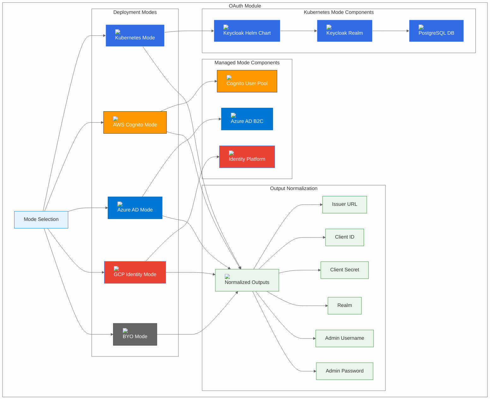

# OAuth Module

## Overview

The OAuth module provides a unified interface for deploying OAuth/Identity providers across multiple platforms and deployment modes. It supports the three-mode pattern: Kubernetes-native (Keycloak), managed cloud services, and Bring Your Own (BYO) external identity providers.

## Module Architecture



## Configuration Options

### Mode Selection

The module supports five deployment modes:

| Mode | Description | Use Case |
|------|-------------|----------|
| **k8s** | Kubernetes-native deployment using Keycloak | Development, testing, or when you want full control |
| **aws** | AWS Cognito User Pool managed service | Production environments requiring AWS integration |
| **azure** | Azure AD B2C managed service | Production environments on Azure |
| **gcp** | Google Identity Platform managed service | Production environments on GCP |
| **byo** | Bring Your Own external OIDC provider | Enterprise environments with existing identity infrastructure |

### Common Configuration

```hcl
module "oauth" {
  source = "./deps/oauth"
  
  mode             = "k8s"                    # Deployment mode
  namespace        = "btp-deps"              # Kubernetes namespace
  manage_namespace = true                    # Whether to manage the namespace
  base_domain      = "btp.example.com"       # Base domain for ingress
  
  # Provider-specific configurations
  k8s   = {...}   # Kubernetes configuration
  aws   = {...}   # AWS configuration
  azure = {...}   # Azure configuration
  gcp   = {...}   # GCP configuration
  byo   = {...}   # BYO configuration
}
```

## Deployment Modes

### Kubernetes Mode (k8s)

Deploys Keycloak using the official Keycloak Helm chart for Kubernetes-native identity management.

#### Features
- **Full OIDC/OAuth2 Support**: Complete OpenID Connect and OAuth2 implementation
- **Multi-Realm Support**: Multiple realms for different applications
- **User Management**: Built-in user management and administration
- **Social Login**: Support for social identity providers
- **Custom Themes**: Customizable login themes and branding
- **Database Backend**: PostgreSQL database for user data storage

#### Configuration
```hcl
oauth = {
  mode = "k8s"
  k8s = {
    namespace      = "btp-deps"
    chart_version  = "23.0.0"
    release_name   = "keycloak"
    realm_name     = "btp"
    
    # Admin credentials
    admin_username = "admin"
    admin_password = "secure-admin-password"
    
    # Database configuration
    database = {
      type     = "postgresql"
      host     = "postgres.btp-deps.svc.cluster.local"
      port     = 5432
      database = "keycloak"
      username = "keycloak"
      password = "secure-keycloak-db-password"
    }
    
    # High Availability
    replica_count = 2
    
    # Persistence
    persistence = {
      enabled = true
      size    = "10Gi"
      storageClass = "gp2"
    }
    
    # Ingress configuration
    ingress = {
      enabled = true
      hosts = ["auth.btp.example.com"]
      tls = [{
        secretName = "keycloak-tls"
        hosts = ["auth.btp.example.com"]
      }]
    }
    
    # Custom values
    values = {
      resources = {
        requests = {
          memory = "512Mi"
          cpu    = "500m"
        }
        limits = {
          memory = "1Gi"
          cpu    = "1000m"
        }
      }
      
      # Keycloak configuration
      extraEnvVars = [
        {
          name = "KC_HEALTH_ENABLED"
          value = "true"
        },
        {
          name = "KC_METRICS_ENABLED"
          value = "true"
        }
      ]
    }
  }
}
```

#### Keycloak with External Database
```hcl
oauth = {
  mode = "k8s"
  k8s = {
    # External PostgreSQL database
    database = {
      type     = "postgresql"
      host     = "external-postgres.company.com"
      port     = 5432
      database = "keycloak"
      username = "keycloak"
      password = "secure-external-db-password"
    }
    
    # Disable built-in database
    postgresql = {
      enabled = false
    }
  }
}
```

#### Keycloak with Custom Theme
```hcl
oauth = {
  mode = "k8s"
  k8s = {
    # Custom theme configuration
    values = {
      extraVolumes = [{
        name = "custom-theme"
        configMap = {
          name = "keycloak-custom-theme"
        }
      }]
      
      extraVolumeMounts = [{
        name = "custom-theme"
        mountPath = "/opt/keycloak/themes/custom"
      }]
      
      # Enable custom theme
      extraEnvVars = [
        {
          name = "KC_SPI_THEME_STATIC_MAX_AGE"
          value = "2592000"
        }
      ]
    }
  }
}
```

### AWS Mode (aws)

Deploys OAuth using AWS Cognito User Pool managed service.

#### Features
- **Managed Service**: Fully managed OAuth/OIDC service
- **User Pools**: Built-in user management and authentication
- **Social Login**: Support for social identity providers
- **MFA Support**: Multi-factor authentication options
- **Custom Domains**: Custom domain support for hosted UI
- **Lambda Triggers**: Custom authentication flows

#### Configuration
```hcl
oauth = {
  mode = "aws"
  aws = {
    user_pool_name = "btp-users"
    region         = "us-east-1"
    
    # User pool configuration
    username_attributes      = ["email"]
    auto_verified_attributes = ["email"]
    mfa_configuration        = "OPTIONAL"
    
    # Password policy
    password_policy = {
      minimum_length    = 8
      require_lowercase = true
      require_uppercase = true
      require_numbers   = true
      require_symbols   = true
    }
    
    # User pool client
    client_name = "btp-client"
    client_settings = {
      generate_secret = true
      explicit_auth_flows = [
        "ALLOW_USER_PASSWORD_AUTH",
        "ALLOW_USER_SRP_AUTH",
        "ALLOW_REFRESH_TOKEN_AUTH"
      ]
      supported_identity_providers = ["COGNITO"]
      callback_urls = [
        "https://btp.example.com/auth/callback",
        "http://localhost:3000/auth/callback"
      ]
      logout_urls = [
        "https://btp.example.com/auth/logout",
        "http://localhost:3000/auth/logout"
      ]
    }
    
    # Custom domain
    domain = "auth.btp.example.com"
    
    # Social identity providers
    identity_providers = [{
      provider_name = "Google"
      provider_type = "Google"
      provider_details = {
        client_id     = "your-google-client-id"
        client_secret = "your-google-client-secret"
        authorize_scopes = "email openid profile"
      }
      attribute_mapping = {
        email = "email"
        username = "sub"
      }
    }]
    
    # User pool groups
    user_pool_groups = [{
      name = "btp-users"
      description = "BTP platform users"
      precedence = 1
    }]
  }
}
```

#### Cognito with SAML Identity Provider
```hcl
oauth = {
  mode = "aws"
  aws = {
    # SAML identity provider
    identity_providers = [{
      provider_name = "SAML"
      provider_type = "SAML"
      provider_details = {
        MetadataURL = "https://your-saml-provider.com/metadata"
        IDPSignout = "true"
      }
      attribute_mapping = {
        email = "http://schemas.xmlsoap.org/ws/2005/05/identity/claims/emailaddress"
        username = "http://schemas.xmlsoap.org/ws/2005/05/identity/claims/name"
      }
    }]
  }
}
```

### Azure Mode (azure)

Deploys OAuth using Azure AD B2C managed service.

#### Features
- **Managed Service**: Fully managed OAuth/OIDC service
- **User Flows**: Customizable user authentication flows
- **Social Login**: Support for social identity providers
- **Custom Policies**: Advanced custom policies for complex scenarios
- **Multi-Tenant**: Support for multiple tenants
- **Conditional Access**: Advanced conditional access policies

#### Configuration
```hcl
oauth = {
  mode = "azure"
  azure = {
    tenant_name = "btp-tenant"
    location    = "East US"
    
    # B2C tenant configuration
    sku_name = "PremiumP1"
    
    # User flows
    user_flows = [{
      name = "B2C_1_signup_signin"
      type = "signUpOrSignIn"
      user_flow_type = "signUpOrSignIn"
      
      # Social identity providers
      identity_providers = [{
        name = "Google"
        type = "Google"
        client_id = "your-google-client-id"
        client_secret = "your-google-client-secret"
      }]
      
      # User attributes
      user_attributes = [
        "displayName",
        "givenName",
        "surname",
        "email"
      ]
      
      # Application claims
      application_claims = [
        "displayName",
        "givenName",
        "surname",
        "email"
      ]
    }]
    
    # Application registration
    application_registration = {
      display_name = "BTP Application"
      sign_in_audience = "AzureADandPersonalMicrosoftAccount"
      
      # Redirect URIs
      redirect_uris = [
        "https://btp.example.com/auth/callback",
        "http://localhost:3000/auth/callback"
      ]
      
      # API permissions
      api_permissions = [
        "openid",
        "profile",
        "email"
      ]
    }
    
    # Custom domain
    custom_domain = "auth.btp.example.com"
  }
}
```

#### Azure AD B2C with Custom Policies
```hcl
oauth = {
  mode = "azure"
  azure = {
    # Custom policies
    custom_policies = [{
      name = "B2C_1A_signup_signin_custom"
      type = "TrustFrameworkPolicy"
      
      # Policy configuration
      policy_content = file("${path.module}/policies/signup-signin-custom.xml")
      
      # Social identity providers
      identity_providers = [{
        name = "Google"
        type = "Google"
        client_id = "your-google-client-id"
        client_secret = "your-google-client-secret"
      }]
    }]
  }
}
```

### GCP Mode (gcp)

Deploys OAuth using Google Identity Platform managed service.

#### Features
- **Managed Service**: Fully managed OAuth/OIDC service
- **Multi-Provider**: Support for multiple identity providers
- **Social Login**: Built-in social identity providers
- **Custom Claims**: Custom user claims and attributes
- **Multi-Tenant**: Support for multiple tenants
- **Advanced Security**: Advanced security features and policies

#### Configuration
```hcl
oauth = {
  mode = "gcp"
  gcp = {
    project_id = "your-project-id"
    region     = "us-central1"
    
    # Identity Platform configuration
    identity_platform = {
      enabled = true
      
      # Multi-factor authentication
      mfa_config = {
        enabled_providers = ["PHONE_SMS", "PHONE_CALL"]
        provider_configs = [{
          state = "ENABLED"
          totp_provider_config = {
            adjacent_intervals = 5
          }
        }]
      }
      
      # Blocking functions
      blocking_functions = {
        triggers = [{
          event_type = "beforeSignIn"
          function_uri = "https://us-central1-your-project.cloudfunctions.net/beforeSignIn"
        }]
      }
    }
    
    # OAuth consent screen
    oauth_consent_screen = {
      user_type = "EXTERNAL"
      consent_screen_config = {
        application_name = "BTP Platform"
        user_support_email = "support@btp.example.com"
        developer_contact_information = "admin@btp.example.com"
        privacy_policy_link = "https://btp.example.com/privacy"
        terms_of_service_link = "https://btp.example.com/terms"
      }
    }
    
    # OAuth client
    oauth_client = {
      display_name = "BTP Client"
      authorized_redirect_uris = [
        "https://btp.example.com/auth/callback",
        "http://localhost:3000/auth/callback"
      ]
      authorized_javascript_origins = [
        "https://btp.example.com",
        "http://localhost:3000"
      ]
    }
    
    # Identity providers
    identity_providers = [{
      provider_id = "google.com"
      display_name = "Google"
      enabled = true
      client_id = "your-google-client-id"
      client_secret = "your-google-client-secret"
    }]
  }
}
```

#### GCP with Custom Claims
```hcl
oauth = {
  mode = "gcp"
  gcp = {
    # Custom claims
    custom_claims = [{
      name = "role"
      value = "user"
    }, {
      name = "department"
      value = "engineering"
    }]
    
    # Blocking functions for custom claims
    blocking_functions = {
      triggers = [{
        event_type = "beforeSignIn"
        function_uri = "https://us-central1-your-project.cloudfunctions.net/addCustomClaims"
      }]
    }
  }
}
```

### BYO Mode (byo)

Connects to an existing OIDC-compatible identity provider.

#### Features
- **External Provider**: Connect to existing OIDC provider
- **Flexible Configuration**: Support for various OIDC providers
- **Network Integration**: Works with any network-accessible provider
- **Custom Claims**: Support for custom user claims

#### Configuration
```hcl
oauth = {
  mode = "byo"
  byo = {
    issuer_url = "https://auth.yourcompany.com/realms/btp"
    client_id = "btp-client"
    client_secret = "your-client-secret"
    realm = "btp"
    
    # Admin credentials for user management
    admin_username = "admin"
    admin_password = "admin-password"
    
    # OIDC configuration
    oidc_config = {
      authorization_endpoint = "https://auth.yourcompany.com/realms/btp/protocol/openid-connect/auth"
      token_endpoint = "https://auth.yourcompany.com/realms/btp/protocol/openid-connect/token"
      userinfo_endpoint = "https://auth.yourcompany.com/realms/btp/protocol/openid-connect/userinfo"
      jwks_uri = "https://auth.yourcompany.com/realms/btp/protocol/openid-connect/certs"
    }
    
    # Custom claims mapping
    claims_mapping = {
      email = "email"
      name = "name"
      preferred_username = "preferred_username"
      groups = "groups"
    }
  }
}
```

#### Keycloak Configuration (BYO)
```hcl
oauth = {
  mode = "byo"
  byo = {
    issuer_url = "https://keycloak.yourcompany.com/realms/btp"
    client_id = "btp-client"
    client_secret = "your-keycloak-client-secret"
    realm = "btp"
    
    admin_username = "admin"
    admin_password = "keycloak-admin-password"
    
    # Keycloak specific configuration
    oidc_config = {
      authorization_endpoint = "https://keycloak.yourcompany.com/realms/btp/protocol/openid-connect/auth"
      token_endpoint = "https://keycloak.yourcompany.com/realms/btp/protocol/openid-connect/token"
      userinfo_endpoint = "https://keycloak.yourcompany.com/realms/btp/protocol/openid-connect/userinfo"
      jwks_uri = "https://keycloak.yourcompany.com/realms/btp/protocol/openid-connect/certs"
    }
  }
}
```

#### Okta Configuration (BYO)
```hcl
oauth = {
  mode = "byo"
  byo = {
    issuer_url = "https://your-company.okta.com/oauth2/default"
    client_id = "your-okta-client-id"
    client_secret = "your-okta-client-secret"
    realm = "default"
    
    # Okta specific configuration
    oidc_config = {
      authorization_endpoint = "https://your-company.okta.com/oauth2/default/v1/authorize"
      token_endpoint = "https://your-company.okta.com/oauth2/default/v1/token"
      userinfo_endpoint = "https://your-company.okta.com/oauth2/default/v1/userinfo"
      jwks_uri = "https://your-company.okta.com/oauth2/default/v1/keys"
    }
    
    # Okta claims mapping
    claims_mapping = {
      email = "email"
      name = "name"
      preferred_username = "preferred_username"
      groups = "groups"
    }
  }
}
```

## Output Variables

### Normalized Outputs

The module provides consistent outputs regardless of the deployment mode:

```hcl
output "issuer_url" {
  description = "OAuth issuer URL"
  value       = local.issuer_url
}

output "client_id" {
  description = "OAuth client ID"
  value       = local.client_id
}

output "client_secret" {
  description = "OAuth client secret"
  value       = local.client_secret
  sensitive   = true
}

output "realm" {
  description = "OAuth realm"
  value       = local.realm
}

output "admin_username" {
  description = "OAuth admin username"
  value       = local.admin_username
}

output "admin_password" {
  description = "OAuth admin password"
  value       = local.admin_password
  sensitive   = true
}
```

### Output Values by Mode

| Mode | Issuer URL | Client ID | Realm | Admin Username |
|------|------------|-----------|-------|----------------|
| **k8s** | `https://auth.btp.example.com/realms/btp` | `btp-client` | `btp` | `admin` |
| **aws** | `https://cognito-idp.us-east-1.amazonaws.com/us-east-1_XXXXXXXXX` | `cognito-client-id` | `us-east-1_XXXXXXXXX` | `cognito-admin` |
| **azure** | `https://btp-tenant.b2clogin.com/btp-tenant.onmicrosoft.com/v2.0` | `azure-client-id` | `btp-tenant.onmicrosoft.com` | `azure-admin` |
| **gcp** | `https://securetoken.google.com/your-project-id` | `gcp-client-id` | `your-project-id` | `gcp-admin` |
| **byo** | `https://auth.yourcompany.com/realms/btp` | `btp-client` | `btp` | `admin` |

## Security Considerations

### Network Security

#### Kubernetes Mode
```yaml
# Network Policy Example
apiVersion: networking.k8s.io/v1
kind: NetworkPolicy
metadata:
  name: keycloak-network-policy
  namespace: btp-deps
spec:
  podSelector:
    matchLabels:
      app: keycloak
  policyTypes:
  - Ingress
  ingress:
  - from:
    - namespaceSelector:
        matchLabels:
          name: settlemint
    ports:
    - protocol: TCP
      port: 8080
```

#### Managed Services
- **AWS**: VPC isolation, security groups, encrypted storage
- **Azure**: VNet integration, private endpoints, encrypted storage
- **GCP**: VPC-native connectivity, private IP, encrypted storage

### Authentication and Authorization

#### Client Configuration
```bash
# Keycloak client configuration
kcadm.sh create clients -r btp -s clientId=btp-client -s enabled=true -s clientAuthenticatorType=client-secret -s secret=your-client-secret

# Set client redirect URIs
kcadm.sh update clients/btp-client-id -r btp -s 'redirectUris=["https://btp.example.com/auth/callback"]'

# Configure client scopes
kcadm.sh create client-scopes -r btp -s name=btp-scope -s protocol=openid-connect
kcadm.sh create clients/btp-client-id/optional-client-scopes/btp-scope -r btp
```

#### User Management
```bash
# Create user in Keycloak
kcadm.sh create users -r btp -s username=btp-user -s enabled=true -s email=user@example.com

# Set user password
kcadm.sh set-password -r btp --username btp-user --new-password secure-password

# Assign user to group
kcadm.sh create users/btp-user-id/groups/btp-users -r btp
```

### Encryption

#### At Rest
- **Kubernetes**: Use encrypted storage classes
- **AWS**: Cognito encryption at rest
- **Azure**: AD B2C encryption at rest
- **GCP**: Identity Platform encryption at rest

#### In Transit
- **All Modes**: TLS encryption for all connections
- **Certificate Management**: Automated certificate rotation

## Performance Optimization

### Caching Strategies

#### Redis Caching
```hcl
oauth = {
  mode = "k8s"
  k8s = {
    # Enable Redis caching
    values = {
      extraEnvVars = [
        {
          name = "KC_CACHE"
          value = "redis"
        },
        {
          name = "KC_CACHE_STACK"
          value = "redis"
        },
        {
          name = "KC_SPI_CACHE_DEFAULT"
          value = "redis"
        }
      ]
      
      # Redis configuration
      redis = {
        url = "redis://redis.btp-deps.svc.cluster.local:6379"
        password = "redis-password"
      }
    }
  }
}
```

#### Session Management
```hcl
oauth = {
  mode = "k8s"
  k8s = {
    # Session configuration
    values = {
      extraEnvVars = [
        {
          name = "KC_SPI_USER_SESSIONS"
          value = "redis"
        },
        {
          name = "KC_SPI_CLIENT_SESSIONS"
          value = "redis"
        }
      ]
    }
  }
}
```

### Database Optimization

#### Connection Pooling
```hcl
oauth = {
  mode = "k8s"
  k8s = {
    # Database connection pooling
    values = {
      extraEnvVars = [
        {
          name = "KC_DB_POOL_INITIAL_SIZE"
          value = "5"
        },
        {
          name = "KC_DB_POOL_MAX_SIZE"
          value = "20"
        },
        {
          name = "KC_DB_POOL_MIN_SIZE"
          value = "5"
        }
      ]
    }
  }
}
```

## Monitoring and Observability

### Metrics Collection

#### Kubernetes Mode
```yaml
# ServiceMonitor for Prometheus
apiVersion: monitoring.coreos.com/v1
kind: ServiceMonitor
metadata:
  name: keycloak-monitor
  namespace: btp-deps
spec:
  selector:
    matchLabels:
      app: keycloak
  endpoints:
  - port: http
    path: /realms/btp/metrics
```

#### Key Metrics to Monitor
- **Active Sessions**: `keycloak_active_sessions`
- **Login Attempts**: `keycloak_login_attempts_total`
- **Failed Logins**: `keycloak_failed_logins_total`
- **Token Issuance**: `keycloak_tokens_issued_total`
- **User Registrations**: `keycloak_user_registrations_total`

### Health Checks

#### Kubernetes Mode
```yaml
# Liveness and Readiness Probes
livenessProbe:
  httpGet:
    path: /realms/btp/.well-known/openid_configuration
    port: 8080
  initialDelaySeconds: 60
  periodSeconds: 30

readinessProbe:
  httpGet:
    path: /realms/btp/.well-known/openid_configuration
    port: 8080
  initialDelaySeconds: 30
  periodSeconds: 10
```

#### Custom Health Checks
```bash
# Check Keycloak health
curl -f https://auth.btp.example.com/realms/btp/.well-known/openid_configuration

# Check OIDC discovery
curl -f https://auth.btp.example.com/realms/btp/.well-known/openid_configuration | jq .

# Check user info endpoint
curl -H "Authorization: Bearer $ACCESS_TOKEN" https://auth.btp.example.com/realms/btp/protocol/openid-connect/userinfo
```

## Backup and Recovery

### Backup Strategies

#### Kubernetes Mode
```yaml
# Backup CronJob
apiVersion: batch/v1
kind: CronJob
metadata:
  name: keycloak-backup
  namespace: btp-deps
spec:
  schedule: "0 2 * * *"  # Daily at 2 AM
  jobTemplate:
    spec:
      template:
        spec:
          containers:
          - name: keycloak-backup
            image: keycloak:23.0.0
            command:
            - /bin/bash
            - -c
            - |
              kcadm.sh config credentials --server https://keycloak:8080 --realm master --user admin --password $ADMIN_PASSWORD
              kcadm.sh get realms/btp > /backup/btp-realm-$(date +%Y%m%d).json
            env:
            - name: ADMIN_PASSWORD
              valueFrom:
                secretKeyRef:
                  name: keycloak
                  key: admin-password
            volumeMounts:
            - name: backup-volume
              mountPath: /backup
          volumes:
          - name: backup-volume
            persistentVolumeClaim:
              claimName: keycloak-backup-pvc
```

#### Managed Services
- **AWS**: Cognito user pool backup and restore
- **Azure**: AD B2C tenant backup and restore
- **GCP**: Identity Platform backup and restore

### Recovery Procedures

#### Point-in-Time Recovery
```bash
# Keycloak realm recovery
kcadm.sh config credentials --server https://keycloak:8080 --realm master --user admin --password $ADMIN_PASSWORD
kcadm.sh create realms -f /backup/btp-realm-20240101.json

# AWS Cognito recovery
aws cognito-idp create-user-pool --user-pool-name btp-users-recovered --policies file://user-pool-policy.json

# Azure AD B2C recovery
az ad b2c tenant create --tenant-name btp-tenant-recovered --location "East US"
```

## Troubleshooting

### Common Issues

#### Connection Issues
```bash
# Test Keycloak connectivity
kubectl run keycloak-test --rm -i --tty --image curlimages/curl -- \
  curl -f https://auth.btp.example.com/realms/btp/.well-known/openid_configuration

# Test OIDC discovery
kubectl run oidc-test --rm -i --tty --image curlimages/curl -- \
  curl -f https://auth.btp.example.com/realms/btp/.well-known/openid_configuration | jq .

# Check network connectivity
kubectl run network-test --rm -i --tty --image busybox -- \
  nc -zv auth.btp.example.com 443
```

#### Authentication Issues
```bash
# Test token issuance
curl -X POST https://auth.btp.example.com/realms/btp/protocol/openid-connect/token \
  -H "Content-Type: application/x-www-form-urlencoded" \
  -d "grant_type=client_credentials&client_id=btp-client&client_secret=your-client-secret"

# Test user authentication
curl -X POST https://auth.btp.example.com/realms/btp/protocol/openid-connect/token \
  -H "Content-Type: application/x-www-form-urlencoded" \
  -d "grant_type=password&client_id=btp-client&client_secret=your-client-secret&username=btp-user&password=user-password"
```

#### Performance Issues
```bash
# Check Keycloak logs
kubectl logs -n btp-deps deployment/keycloak

# Check database connectivity
kubectl exec -n btp-deps deployment/keycloak -- kcadm.sh config credentials --server https://keycloak:8080 --realm master --user admin --password $ADMIN_PASSWORD

# Check Redis connectivity
kubectl exec -n btp-deps deployment/keycloak -- redis-cli -h redis.btp-deps.svc.cluster.local ping
```

### Debug Commands

#### Kubernetes Mode
```bash
# Check Keycloak logs
kubectl logs -n btp-deps deployment/keycloak

# Check Keycloak configuration
kubectl exec -n btp-deps deployment/keycloak -- kcadm.sh config credentials --server https://keycloak:8080 --realm master --user admin --password $ADMIN_PASSWORD

# Check realm configuration
kubectl exec -n btp-deps deployment/keycloak -- kcadm.sh get realms/btp
```

#### Managed Services
```bash
# AWS Cognito
aws cognito-idp describe-user-pool --user-pool-id us-east-1_XXXXXXXXX
aws cognito-idp describe-user-pool-client --user-pool-id us-east-1_XXXXXXXXX --client-id your-client-id

# Azure AD B2C
az ad b2c tenant show --tenant-name btp-tenant
az ad b2c application show --tenant-name btp-tenant --application-id your-app-id

# GCP Identity Platform
gcloud auth application-default login
gcloud identity platform oauth-clients list --project=your-project-id
```

## Best Practices

### 1. **Security**
- Use strong passwords and enable MFA
- Implement proper client authentication
- Use HTTPS for all connections
- Regular security updates and patches

### 2. **Performance**
- Enable caching for better performance
- Use connection pooling for database connections
- Monitor and optimize database queries
- Implement proper session management

### 3. **High Availability**
- Use multiple replicas for Kubernetes deployments
- Implement proper backup strategies
- Test failover procedures regularly
- Monitor replication lag and health

### 4. **Monitoring**
- Set up comprehensive monitoring and alerting
- Monitor key performance metrics
- Track authentication success/failure rates
- Regular health checks

### 5. **User Management**
- Implement proper user lifecycle management
- Use groups and roles for authorization
- Regular user access reviews
- Implement account lockout policies

## Next Steps

- [Secrets Module](16-secrets-module.md) - Secrets management module documentation
- [Observability Module](17-observability-module.md) - Observability stack module documentation
- [Operations Guide](18-operations.md) - Day-to-day operations
- [Security Guide](19-security.md) - Security best practices

---

*This OAuth module documentation provides comprehensive guidance for deploying and managing OAuth/Identity providers across all supported platforms and deployment modes. The three-mode pattern ensures consistency while providing flexibility for different deployment scenarios.*
