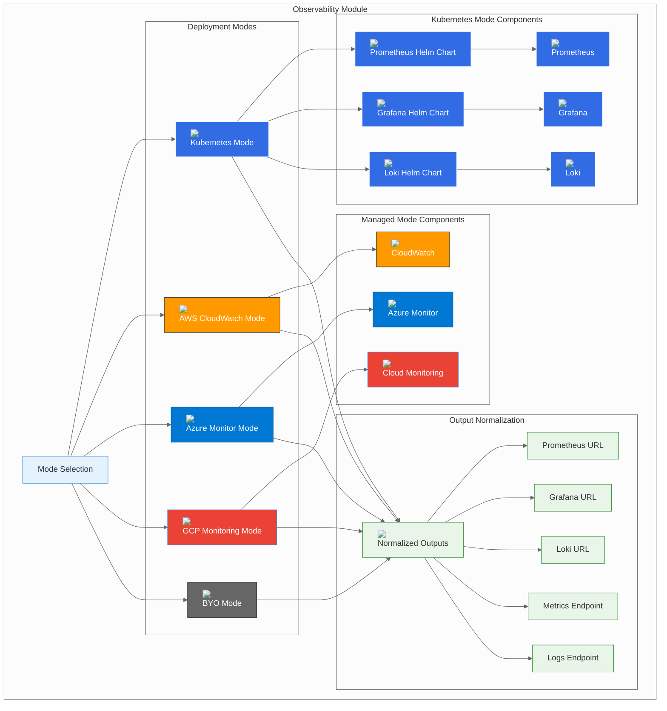

# Observability Module

## Overview

The Observability module provides a unified interface for deploying monitoring, logging, and observability solutions across multiple platforms and deployment modes. It supports the three-mode pattern: Kubernetes-native (Prometheus + Grafana + Loki), managed cloud services, and Bring Your Own (BYO) external observability.

## Module Architecture



## Configuration Options

### Mode Selection

The module supports five deployment modes:

| Mode | Description | Use Case |
|------|-------------|----------|
| **k8s** | Kubernetes-native deployment using Prometheus + Grafana + Loki | Development, testing, or when you want full control |
| **aws** | AWS CloudWatch managed service | Production environments requiring AWS integration |
| **azure** | Azure Monitor managed service | Production environments on Azure |
| **gcp** | Google Cloud Monitoring managed service | Production environments on GCP |
| **byo** | Bring Your Own external observability | Enterprise environments with existing observability infrastructure |

### Common Configuration

```hcl
module "metrics_logs" {
  source = "./deps/metrics_logs"
  
  mode             = "k8s"                    # Deployment mode
  namespace        = "btp-deps"              # Kubernetes namespace
  manage_namespace = true                    # Whether to manage the namespace
  base_domain      = "btp.example.com"       # Base domain for ingress
  
  # Provider-specific configurations
  k8s   = {...}   # Kubernetes configuration
  aws   = {...}   # AWS configuration
  azure = {...}   # Azure configuration
  gcp   = {...}   # GCP configuration
  byo   = {...}   # BYO configuration
}
```

## Deployment Modes

### Kubernetes Mode (k8s)

Deploys a complete observability stack using Prometheus, Grafana, and Loki Helm charts.

#### Features
- **Prometheus**: Metrics collection and alerting
- **Grafana**: Visualization and dashboards
- **Loki**: Log aggregation and querying
- **AlertManager**: Alert routing and notification
- **Service Discovery**: Automatic service discovery
- **Custom Dashboards**: Pre-built and custom dashboards

#### Configuration
```hcl
metrics_logs = {
  mode = "k8s"
  k8s = {
    namespace = "btp-deps"
    
    # Prometheus configuration
    prometheus = {
      chart_version = "25.8.2"
      release_name = "kube-prometheus-stack"
      
      # High Availability
      replica_count = 2
      
      # Persistence
      persistence = {
        enabled = true
        size = "50Gi"
        storageClass = "gp2"
      }
      
      # Ingress configuration
      ingress = {
        enabled = true
        hosts = ["prometheus.btp.example.com"]
        tls = [{
          secretName = "prometheus-tls"
          hosts = ["prometheus.btp.example.com"]
        }]
      }
      
      # Custom values
      values = {
        prometheus = {
          prometheusSpec = {
            resources = {
              requests = {
                memory = "512Mi"
                cpu = "500m"
              }
              limits = {
                memory = "1Gi"
                cpu = "1000m"
              }
            }
            
            # Retention
            retention = "30d"
            retentionSize = "50GB"
            
            # Service discovery
            serviceMonitorSelectorNilUsesHelmValues = false
            podMonitorSelectorNilUsesHelmValues = false
            ruleSelectorNilUsesHelmValues = false
          }
        }
        
        alertmanager = {
          alertmanagerSpec = {
            resources = {
              requests = {
                memory = "256Mi"
                cpu = "250m"
              }
              limits = {
                memory = "512Mi"
                cpu = "500m"
              }
            }
          }
        }
      }
    }
    
    # Grafana configuration
    grafana = {
      chart_version = "7.0.12"
      release_name = "grafana"
      
      # Admin credentials
      admin_user = "admin"
      admin_password = "secure-grafana-password"
      
      # Persistence
      persistence = {
        enabled = true
        size = "10Gi"
        storageClass = "gp2"
      }
      
      # Ingress configuration
      ingress = {
        enabled = true
        hosts = ["grafana.btp.example.com"]
        tls = [{
          secretName = "grafana-tls"
          hosts = ["grafana.btp.example.com"]
        }]
      }
      
      # Custom values
      values = {
        resources = {
          requests = {
            memory = "256Mi"
            cpu = "250m"
          }
          limits = {
            memory = "512Mi"
            cpu = "500m"
          }
        }
        
        # Grafana configuration
        grafana.ini = {
          server = {
            root_url = "https://grafana.btp.example.com"
          }
          security = {
            admin_user = "admin"
            admin_password = "secure-grafana-password"
          }
        }
      }
    }
    
    # Loki configuration
    loki = {
      chart_version = "5.45.0"
      release_name = "loki"
      
      # High Availability
      replica_count = 2
      
      # Persistence
      persistence = {
        enabled = true
        size = "100Gi"
        storageClass = "gp2"
      }
      
      # Ingress configuration
      ingress = {
        enabled = true
        hosts = ["loki.btp.example.com"]
        tls = [{
          secretName = "loki-tls"
          hosts = ["loki.btp.example.com"]
        }]
      }
      
      # Custom values
      values = {
        loki = {
          resources = {
            requests = {
              memory = "512Mi"
              cpu = "500m"
            }
            limits = {
              memory = "1Gi"
              cpu = "1000m"
            }
          }
          
          # Configuration
          config = {
            auth_enabled = false
            server = {
              http_listen_port = 3100
            }
            ingester = {
              lifecycler = {
                ring = {
                  kvstore = {
                    store = "inmemory"
                  }
                }
              }
            }
            schema_config = {
              configs = [{
                from = "2020-10-24"
                store = "boltdb-shipper"
                object_store = "filesystem"
                schema = "v11"
                index = {
                  prefix = "index_"
                  period = "24h"
                }
              }]
            }
            storage_config = {
              boltdb_shipper = {
                active_index_directory = "/loki/boltdb-shipper-active"
                cache_location = "/loki/boltdb-shipper-cache"
                shared_store = "filesystem"
              }
              filesystem = {
                directory = "/loki/chunks"
              }
            }
            limits_config = {
              enforce_metric_name = false
              reject_old_samples = true
              reject_old_samples_max_age = "168h"
            }
          }
        }
      }
    }
  }
}
```

#### Prometheus with External Storage
```hcl
metrics_logs = {
  mode = "k8s"
  k8s = {
    prometheus = {
      values = {
        prometheus = {
          prometheusSpec = {
            # External storage configuration
            storageSpec = {
              volumeClaimTemplate = {
                spec = {
                  storageClassName = "gp2"
                  accessModes = ["ReadWriteOnce"]
                  resources = {
                    requests = {
                      storage = "100Gi"
                    }
                  }
                }
              }
            }
            
            # Remote write configuration
            remoteWrite = [{
              url = "https://prometheus-remote-write.example.com/api/v1/write"
              basicAuth = {
                username = {
                  name = "prometheus-remote-write"
                  key = "username"
                }
                password = {
                  name = "prometheus-remote-write"
                  key = "password"
                }
              }
            }]
          }
        }
      }
    }
  }
}
```

#### Grafana with Custom Dashboards
```hcl
metrics_logs = {
  mode = "k8s"
  k8s = {
    grafana = {
      values = {
        # Custom dashboards
        dashboardProviders = {
          "dashboardproviders.yaml" = {
            apiVersion = 1
            providers = [{
              name = "default"
              orgId = 1
              folder = ""
              type = "file"
              disableDeletion = false
              editable = true
              options = {
                path = "/var/lib/grafana/dashboards/default"
              }
            }]
          }
        }
        
        dashboards = {
          default = {
            "btp-overview" = {
              gnetId = 1860
              revision = 1
              datasource = "Prometheus"
            }
            "btp-kubernetes" = {
              gnetId = 315
              revision = 1
              datasource = "Prometheus"
            }
          }
        }
      }
    }
  }
}
```

### AWS Mode (aws)

Deploys observability using AWS CloudWatch managed service.

#### Features
- **CloudWatch Metrics**: Custom and AWS service metrics
- **CloudWatch Logs**: Centralized log management
- **CloudWatch Insights**: Log query and analysis
- **CloudWatch Alarms**: Alerting and notifications
- **X-Ray**: Distributed tracing
- **CloudWatch Dashboards**: Visualization

#### Configuration
```hcl
metrics_logs = {
  mode = "aws"
  aws = {
    region = "us-east-1"
    
    # CloudWatch Log Groups
    log_groups = [{
      name = "/aws/eks/btp-cluster/application"
      retention_in_days = 30
      kms_key_id = "arn:aws:kms:us-east-1:123456789012:key/12345678-1234-1234-1234-123456789012"
    }, {
      name = "/aws/eks/btp-cluster/audit"
      retention_in_days = 90
      kms_key_id = "arn:aws:kms:us-east-1:123456789012:key/12345678-1234-1234-1234-123456789012"
    }]
    
    # CloudWatch Alarms
    alarms = [{
      name = "btp-cpu-high"
      comparison_operator = "GreaterThanThreshold"
      evaluation_periods = "2"
      metric_name = "CPUUtilization"
      namespace = "AWS/EKS"
      period = "300"
      statistic = "Average"
      threshold = "80"
      alarm_description = "This metric monitors EKS cluster CPU utilization"
      alarm_actions = ["arn:aws:sns:us-east-1:123456789012:btp-alerts"]
    }, {
      name = "btp-memory-high"
      comparison_operator = "GreaterThanThreshold"
      evaluation_periods = "2"
      metric_name = "MemoryUtilization"
      namespace = "AWS/EKS"
      period = "300"
      statistic = "Average"
      threshold = "80"
      alarm_description = "This metric monitors EKS cluster memory utilization"
      alarm_actions = ["arn:aws:sns:us-east-1:123456789012:btp-alerts"]
    }]
    
    # CloudWatch Dashboards
    dashboards = [{
      name = "btp-overview"
      dashboard_body = jsonencode({
        widgets = [{
          type = "metric"
          x = 0
          y = 0
          width = 12
          height = 6
          properties = {
            metrics = [
              ["AWS/EKS", "CPUUtilization", "ClusterName", "btp-cluster"],
              [".", "MemoryUtilization", ".", "."]
            ]
            view = "timeSeries"
            stacked = false
            region = "us-east-1"
            title = "EKS Cluster Metrics"
            period = 300
          }
        }]
      })
    }]
    
    # X-Ray Configuration
    xray = {
      enabled = true
      sampling_rule = {
        rule_name = "btp-sampling-rule"
        priority = 1000
        version = 1
        reservoir_size = 100
        fixed_rate = 0.1
        service_name = "btp-service"
        service_type = "AWS::EKS::Service"
        host = "*"
        http_method = "*"
        url_path = "*"
        resource_arn = "*"
      }
    }
  }
}
```

#### AWS with Custom Metrics
```hcl
metrics_logs = {
  mode = "aws"
  aws = {
    # Custom metrics
    custom_metrics = [{
      namespace = "BTP/Application"
      metric_name = "RequestCount"
      dimensions = {
        Service = "btp-api"
        Environment = "production"
      }
    }, {
      namespace = "BTP/Application"
      metric_name = "ResponseTime"
      dimensions = {
        Service = "btp-api"
        Environment = "production"
      }
    }]
    
    # CloudWatch Insights queries
    insights_queries = [{
      log_group_name = "/aws/eks/btp-cluster/application"
      query_string = "fields @timestamp, @message | filter @message like /ERROR/ | sort @timestamp desc | limit 100"
      query_name = "error-logs"
    }]
  }
}
```

### Azure Mode (azure)

Deploys observability using Azure Monitor managed service.

#### Features
- **Azure Monitor**: Comprehensive monitoring and alerting
- **Application Insights**: Application performance monitoring
- **Log Analytics**: Centralized log management and analysis
- **Azure Dashboards**: Visualization and dashboards
- **Azure Alerts**: Alerting and notifications
- **Azure Workbooks**: Interactive reports

#### Configuration
```hcl
metrics_logs = {
  mode = "azure"
  azure = {
    resource_group_name = "btp-resources"
    location = "East US"
    
    # Log Analytics Workspace
    log_analytics_workspace = {
      name = "btp-logs"
      sku = "PerGB2018"
      retention_in_days = 30
    }
    
    # Application Insights
    application_insights = {
      name = "btp-insights"
      application_type = "web"
      daily_data_cap_in_gb = 1
      daily_data_cap_notifications_disabled = false
      retention_in_days = 30
      sampling_percentage = 100
      disable_ip_masking = false
    }
    
    # Azure Monitor Alerts
    alerts = [{
      name = "btp-cpu-high"
      description = "Alert when CPU usage is high"
      severity = 2
      frequency = "PT5M"
      window_size = "PT5M"
      criteria = {
        metric_name = "Percentage CPU"
        metric_namespace = "Microsoft.Compute/virtualMachines"
        operator = "GreaterThan"
        threshold = 80
        aggregation = "Average"
      }
      action_group_name = "btp-alerts"
    }]
    
    # Azure Dashboards
    dashboards = [{
      name = "btp-overview"
      title = "BTP Platform Overview"
      dashboard_properties = jsonencode({
        lenses = {
          "0" = {
            order = 0
            parts = {
              "0" = {
                position = {
                  x = 0
                  y = 0
                  rowSpan = 4
                  colSpan = 6
                }
                metadata = {
                  inputs = {
                    "0" = {
                      name = "resourceTypeMode"
                      isOptional = true
                    }
                    "1" = {
                      name = "ComponentId"
                      value = {
                        Name = "btp-cluster"
                        SubscriptionId = "your-subscription-id"
                        ResourceGroup = "btp-resources"
                      }
                      isOptional = true
                    }
                  }
                  type = "Extension/Microsoft_OperationsManagementSuite_Workspace/PartType/LogsDashboardPart"
                  settings = {
                    content = {
                      Query = "AzureActivity | summarize count() by bin(timestamp, 1h)"
                      ControlType = "FrameControlChart"
                      SpecificChart = "Line"
                      PartTitle = "Activity Log"
                      PartSubTitle = "btp-cluster"
                    }
                  }
                }
              }
            }
          }
        }
      })
    }]
  }
}
```

#### Azure with Custom Queries
```hcl
metrics_logs = {
  mode = "azure"
  azure = {
    # Custom log queries
    log_queries = [{
      name = "btp-error-logs"
      query = "ContainerLog | where TimeGenerated > ago(1h) | where LogEntry contains 'ERROR' | summarize count() by bin(TimeGenerated, 5m)"
      category = "Custom"
    }, {
      name = "btp-performance"
      query = "Perf | where TimeGenerated > ago(1h) | where CounterName == 'CPU' | summarize avg(CounterValue) by bin(TimeGenerated, 5m)"
      category = "Performance"
    }]
    
    # Workbooks
    workbooks = [{
      name = "btp-workbook"
      display_name = "BTP Platform Workbook"
      category = "BTP"
      source_id = "btp-logs"
      content = jsonencode({
        version = "Notebook/1.0"
        items = [{
          type = 1
          content = {
            json = "## BTP Platform Monitoring"
          }
        }]
      })
    }]
  }
}
```

### GCP Mode (gcp)

Deploys observability using Google Cloud Monitoring managed service.

#### Features
- **Cloud Monitoring**: Comprehensive monitoring and alerting
- **Cloud Logging**: Centralized log management
- **Cloud Trace**: Distributed tracing
- **Cloud Profiler**: Application profiling
- **Cloud Debugger**: Application debugging
- **Custom Dashboards**: Visualization and dashboards

#### Configuration
```hcl
metrics_logs = {
  mode = "gcp"
  gcp = {
    project_id = "your-project-id"
    region = "us-central1"
    
    # Cloud Logging
    logging = {
      log_sinks = [{
        name = "btp-application-logs"
        destination = "bigquery.googleapis.com/projects/your-project-id/datasets/btp_logs"
        filter = "resource.type=\"k8s_container\" AND resource.labels.cluster_name=\"btp-cluster\""
      }, {
        name = "btp-audit-logs"
        destination = "storage.googleapis.com/btp-audit-logs"
        filter = "resource.type=\"k8s_cluster\" AND protoPayload.methodName=\"io.k8s.authorization.v1.SubjectAccessReview.create\""
      }]
    }
    
    # Cloud Monitoring
    monitoring = {
      alert_policies = [{
        display_name = "BTP CPU High"
        documentation = {
          content = "Alert when CPU usage is high"
        }
        conditions = [{
          display_name = "CPU usage is high"
          condition_threshold = {
            filter = "resource.type=\"k8s_cluster\" AND resource.labels.cluster_name=\"btp-cluster\""
            comparison = "COMPARISON_GREATER_THAN"
            threshold_value = 80
            duration = "300s"
            aggregations = [{
              alignment_period = "300s"
              per_series_aligner = "ALIGN_MEAN"
            }]
          }
        }]
        notification_channels = ["projects/your-project-id/notificationChannels/btp-alerts"]
      }]
      
      uptime_checks = [{
        display_name = "BTP API Health Check"
        timeout = "10s"
        period = "60s"
        http_check = {
          request_method = "GET"
          path = "/health"
          port = 8080
          use_ssl = true
          validate_ssl = true
        }
        monitored_resource = {
          type = "uptime_url"
          labels = {
            host = "api.btp.example.com"
          }
        }
      }]
    }
    
    # Cloud Trace
    trace = {
      enabled = true
      sampling_rate = 0.1
    }
    
    # Cloud Profiler
    profiler = {
      enabled = true
      sampling_rate = 0.1
    }
    
    # Custom Dashboards
    dashboards = [{
      display_name = "BTP Platform Overview"
      mosaic_layout = {
        tiles = [{
          width = 6
          height = 4
          widget = {
            title = "CPU Usage"
            xy_chart = {
              data_sets = [{
                time_series_query = {
                  time_series_filter = {
                    filter = "resource.type=\"k8s_cluster\" AND resource.labels.cluster_name=\"btp-cluster\""
                    aggregation = {
                      alignment_period = "300s"
                      per_series_aligner = "ALIGN_MEAN"
                    }
                  }
                }
                plot_type = "LINE"
              }]
            }
          }
        }]
      }
    }]
  }
}
```

#### GCP with Custom Metrics
```hcl
metrics_logs = {
  mode = "gcp"
  gcp = {
    # Custom metrics
    custom_metrics = [{
      metric_type = "custom.googleapis.com/btp/request_count"
      metric_kind = "GAUGE"
      value_type = "INT64"
      unit = "1"
      description = "Number of requests processed by BTP API"
    }, {
      metric_type = "custom.googleapis.com/btp/response_time"
      metric_kind = "GAUGE"
      value_type = "DISTRIBUTION"
      unit = "ms"
      description = "Response time for BTP API requests"
    }]
    
    # Log-based metrics
    log_metrics = [{
      name = "btp_error_count"
      description = "Count of error logs"
      filter = "resource.type=\"k8s_container\" AND resource.labels.cluster_name=\"btp-cluster\" AND textPayload:\"ERROR\""
      metric_descriptor = {
        metric_kind = "GAUGE"
        value_type = "INT64"
      }
    }]
  }
}
```

### BYO Mode (byo)

Connects to an existing observability solution.

#### Features
- **External Service**: Connect to existing observability service
- **Flexible Configuration**: Support for various observability solutions
- **Network Integration**: Works with any network-accessible service
- **Custom Authentication**: Support for custom authentication methods

#### Configuration
```hcl
metrics_logs = {
  mode = "byo"
  byo = {
    # Prometheus configuration
    prometheus = {
      url = "https://prometheus.yourcompany.com"
      username = "prometheus-user"
      password = "prometheus-password"
    }
    
    # Grafana configuration
    grafana = {
      url = "https://grafana.yourcompany.com"
      username = "grafana-user"
      password = "grafana-password"
      api_key = "grafana-api-key"
    }
    
    # Loki configuration
    loki = {
      url = "https://loki.yourcompany.com"
      username = "loki-user"
      password = "loki-password"
    }
    
    # Custom configuration
    custom = {
      metrics_endpoint = "https://metrics.yourcompany.com/api/v1/write"
      logs_endpoint = "https://logs.yourcompany.com/api/v1/logs"
      auth_token = "your-auth-token"
    }
  }
}
```

#### Prometheus + Grafana Configuration (BYO)
```hcl
metrics_logs = {
  mode = "byo"
  byo = {
    # Prometheus configuration
    prometheus = {
      url = "https://prometheus.yourcompany.com"
      username = "prometheus-user"
      password = "prometheus-password"
      
      # Remote write configuration
      remote_write = {
        url = "https://prometheus-remote-write.yourcompany.com/api/v1/write"
        basic_auth = {
          username = "remote-write-user"
          password = "remote-write-password"
        }
      }
    }
    
    # Grafana configuration
    grafana = {
      url = "https://grafana.yourcompany.com"
      username = "grafana-user"
      password = "grafana-password"
      api_key = "grafana-api-key"
      
      # Data source configuration
      datasources = [{
        name = "Prometheus"
        type = "prometheus"
        url = "https://prometheus.yourcompany.com"
        access = "proxy"
        is_default = true
      }]
    }
  }
}
```

#### ELK Stack Configuration (BYO)
```hcl
metrics_logs = {
  mode = "byo"
  byo = {
    # Elasticsearch configuration
    elasticsearch = {
      url = "https://elasticsearch.yourcompany.com"
      username = "elasticsearch-user"
      password = "elasticsearch-password"
      index = "btp-logs-*"
    }
    
    # Kibana configuration
    kibana = {
      url = "https://kibana.yourcompany.com"
      username = "kibana-user"
      password = "kibana-password"
    }
    
    # Logstash configuration
    logstash = {
      url = "https://logstash.yourcompany.com"
      username = "logstash-user"
      password = "logstash-password"
    }
  }
}
```

## Output Variables

### Normalized Outputs

The module provides consistent outputs regardless of the deployment mode:

```hcl
output "prometheus_url" {
  description = "Prometheus URL"
  value       = local.prometheus_url
}

output "grafana_url" {
  description = "Grafana URL"
  value       = local.grafana_url
}

output "loki_url" {
  description = "Loki URL"
  value       = local.loki_url
}

output "metrics_endpoint" {
  description = "Metrics endpoint URL"
  value       = local.metrics_endpoint
}

output "logs_endpoint" {
  description = "Logs endpoint URL"
  value       = local.logs_endpoint
}
```

### Output Values by Mode

| Mode | Prometheus URL | Grafana URL | Loki URL | Metrics Endpoint |
|------|----------------|-------------|----------|------------------|
| **k8s** | `https://prometheus.btp.example.com` | `https://grafana.btp.example.com` | `https://loki.btp.example.com` | `https://prometheus.btp.example.com/api/v1/write` |
| **aws** | `https://monitoring.us-east-1.amazonaws.com` | `https://grafana.btp.example.com` | `https://logs.us-east-1.amazonaws.com` | `https://monitoring.us-east-1.amazonaws.com` |
| **azure** | `https://btp-insights.applicationinsights.azure.com` | `https://grafana.btp.example.com` | `https://btp-logs.loganalytics.azure.com` | `https://btp-insights.applicationinsights.azure.com` |
| **gcp** | `https://monitoring.googleapis.com` | `https://grafana.btp.example.com` | `https://logging.googleapis.com` | `https://monitoring.googleapis.com` |
| **byo** | `https://prometheus.yourcompany.com` | `https://grafana.yourcompany.com` | `https://loki.yourcompany.com` | `https://metrics.yourcompany.com` |

## Security Considerations

### Network Security

#### Kubernetes Mode
```yaml
# Network Policy Example
apiVersion: networking.k8s.io/v1
kind: NetworkPolicy
metadata:
  name: observability-network-policy
  namespace: btp-deps
spec:
  podSelector:
    matchLabels:
      app: prometheus
  policyTypes:
  - Ingress
  ingress:
  - from:
    - namespaceSelector:
        matchLabels:
          name: settlemint
    ports:
    - protocol: TCP
      port: 9090
```

#### Managed Services
- **AWS**: VPC isolation, security groups, encrypted storage
- **Azure**: VNet integration, private endpoints, encrypted storage
- **GCP**: VPC-native connectivity, private IP, encrypted storage

### Authentication and Authorization

#### Grafana Authentication
```yaml
# Grafana authentication configuration
grafana.ini:
  [auth.anonymous]
  enabled = false
  
  [auth.basic]
  enabled = true
  
  [auth.ldap]
  enabled = true
  config_file = /etc/grafana/ldap.toml
  
  [auth.proxy]
  enabled = true
  header_name = X-WEBAUTH-USER
  header_property = username
```

#### Prometheus Authentication
```yaml
# Prometheus authentication configuration
prometheus.yml:
  global:
    external_labels:
      cluster: 'btp-cluster'
  
  remote_write:
  - url: https://prometheus-remote-write.example.com/api/v1/write
    basic_auth:
      username: remote-write-user
      password: remote-write-password
```

### Encryption

#### At Rest
- **Kubernetes**: Use encrypted storage classes
- **AWS**: CloudWatch encryption at rest
- **Azure**: Monitor encryption at rest
- **GCP**: Monitoring encryption at rest

#### In Transit
- **All Modes**: TLS encryption for all connections
- **Certificate Management**: Automated certificate rotation

## Performance Optimization

### Caching Strategies

#### Prometheus Caching
```hcl
metrics_logs = {
  mode = "k8s"
  k8s = {
    prometheus = {
      values = {
        prometheus = {
          prometheusSpec = {
            # Enable caching
            enableAdminAPI = true
            
            # Storage configuration
            storageSpec = {
              volumeClaimTemplate = {
                spec = {
                  storageClassName = "gp2"
                  accessModes = ["ReadWriteOnce"]
                  resources = {
                    requests = {
                      storage = "100Gi"
                    }
                  }
                }
              }
            }
          }
        }
      }
    }
  }
}
```

#### Grafana Caching
```hcl
metrics_logs = {
  mode = "k8s"
  k8s = {
    grafana = {
      values = {
        grafana.ini = {
          cache = {
            enabled = true
            type = "redis"
            redis = {
              addr = "redis.btp-deps.svc.cluster.local:6379"
              password = "redis-password"
            }
          }
        }
      }
    }
  }
}
```

## Monitoring and Observability

### Metrics Collection

#### Kubernetes Mode
```yaml
# ServiceMonitor for Prometheus
apiVersion: monitoring.coreos.com/v1
kind: ServiceMonitor
metadata:
  name: btp-monitor
  namespace: btp-deps
spec:
  selector:
    matchLabels:
      app: btp
  endpoints:
  - port: http
    path: /metrics
```

#### Key Metrics to Monitor
- **Application Metrics**: Request rate, response time, error rate
- **Infrastructure Metrics**: CPU, memory, disk, network usage
- **Business Metrics**: User registrations, transactions, revenue
- **Custom Metrics**: Application-specific metrics

### Health Checks

#### Kubernetes Mode
```yaml
# Liveness and Readiness Probes
livenessProbe:
  httpGet:
    path: /health
    port: 8080
  initialDelaySeconds: 30
  periodSeconds: 10

readinessProbe:
  httpGet:
    path: /ready
    port: 8080
  initialDelaySeconds: 5
  periodSeconds: 5
```

#### Custom Health Checks
```bash
# Check Prometheus health
curl -f https://prometheus.btp.example.com/-/healthy

# Check Grafana health
curl -f https://grafana.btp.example.com/api/health

# Check Loki health
curl -f https://loki.btp.example.com/ready
```

## Backup and Recovery

### Backup Strategies

#### Kubernetes Mode
```yaml
# Backup CronJob
apiVersion: batch/v1
kind: CronJob
metadata:
  name: observability-backup
  namespace: btp-deps
spec:
  schedule: "0 2 * * *"  # Daily at 2 AM
  jobTemplate:
    spec:
      template:
        spec:
          containers:
          - name: observability-backup
            image: prom/prometheus:latest
            command:
            - /bin/bash
            - -c
            - |
              # Backup Prometheus data
              promtool tsdb create-blocks-from openmetrics /backup/prometheus-data /backup/prometheus-backup-$(date +%Y%m%d)
              
              # Backup Grafana dashboards
              curl -H "Authorization: Bearer $GRAFANA_API_KEY" https://grafana.btp-deps.svc.cluster.local:3000/api/dashboards/home > /backup/grafana-dashboards-$(date +%Y%m%d).json
            env:
            - name: GRAFANA_API_KEY
              valueFrom:
                secretKeyRef:
                  name: grafana
                  key: api-key
            volumeMounts:
            - name: backup-volume
              mountPath: /backup
          volumes:
          - name: backup-volume
            persistentVolumeClaim:
              claimName: observability-backup-pvc
```

#### Managed Services
- **AWS**: CloudWatch backup and restore
- **Azure**: Monitor backup and restore
- **GCP**: Monitoring backup and restore

### Recovery Procedures

#### Point-in-Time Recovery
```bash
# Prometheus data recovery
promtool tsdb create-blocks-from openmetrics /backup/prometheus-backup-20240101 /var/lib/prometheus/data

# Grafana dashboard recovery
curl -X POST -H "Authorization: Bearer $GRAFANA_API_KEY" -H "Content-Type: application/json" -d @/backup/grafana-dashboards-20240101.json https://grafana.btp.example.com/api/dashboards/db

# Loki data recovery
loki --config.file=/etc/loki/loki.yaml --storage.tsdb.path=/var/lib/loki --storage.tsdb.retention.time=30d
```

## Troubleshooting

### Common Issues

#### Connection Issues
```bash
# Test Prometheus connectivity
kubectl run prometheus-test --rm -i --tty --image curlimages/curl -- \
  curl -f https://prometheus.btp-deps.svc.cluster.local:9090/-/healthy

# Test Grafana connectivity
kubectl run grafana-test --rm -i --tty --image curlimages/curl -- \
  curl -f https://grafana.btp-deps.svc.cluster.local:3000/api/health

# Test Loki connectivity
kubectl run loki-test --rm -i --tty --image curlimages/curl -- \
  curl -f https://loki.btp-deps.svc.cluster.local:3100/ready
```

#### Performance Issues
```bash
# Check Prometheus status
kubectl exec -n btp-deps deployment/prometheus -- promtool query instant 'up'

# Check Grafana logs
kubectl logs -n btp-deps deployment/grafana

# Check Loki logs
kubectl logs -n btp-deps deployment/loki
```

#### Data Issues
```bash
# Check Prometheus data
kubectl exec -n btp-deps deployment/prometheus -- promtool tsdb list /var/lib/prometheus/data

# Check Grafana data sources
curl -H "Authorization: Bearer $GRAFANA_API_KEY" https://grafana.btp.example.com/api/datasources

# Check Loki data
curl -H "Authorization: Bearer $LOKI_TOKEN" https://loki.btp.example.com/loki/api/v1/label/__name__/values
```

### Debug Commands

#### Kubernetes Mode
```bash
# Check Prometheus logs
kubectl logs -n btp-deps deployment/prometheus

# Check Grafana logs
kubectl logs -n btp-deps deployment/grafana

# Check Loki logs
kubectl logs -n btp-deps deployment/loki

# Check Prometheus configuration
kubectl exec -n btp-deps deployment/prometheus -- cat /etc/prometheus/prometheus.yml

# Check Grafana configuration
kubectl exec -n btp-deps deployment/grafana -- cat /etc/grafana/grafana.ini
```

#### Managed Services
```bash
# AWS CloudWatch
aws logs describe-log-groups --log-group-name-prefix "/aws/eks/btp-cluster"
aws cloudwatch get-metric-statistics --namespace "AWS/EKS" --metric-name "CPUUtilization"

# Azure Monitor
az monitor log-analytics query --workspace "btp-logs" --analytics-query "AzureActivity | summarize count() by bin(timestamp, 1h)"
az monitor metrics list --resource "btp-cluster" --metric "Percentage CPU"

# GCP Monitoring
gcloud logging read "resource.type=\"k8s_cluster\" AND resource.labels.cluster_name=\"btp-cluster\"" --limit=10
gcloud monitoring metrics list --filter="metric.type=\"kubernetes.io/container/cpu/core_usage_time\""
```

## Best Practices

### 1. **Security**
- Use strong authentication and authorization
- Enable TLS encryption for all connections
- Implement proper access control policies
- Regular security updates and patches

### 2. **Performance**
- Enable caching for better performance
- Use appropriate retention policies
- Monitor and optimize query performance
- Implement proper data sampling

### 3. **High Availability**
- Use multiple replicas for Kubernetes deployments
- Implement proper backup strategies
- Test recovery procedures regularly
- Monitor replication lag and health

### 4. **Monitoring**
- Set up comprehensive monitoring and alerting
- Monitor key performance metrics
- Track application and infrastructure health
- Regular health checks

### 5. **Data Management**
- Implement proper data retention policies
- Use appropriate storage classes
- Regular data cleanup and archiving
- Monitor storage usage and costs

## Next Steps

- [Operations Guide](18-operations.md) - Day-to-day operations
- [Security Guide](19-security.md) - Security best practices
- [Troubleshooting Guide](20-troubleshooting.md) - Common issues and solutions
- [Advanced Configuration](21-advanced-configuration.md) - Advanced configuration options

---

*This Observability module documentation provides comprehensive guidance for deploying and managing observability across all supported platforms and deployment modes. The three-mode pattern ensures consistency while providing flexibility for different deployment scenarios.*
