# Security Guide

## Overview

This guide provides comprehensive security best practices, procedures, and configurations for the SettleMint BTP platform deployed using the Universal Terraform project. It covers network security, authentication, authorization, encryption, compliance, and security monitoring.

## Table of Contents

- [Security Architecture](#security-architecture)
- [Network Security](#network-security)
- [Authentication & Authorization](#authentication--authorization)
- [Encryption](#encryption)
- [Secrets Management](#secrets-management)
- [Container Security](#container-security)
- [Compliance & Governance](#compliance--governance)
- [Security Monitoring](#security-monitoring)
- [Incident Response](#incident-response)
- [Security Best Practices](#security-best-practices)

## Security Architecture

### Security Model

```mermaid
%%{init: {'theme':'neutral','securityLevel':'loose','flowchart':{'htmlLabels':true,'curve':'basis'}}}%%
graph TB
    subgraph "Security Layers"
        subgraph "External Security"
            WAF[<img src="assets/icons/security/waf.svg" width="20"/> Web Application Firewall]
            CDN[<img src="assets/icons/security/cdn.svg" width="20"/> CDN/DDoS Protection]
            LB[<img src="assets/icons/security/load-balancer.svg" width="20"/> Load Balancer]
        end
        
        subgraph "Network Security"
            VPC[<img src="assets/icons/network/vpc.svg" width="20"/> VPC/Network Isolation]
            SG[<img src="assets/icons/security/security-group.svg" width="20"/> Security Groups]
            NP[<img src="assets/icons/security/network-policy.svg" width="20"/> Network Policies]
            FW[<img src="assets/icons/security/firewall.svg" width="20"/> Firewall Rules]
        end
        
        subgraph "Application Security"
            TLS[<img src="assets/icons/security/tls.svg" width="20"/> TLS Encryption]
            AUTH[<img src="assets/icons/security/authentication.svg" width="20"/> Authentication]
            AUTHZ[<img src="assets/icons/security/authorization.svg" width="20"/> Authorization]
            API[<img src="assets/icons/security/api-security.svg" width="20"/> API Security]
        end
        
        subgraph "Data Security"
            ENCRYPT[<img src="assets/icons/security/encryption.svg" width="20"/> Data Encryption]
            SECRETS[<img src="assets/icons/security/secrets.svg" width="20"/> Secrets Management]
            BACKUP[<img src="assets/icons/security/backup.svg" width="20"/> Secure Backup]
            AUDIT[<img src="assets/icons/security/audit.svg" width="20"/> Audit Logging]
        end
        
        subgraph "Infrastructure Security"
            CONTAINER[<img src="assets/icons/security/container.svg" width="20"/> Container Security]
            OS[<img src="assets/icons/security/os.svg" width="20"/> OS Hardening]
            RUNTIME[<img src="assets/icons/security/runtime.svg" width="20"/> Runtime Security]
            SCAN[<img src="assets/icons/security/scanning.svg" width="20"/> Vulnerability Scanning]
        end
    end
    
    WAF --> CDN
    CDN --> LB
    LB --> VPC
    
    VPC --> SG
    SG --> NP
    NP --> FW
    
    FW --> TLS
    TLS --> AUTH
    AUTH --> AUTHZ
    AUTHZ --> API
    
    API --> ENCRYPT
    ENCRYPT --> SECRETS
    SECRETS --> BACKUP
    BACKUP --> AUDIT
    
    AUDIT --> CONTAINER
    CONTAINER --> OS
    OS --> RUNTIME
    RUNTIME --> SCAN
    
    classDef external fill:#FFE0B2,stroke:#FF9800,color:#333
    classDef network fill:#E3F2FD,stroke:#2196F3,color:#333
    classDef app fill:#E8F5E8,stroke:#4CAF50,color:#333
    classDef data fill:#F3E5F5,stroke:#9C27B0,color:#333
    classDef infra fill:#FFF3E0,stroke:#FF5722,color:#333
    
    class WAF,CDN,LB external
    class VPC,SG,NP,FW network
    class TLS,AUTH,AUTHZ,API app
    class ENCRYPT,SECRETS,BACKUP,AUDIT data
    class CONTAINER,OS,RUNTIME,SCAN infra
```



### Security Principles

1. **Defense in Depth**: Multiple layers of security controls
2. **Principle of Least Privilege**: Minimum necessary access
3. **Zero Trust**: Never trust, always verify
4. **Security by Design**: Security built into the architecture
5. **Continuous Monitoring**: Real-time security monitoring
6. **Incident Response**: Prepared for security incidents

## Network Security

### VPC/Network Isolation

#### AWS VPC Configuration
```hcl
# VPC with private subnets
resource "aws_vpc" "btp_vpc" {
  cidr_block           = "10.0.0.0/16"
  enable_dns_hostnames = true
  enable_dns_support   = true
  
  tags = {
    Name = "btp-vpc"
    Environment = "production"
  }
}

# Private subnets
resource "aws_subnet" "private" {
  count = 2
  
  vpc_id            = aws_vpc.btp_vpc.id
  cidr_block        = "10.0.${count.index + 1}.0/24"
  availability_zone = data.aws_availability_zones.available.names[count.index]
  
  tags = {
    Name = "btp-private-${count.index + 1}"
    Type = "private"
  }
}

# NAT Gateway for private subnet internet access
resource "aws_nat_gateway" "btp_nat" {
  count = 2
  
  allocation_id = aws_eip.nat[count.index].id
  subnet_id     = aws_subnet.public[count.index].id
  
  tags = {
    Name = "btp-nat-${count.index + 1}"
  }
}
```

#### Azure VNet Configuration
```hcl
# Virtual Network
resource "azurerm_virtual_network" "btp_vnet" {
  name                = "btp-vnet"
  address_space       = ["10.0.0.0/16"]
  location            = azurerm_resource_group.btp_rg.location
  resource_group_name = azurerm_resource_group.btp_rg.name
  
  tags = {
    Environment = "production"
  }
}

# Private subnets
resource "azurerm_subnet" "private" {
  count = 2
  
  name                 = "btp-private-${count.index + 1}"
  resource_group_name  = azurerm_resource_group.btp_rg.name
  virtual_network_name = azurerm_virtual_network.btp_vnet.name
  address_prefixes     = ["10.0.${count.index + 1}.0/24"]
  
  # Private endpoint support
  private_endpoint_network_policies_enabled = true
}
```

#### GCP VPC Configuration
```hcl
# VPC Network
resource "google_compute_network" "btp_vpc" {
  name                    = "btp-vpc"
  auto_create_subnetworks = false
  routing_mode            = "REGIONAL"
  
  depends_on = [google_project_service.compute]
}

# Private subnets
resource "google_compute_subnetwork" "private" {
  count = 2
  
  name          = "btp-private-${count.index + 1}"
  ip_cidr_range = "10.0.${count.index + 1}.0/24"
  region        = var.region
  network       = google_compute_network.btp_vpc.id
  
  # Private Google Access
  private_ip_google_access = true
  
  # Secondary IP ranges for pods and services
  secondary_ip_range {
    range_name    = "pods"
    ip_cidr_range = "10.${count.index + 1}.0.0/16"
  }
  
  secondary_ip_range {
    range_name    = "services"
    ip_cidr_range = "10.${count.index + 10}.0.0/16"
  }
}
```

### Security Groups/Firewall Rules

#### AWS Security Groups
```hcl
# Application security group
resource "aws_security_group" "btp_app" {
  name_prefix = "btp-app-"
  vpc_id      = aws_vpc.btp_vpc.id
  
  # Allow HTTPS from load balancer
  ingress {
    from_port       = 443
    to_port         = 443
    protocol        = "tcp"
    security_groups = [aws_security_group.btp_alb.id]
  }
  
  # Allow HTTP from load balancer (redirects to HTTPS)
  ingress {
    from_port       = 80
    to_port         = 80
    protocol        = "tcp"
    security_groups = [aws_security_group.btp_alb.id]
  }
  
  # Allow database access
  ingress {
    from_port       = 5432
    to_port         = 5432
    protocol        = "tcp"
    security_groups = [aws_security_group.btp_db.id]
  }
  
  # Allow Redis access
  ingress {
    from_port       = 6379
    to_port         = 6379
    protocol        = "tcp"
    security_groups = [aws_security_group.btp_cache.id]
  }
  
  egress {
    from_port   = 0
    to_port     = 0
    protocol    = "-1"
    cidr_blocks = ["0.0.0.0/0"]
  }
  
  tags = {
    Name = "btp-app-sg"
  }
}

# Database security group
resource "aws_security_group" "btp_db" {
  name_prefix = "btp-db-"
  vpc_id      = aws_vpc.btp_vpc.id
  
  # Allow PostgreSQL from application
  ingress {
    from_port       = 5432
    to_port         = 5432
    protocol        = "tcp"
    security_groups = [aws_security_group.btp_app.id]
  }
  
  egress {
    from_port   = 0
    to_port     = 0
    protocol    = "-1"
    cidr_blocks = ["0.0.0.0/0"]
  }
  
  tags = {
    Name = "btp-db-sg"
  }
}
```

#### Azure Network Security Groups
```hcl
# Application NSG
resource "azurerm_network_security_group" "btp_app" {
  name                = "btp-app-nsg"
  location            = azurerm_resource_group.btp_rg.location
  resource_group_name = azurerm_resource_group.btp_rg.name
  
  # Allow HTTPS from load balancer
  security_rule {
    name                       = "AllowHTTPS"
    priority                   = 100
    direction                  = "Inbound"
    access                     = "Allow"
    protocol                   = "Tcp"
    source_port_range          = "*"
    destination_port_range     = "443"
    source_address_prefix      = "10.0.0.0/16"
    destination_address_prefix = "*"
  }
  
  # Allow database access
  security_rule {
    name                       = "AllowPostgreSQL"
    priority                   = 110
    direction                  = "Inbound"
    access                     = "Allow"
    protocol                   = "Tcp"
    source_port_range          = "*"
    destination_port_range     = "5432"
    source_address_prefix      = "10.0.0.0/16"
    destination_address_prefix = "*"
  }
  
  tags = {
    Environment = "production"
  }
}
```

#### GCP Firewall Rules
```hcl
# Application firewall rule
resource "google_compute_firewall" "btp_app" {
  name    = "btp-app-firewall"
  network = google_compute_network.btp_vpc.name
  
  # Allow HTTPS from load balancer
  allow {
    protocol = "tcp"
    ports    = ["443"]
  }
  
  # Allow HTTP from load balancer
  allow {
    protocol = "tcp"
    ports    = ["80"]
  }
  
  source_tags = ["btp-load-balancer"]
  target_tags = ["btp-application"]
  
  depends_on = [google_compute_network.btp_vpc]
}

# Database firewall rule
resource "google_compute_firewall" "btp_db" {
  name    = "btp-db-firewall"
  network = google_compute_network.btp_vpc.name
  
  # Allow PostgreSQL from application
  allow {
    protocol = "tcp"
    ports    = ["5432"]
  }
  
  source_tags = ["btp-application"]
  target_tags = ["btp-database"]
  
  depends_on = [google_compute_network.btp_vpc]
}
```

### Kubernetes Network Policies

#### Namespace Isolation
```yaml
apiVersion: networking.k8s.io/v1
kind: NetworkPolicy
metadata:
  name: default-deny-all
  namespace: settlemint
spec:
  podSelector: {}
  policyTypes:
  - Ingress
  - Egress
---
apiVersion: networking.k8s.io/v1
kind: NetworkPolicy
metadata:
  name: allow-btp-platform
  namespace: settlemint
spec:
  podSelector:
    matchLabels:
      app: btp-platform
  policyTypes:
  - Ingress
  - Egress
  ingress:
  - from:
    - namespaceSelector:
        matchLabels:
          name: ingress-nginx
    ports:
    - protocol: TCP
      port: 8080
  egress:
  - to:
    - namespaceSelector:
        matchLabels:
          name: btp-deps
    ports:
    - protocol: TCP
      port: 5432  # PostgreSQL
    - protocol: TCP
      port: 6379  # Redis
    - protocol: TCP
      port: 9000  # MinIO
    - protocol: TCP
      port: 8200  # Vault
    - protocol: TCP
      port: 8080  # Keycloak
```

#### Dependency Isolation
```yaml
apiVersion: networking.k8s.io/v1
kind: NetworkPolicy
metadata:
  name: allow-dependency-access
  namespace: btp-deps
spec:
  podSelector: {}
  policyTypes:
  - Ingress
  ingress:
  - from:
    - namespaceSelector:
        matchLabels:
          name: settlemint
    ports:
    - protocol: TCP
      port: 5432  # PostgreSQL
    - protocol: TCP
      port: 6379  # Redis
    - protocol: TCP
      port: 9000  # MinIO
    - protocol: TCP
      port: 8200  # Vault
    - protocol: TCP
      port: 8080  # Keycloak
```

## Authentication & Authorization

### OAuth/OIDC Configuration

#### Keycloak Security Configuration
```yaml
apiVersion: v1
kind: ConfigMap
metadata:
  name: keycloak-security-config
  namespace: btp-deps
data:
  keycloak.conf: |
    # Security settings
    KC_SPI_THEME_STATIC_MAX_AGE=2592000
    KC_SPI_THEME_CACHE_THEMES=true
    KC_SPI_THEME_CACHE_TEMPLATES=true
    
    # Session settings
    KC_SPI_LOGIN_PROTOCOL_OPENID_CONNECT_LEGACY_LOGOUT_REDIRECT_URI=true
    KC_SPI_LOGIN_PROTOCOL_OPENID_CONNECT_LEGACY_LOGOUT_REDIRECT_URI=true
    
    # Security headers
    KC_SPI_THEME_STATIC_MAX_AGE=2592000
    KC_SPI_THEME_CACHE_THEMES=true
    KC_SPI_THEME_CACHE_TEMPLATES=true
```

#### JWT Configuration
```yaml
apiVersion: v1
kind: ConfigMap
metadata:
  name: btp-jwt-config
  namespace: settlemint
data:
  jwt-config.yaml: |
    jwt:
      issuer: "https://auth.btp.example.com/realms/btp"
      audience: "btp-client"
      algorithm: "RS256"
      expires_in: "1h"
      refresh_expires_in: "24h"
      clock_skew: "30s"
    
    oidc:
      client_id: "btp-client"
      client_secret: "${JWT_CLIENT_SECRET}"
      discovery_url: "https://auth.btp.example.com/realms/btp/.well-known/openid_configuration"
      scope: "openid profile email"
    
    security:
      cors:
        allowed_origins: ["https://btp.example.com"]
        allowed_methods: ["GET", "POST", "PUT", "DELETE", "OPTIONS"]
        allowed_headers: ["Authorization", "Content-Type"]
        allow_credentials: true
```

### RBAC Configuration

#### Kubernetes RBAC
```yaml
apiVersion: rbac.authorization.k8s.io/v1
kind: ClusterRole
metadata:
  name: btp-platform-role
rules:
- apiGroups: [""]
  resources: ["pods", "services", "endpoints", "persistentvolumeclaims", "events", "configmaps", "secrets"]
  verbs: ["get", "list", "watch"]
- apiGroups: ["apps"]
  resources: ["deployments", "daemonsets", "replicasets", "statefulsets"]
  verbs: ["get", "list", "watch"]
- apiGroups: ["monitoring.coreos.com"]
  resources: ["servicemonitors"]
  verbs: ["get", "list", "watch"]
---
apiVersion: rbac.authorization.k8s.io/v1
kind: ClusterRoleBinding
metadata:
  name: btp-platform-rolebinding
roleRef:
  apiGroup: rbac.authorization.k8s.io
  kind: ClusterRole
  name: btp-platform-role
subjects:
- kind: ServiceAccount
  name: btp-platform
  namespace: settlemint
```

#### Application RBAC
```yaml
apiVersion: v1
kind: ConfigMap
metadata:
  name: btp-rbac-config
  namespace: settlemint
data:
  rbac-config.yaml: |
    roles:
      admin:
        permissions:
          - "btp:read"
          - "btp:write"
          - "btp:delete"
          - "btp:admin"
        resources:
          - "users"
          - "projects"
          - "deployments"
          - "secrets"
      
      user:
        permissions:
          - "btp:read"
          - "btp:write"
        resources:
          - "projects"
          - "deployments"
      
      viewer:
        permissions:
          - "btp:read"
        resources:
          - "projects"
          - "deployments"
    
    policies:
      - name: "admin-policy"
        roles: ["admin"]
        resources: ["*"]
        actions: ["*"]
      
      - name: "user-policy"
        roles: ["user"]
        resources: ["projects", "deployments"]
        actions: ["read", "write"]
      
      - name: "viewer-policy"
        roles: ["viewer"]
        resources: ["projects", "deployments"]
        actions: ["read"]
```

### Multi-Factor Authentication

#### Keycloak MFA Configuration
```yaml
apiVersion: v1
kind: ConfigMap
metadata:
  name: keycloak-mfa-config
  namespace: btp-deps
data:
  mfa-config.json: |
    {
      "otpPolicy": {
        "algorithm": "HmacSHA1",
        "digits": 6,
        "initialCounter": 0,
        "lookAheadWindow": 1,
        "period": 30,
        "type": "totp"
      },
      "requiredActions": [
        "CONFIGURE_TOTP"
      ],
      "browserFlow": "browser",
      "registrationFlow": "registration",
      "directGrantFlow": "direct grant",
      "resetCredentialsFlow": "reset credentials",
      "clientAuthenticationFlow": "clients",
      "dockerAuthenticationFlow": "docker auth"
    }
```

## Encryption

### TLS/SSL Configuration

#### Certificate Management
```yaml
apiVersion: cert-manager.io/v1
kind: ClusterIssuer
metadata:
  name: letsencrypt-prod
spec:
  acme:
    server: https://acme-v02.api.letsencrypt.org/directory
    email: admin@btp.example.com
    privateKeySecretRef:
      name: letsencrypt-prod
    solvers:
    - http01:
        ingress:
          class: nginx
---
apiVersion: cert-manager.io/v1
kind: Certificate
metadata:
  name: btp-tls
  namespace: settlemint
spec:
  secretName: btp-tls
  issuerRef:
    name: letsencrypt-prod
    kind: ClusterIssuer
  dnsNames:
  - btp.example.com
  - api.btp.example.com
  - auth.btp.example.com
  - grafana.btp.example.com
  - prometheus.btp.example.com
```

#### TLS Configuration
```yaml
apiVersion: v1
kind: ConfigMap
metadata:
  name: nginx-tls-config
  namespace: ingress-nginx
data:
  ssl-protocols: "TLSv1.2 TLSv1.3"
  ssl-ciphers: "ECDHE-RSA-AES128-GCM-SHA256:ECDHE-RSA-AES256-GCM-SHA384:ECDHE-RSA-AES128-SHA256:ECDHE-RSA-AES256-SHA384:ECDHE-RSA-AES128-SHA:ECDHE-RSA-AES256-SHA:DHE-RSA-AES128-SHA256:DHE-RSA-AES256-SHA256:DHE-RSA-AES128-SHA:DHE-RSA-AES256-SHA:ECDHE-RSA-DES-CBC3-SHA:EDH-RSA-DES-CBC3-SHA:AES128-GCM-SHA256:AES256-GCM-SHA384:AES128-SHA256:AES256-SHA256:AES128-SHA:AES256-SHA:DES-CBC3-SHA:HIGH:!aNULL:!eNULL:!EXPORT:!DES:!MD5:!PSK:!RC4"
  ssl-prefer-server-ciphers: "on"
  ssl-session-cache: "shared:SSL:10m"
  ssl-session-timeout: "10m"
  ssl-stapling: "on"
  ssl-stapling-verify: "on"
  add_header: "Strict-Transport-Security max-age=31536000; includeSubDomains"
  add_header: "X-Frame-Options DENY"
  add_header: "X-Content-Type-Options nosniff"
  add_header: "X-XSS-Protection 1; mode=block"
  add_header: "Referrer-Policy strict-origin-when-cross-origin"
```

### Data Encryption

#### Database Encryption
```yaml
apiVersion: v1
kind: ConfigMap
metadata:
  name: postgres-encryption-config
  namespace: btp-deps
data:
  postgresql.conf: |
    # Encryption settings
    ssl = on
    ssl_cert_file = '/etc/ssl/certs/server.crt'
    ssl_key_file = '/etc/ssl/private/server.key'
    ssl_ca_file = '/etc/ssl/certs/ca.crt'
    ssl_ciphers = 'ECDHE-RSA-AES128-GCM-SHA256:ECDHE-RSA-AES256-GCM-SHA384'
    ssl_prefer_server_ciphers = on
    
    # Data encryption
    encrypt = on
    encryption_key = '${POSTGRES_ENCRYPTION_KEY}'
    
    # Logging
    log_statement = 'all'
    log_min_duration_statement = 1000
    log_line_prefix = '%t [%p]: [%l-1] user=%u,db=%d,app=%a,client=%h '
```

#### Redis Encryption
```yaml
apiVersion: v1
kind: ConfigMap
metadata:
  name: redis-encryption-config
  namespace: btp-deps
data:
  redis.conf: |
    # TLS configuration
    port 0
    tls-port 6380
    tls-cert-file /etc/ssl/certs/server.crt
    tls-key-file /etc/ssl/private/server.key
    tls-ca-cert-file /etc/ssl/certs/ca.crt
    tls-protocols "TLSv1.2 TLSv1.3"
    tls-ciphers "ECDHE-RSA-AES128-GCM-SHA256:ECDHE-RSA-AES256-GCM-SHA384"
    tls-prefer-server-ciphers yes
    
    # Authentication
    requirepass ${REDIS_PASSWORD}
    
    # Security
    protected-mode yes
    bind 127.0.0.1 ::1
```

#### MinIO Encryption
```yaml
apiVersion: v1
kind: ConfigMap
metadata:
  name: minio-encryption-config
  namespace: btp-deps
data:
  minio.conf: |
    # TLS configuration
    MINIO_SERVER_URL=https://minio.btp.example.com
    MINIO_BROWSER_REDIRECT_URL=https://minio.btp.example.com
    
    # Encryption
    MINIO_KMS_SECRET_KEY=${MINIO_KMS_SECRET_KEY}
    MINIO_KMS_AUTO_ENCRYPTION=on
    
    # Security
    MINIO_BROWSER=off
    MINIO_API_REQUESTS_MAX=1000
    MINIO_API_REQUESTS_DEADLINE=10s
```

## Secrets Management

### Vault Configuration

#### Vault Security Configuration
```yaml
apiVersion: v1
kind: ConfigMap
metadata:
  name: vault-security-config
  namespace: btp-deps
data:
  vault.hcl: |
    # Security settings
    disable_mlock = true
    ui = true
    
    # TLS configuration
    listener "tcp" {
      address = "0.0.0.0:8200"
      tls_cert_file = "/etc/ssl/certs/server.crt"
      tls_key_file = "/etc/ssl/private/server.key"
      tls_min_version = "tls12"
    }
    
    # Storage backend
    storage "consul" {
      address = "consul.btp-deps.svc.cluster.local:8500"
      path = "vault"
      tls_ca_file = "/etc/ssl/certs/ca.crt"
    }
    
    # Seal configuration
    seal "awskms" {
      region = "us-east-1"
      kms_key_id = "arn:aws:kms:us-east-1:123456789012:key/12345678-1234-1234-1234-123456789012"
    }
    
    # Audit logging
    audit_device "file" {
      file_path = "/vault/logs/audit.log"
    }
```

#### Vault Policies
```yaml
apiVersion: v1
kind: ConfigMap
metadata:
  name: vault-policies
  namespace: btp-deps
data:
  btp-policy.hcl: |
    # BTP platform policy
    path "secret/data/btp/*" {
      capabilities = ["read"]
    }
    
    path "secret/metadata/btp/*" {
      capabilities = ["list"]
    }
    
    path "pki/issue/btp" {
      capabilities = ["create", "update"]
    }
    
    path "pki/cert/btp" {
      capabilities = ["read"]
    }
  
  admin-policy.hcl: |
    # Admin policy
    path "secret/*" {
      capabilities = ["create", "read", "update", "delete", "list"]
    }
    
    path "pki/*" {
      capabilities = ["create", "read", "update", "delete", "list"]
    }
    
    path "auth/*" {
      capabilities = ["create", "read", "update", "delete", "list"]
    }
```

### Kubernetes Secrets

#### Secret Management
```yaml
apiVersion: v1
kind: Secret
metadata:
  name: btp-secrets
  namespace: settlemint
type: Opaque
data:
  postgres-password: <base64-encoded-password>
  redis-password: <base64-encoded-password>
  minio-access-key: <base64-encoded-access-key>
  minio-secret-key: <base64-encoded-secret-key>
  jwt-signing-key: <base64-encoded-signing-key>
  api-key: <base64-encoded-api-key>
---
apiVersion: v1
kind: Secret
metadata:
  name: tls-secrets
  namespace: settlemint
type: kubernetes.io/tls
data:
  tls.crt: <base64-encoded-certificate>
  tls.key: <base64-encoded-private-key>
```

#### External Secrets Operator
```yaml
apiVersion: external-secrets.io/v1beta1
kind: SecretStore
metadata:
  name: vault-secret-store
  namespace: settlemint
spec:
  provider:
    vault:
      server: "https://vault.btp-deps.svc.cluster.local:8200"
      path: "secret"
      version: "v2"
      auth:
        kubernetes:
          mountPath: "kubernetes"
          role: "btp-role"
          serviceAccountRef:
            name: "btp-platform"
            namespace: "settlemint"
---
apiVersion: external-secrets.io/v1beta1
kind: ExternalSecret
metadata:
  name: btp-external-secrets
  namespace: settlemint
spec:
  refreshInterval: "1h"
  secretStoreRef:
    name: vault-secret-store
    kind: SecretStore
  target:
    name: btp-secrets
    creationPolicy: Owner
  data:
  - secretKey: postgres-password
    remoteRef:
      key: btp/database
      property: password
  - secretKey: redis-password
    remoteRef:
      key: btp/cache
      property: password
  - secretKey: jwt-signing-key
    remoteRef:
      key: btp/auth
      property: signing-key
```

## Container Security

### Image Security

#### Base Image Security
```dockerfile
# Use minimal base image
FROM alpine:3.18

# Create non-root user
RUN addgroup -g 1001 -S btp && \
    adduser -u 1001 -S btp -G btp

# Install security updates
RUN apk update && \
    apk upgrade && \
    apk add --no-cache ca-certificates && \
    rm -rf /var/cache/apk/*

# Set security headers
ENV HTTP_PROXY=""
ENV HTTPS_PROXY=""
ENV NO_PROXY=""

# Copy application
COPY --chown=btp:btp btp-platform /usr/local/bin/btp-platform

# Switch to non-root user
USER btp

# Expose port
EXPOSE 8080

# Health check
HEALTHCHECK --interval=30s --timeout=3s --start-period=5s --retries=3 \
  CMD /usr/local/bin/btp-platform health

# Run application
CMD ["/usr/local/bin/btp-platform"]
```

#### Image Scanning
```yaml
apiVersion: v1
kind: ConfigMap
metadata:
  name: trivy-scan-config
  namespace: btp-deps
data:
  scan-policy.yaml: |
    apiVersion: v1
    kind: Policy
    metadata:
      name: btp-scan-policy
    spec:
      rules:
      - id: "HIGH"
        severity: HIGH
        message: "High severity vulnerability found"
      - id: "CRITICAL"
        severity: CRITICAL
        message: "Critical severity vulnerability found"
```

### Runtime Security

#### Pod Security Standards
```yaml
apiVersion: v1
kind: Namespace
metadata:
  name: settlemint
  labels:
    pod-security.kubernetes.io/enforce: restricted
    pod-security.kubernetes.io/audit: restricted
    pod-security.kubernetes.io/warn: restricted
---
apiVersion: v1
kind: Namespace
metadata:
  name: btp-deps
  labels:
    pod-security.kubernetes.io/enforce: restricted
    pod-security.kubernetes.io/audit: restricted
    pod-security.kubernetes.io/warn: restricted
```

#### Security Context
```yaml
apiVersion: apps/v1
kind: Deployment
metadata:
  name: btp-platform
  namespace: settlemint
spec:
  template:
    spec:
      securityContext:
        runAsNonRoot: true
        runAsUser: 1001
        runAsGroup: 1001
        fsGroup: 1001
        seccompProfile:
          type: RuntimeDefault
      containers:
      - name: btp-platform
        securityContext:
          allowPrivilegeEscalation: false
          readOnlyRootFilesystem: true
          runAsNonRoot: true
          runAsUser: 1001
          runAsGroup: 1001
          capabilities:
            drop:
            - ALL
        volumeMounts:
        - name: tmp
          mountPath: /tmp
        - name: var-cache
          mountPath: /var/cache
        - name: var-log
          mountPath: /var/log
      volumes:
      - name: tmp
        emptyDir: {}
      - name: var-cache
        emptyDir: {}
      - name: var-log
        emptyDir: {}
```

#### Falco Runtime Security
```yaml
apiVersion: v1
kind: ConfigMap
metadata:
  name: falco-config
  namespace: falco
data:
  falco.yaml: |
    # Falco configuration
    rules_file:
      - /etc/falco/falco_rules.yaml
      - /etc/falco/falco_rules.local.yaml
    
    # Output configuration
    json_output: true
    json_include_output_property: true
    
    # Security settings
    syscall_event_drops:
      actions:
        - log
        - alert
    
    # Custom rules
    custom_rules:
      - rule: BTP Platform Shell Activity
        desc: Detect shell activity in BTP platform containers
        condition: >
          spawned_process and
          container.name = "btp-platform" and
          (proc.name in (shell_binaries))
        output: >
          Shell activity detected in BTP platform container
          (user=%user.name command=%proc.cmdline container=%container.name)
        priority: WARNING
        tags: [btp, shell]
```

## Compliance & Governance

### Security Policies

#### Network Security Policy
```yaml
apiVersion: networking.k8s.io/v1
kind: NetworkPolicy
metadata:
  name: btp-security-policy
  namespace: settlemint
spec:
  podSelector: {}
  policyTypes:
  - Ingress
  - Egress
  ingress:
  - from:
    - namespaceSelector:
        matchLabels:
          name: ingress-nginx
    ports:
    - protocol: TCP
      port: 8080
  egress:
  - to:
    - namespaceSelector:
        matchLabels:
          name: btp-deps
    ports:
    - protocol: TCP
      port: 5432
    - protocol: TCP
      port: 6379
    - protocol: TCP
      port: 9000
    - protocol: TCP
      port: 8200
    - protocol: TCP
      port: 8080
  - to: []
    ports:
    - protocol: TCP
      port: 53
    - protocol: UDP
      port: 53
```

#### Pod Security Policy
```yaml
apiVersion: policy/v1beta1
kind: PodSecurityPolicy
metadata:
  name: btp-psp
spec:
  privileged: false
  allowPrivilegeEscalation: false
  requiredDropCapabilities:
    - ALL
  volumes:
    - 'configMap'
    - 'emptyDir'
    - 'projected'
    - 'secret'
    - 'downwardAPI'
    - 'persistentVolumeClaim'
  runAsUser:
    rule: 'MustRunAsNonRoot'
  seLinux:
    rule: 'RunAsAny'
  fsGroup:
    rule: 'RunAsAny'
```

### Audit Logging

#### Kubernetes Audit Configuration
```yaml
apiVersion: v1
kind: ConfigMap
metadata:
  name: audit-policy
  namespace: kube-system
data:
  audit-policy.yaml: |
    apiVersion: audit.k8s.io/v1
    kind: Policy
    rules:
    - level: Metadata
      namespaces: ["settlemint", "btp-deps"]
      verbs: ["create", "update", "patch", "delete"]
    - level: Request
      namespaces: ["settlemint", "btp-deps"]
      verbs: ["get", "list", "watch"]
    - level: RequestResponse
      resources:
      - group: ""
        resources: ["secrets", "configmaps"]
    - level: Metadata
      resources:
      - group: "rbac.authorization.k8s.io"
        resources: ["roles", "rolebindings", "clusterroles", "clusterrolebindings"]
```

#### Application Audit Logging
```yaml
apiVersion: v1
kind: ConfigMap
metadata:
  name: btp-audit-config
  namespace: settlemint
data:
  audit-config.yaml: |
    audit:
      enabled: true
      level: "info"
      format: "json"
      output:
        - type: "file"
          path: "/var/log/audit.log"
        - type: "syslog"
          host: "syslog.btp.example.com"
          port: 514
          protocol: "udp"
      
      events:
        - "user.login"
        - "user.logout"
        - "user.create"
        - "user.update"
        - "user.delete"
        - "project.create"
        - "project.update"
        - "project.delete"
        - "deployment.create"
        - "deployment.update"
        - "deployment.delete"
        - "secret.access"
        - "secret.create"
        - "secret.update"
        - "secret.delete"
      
      fields:
        - "timestamp"
        - "user_id"
        - "action"
        - "resource"
        - "resource_id"
        - "ip_address"
        - "user_agent"
        - "result"
        - "error_message"
```

## Security Monitoring

### Security Metrics

#### Prometheus Security Rules
```yaml
apiVersion: monitoring.coreos.com/v1
kind: PrometheusRule
metadata:
  name: btp-security-alerts
  namespace: btp-deps
spec:
  groups:
  - name: btp.security
    rules:
    - alert: BTPSecurityViolation
      expr: increase(btp_security_violations_total[5m]) > 0
      for: 1m
      labels:
        severity: critical
      annotations:
        summary: "Security violation detected in BTP platform"
        description: "{{ $labels.violation_type }} violation detected: {{ $labels.description }}"
    
    - alert: BTPFailedLoginAttempts
      expr: increase(btp_failed_logins_total[5m]) > 10
      for: 5m
      labels:
        severity: warning
      annotations:
        summary: "High number of failed login attempts"
        description: "{{ $value }} failed login attempts in the last 5 minutes"
    
    - alert: BTPUnauthorizedAccess
      expr: increase(btp_unauthorized_access_total[5m]) > 0
      for: 1m
      labels:
        severity: critical
      annotations:
        summary: "Unauthorized access attempt detected"
        description: "Unauthorized access attempt from {{ $labels.ip_address }}"
    
    - alert: BTPSuspiciousActivity
      expr: increase(btp_suspicious_activity_total[5m]) > 5
      for: 10m
      labels:
        severity: warning
      annotations:
        summary: "Suspicious activity detected"
        description: "{{ $value }} suspicious activities detected in the last 5 minutes"
```

### Security Dashboards

#### Grafana Security Dashboard
```json
{
  "dashboard": {
    "title": "BTP Security Dashboard",
    "panels": [
      {
        "title": "Security Violations",
        "type": "graph",
        "targets": [
          {
            "expr": "rate(btp_security_violations_total[5m])",
            "legendFormat": "{{ violation_type }}"
          }
        ]
      },
      {
        "title": "Failed Login Attempts",
        "type": "graph",
        "targets": [
          {
            "expr": "rate(btp_failed_logins_total[5m])",
            "legendFormat": "Failed Logins/sec"
          }
        ]
      },
      {
        "title": "Unauthorized Access Attempts",
        "type": "graph",
        "targets": [
          {
            "expr": "rate(btp_unauthorized_access_total[5m])",
            "legendFormat": "Unauthorized Access/sec"
          }
        ]
      },
      {
        "title": "Suspicious Activities",
        "type": "graph",
        "targets": [
          {
            "expr": "rate(btp_suspicious_activity_total[5m])",
            "legendFormat": "Suspicious Activities/sec"
          }
        ]
      }
    ]
  }
}
```

## Incident Response

### Incident Response Plan

#### Incident Classification
```yaml
apiVersion: v1
kind: ConfigMap
metadata:
  name: incident-response-config
  namespace: btp-deps
data:
  incident-classification.yaml: |
    incidents:
      severity:
        critical:
          description: "System compromise or data breach"
          response_time: "15 minutes"
          escalation: "immediate"
          notification: ["security-team", "management", "legal"]
        
        high:
          description: "Security vulnerability or unauthorized access"
          response_time: "1 hour"
          escalation: "4 hours"
          notification: ["security-team", "management"]
        
        medium:
          description: "Security misconfiguration or policy violation"
          response_time: "4 hours"
          escalation: "24 hours"
          notification: ["security-team"]
        
        low:
          description: "Security best practice violation"
          response_time: "24 hours"
          escalation: "72 hours"
          notification: ["security-team"]
      
      categories:
        - "data_breach"
        - "unauthorized_access"
        - "malware_infection"
        - "ddos_attack"
        - "vulnerability_exploit"
        - "insider_threat"
        - "phishing_attack"
        - "social_engineering"
```

#### Incident Response Procedures
```bash
#!/bin/bash
# Incident response script
set -e

INCIDENT_ID="$1"
SEVERITY="$2"
CATEGORY="$3"

if [ -z "$INCIDENT_ID" ] || [ -z "$SEVERITY" ] || [ -z "$CATEGORY" ]; then
  echo "Usage: $0 <incident-id> <severity> <category>"
  exit 1
fi

echo "=== Incident Response: $INCIDENT_ID ==="
echo "Date: $(date)"
echo "Severity: $SEVERITY"
echo "Category: $CATEGORY"
echo ""

# 1. Isolate affected systems
echo "1. Isolating affected systems..."
kubectl patch networkpolicy default-deny-all -n settlemint --type='merge' -p='{"spec":{"podSelector":{"matchLabels":{"incident-id":"'$INCIDENT_ID'"}}}}'

# 2. Preserve evidence
echo "2. Preserving evidence..."
kubectl logs -n settlemint deployment/btp-platform --since=1h > /tmp/incident-$INCIDENT_ID-logs.txt
kubectl get events -n settlemint --sort-by=.metadata.creationTimestamp > /tmp/incident-$INCIDENT_ID-events.txt

# 3. Notify stakeholders
echo "3. Notifying stakeholders..."
case "$SEVERITY" in
  "critical")
    echo "CRITICAL: Incident $INCIDENT_ID - $CATEGORY" | mail -s "CRITICAL Security Incident" security-team@btp.example.com
    ;;
  "high")
    echo "HIGH: Incident $INCIDENT_ID - $CATEGORY" | mail -s "HIGH Security Incident" security-team@btp.example.com
    ;;
  "medium")
    echo "MEDIUM: Incident $INCIDENT_ID - $CATEGORY" | mail -s "MEDIUM Security Incident" security-team@btp.example.com
    ;;
  "low")
    echo "LOW: Incident $INCIDENT_ID - $CATEGORY" | mail -s "LOW Security Incident" security-team@btp.example.com
    ;;
esac

# 4. Document incident
echo "4. Documenting incident..."
cat > /tmp/incident-$INCIDENT_ID-report.txt << EOF
Incident ID: $INCIDENT_ID
Date: $(date)
Severity: $SEVERITY
Category: $CATEGORY
Status: Active

Description:
[To be filled by security team]

Actions Taken:
- Systems isolated
- Evidence preserved
- Stakeholders notified

Next Steps:
- [To be determined by security team]
EOF

echo "=== Incident Response Initiated ==="
echo "Incident report: /tmp/incident-$INCIDENT_ID-report.txt"
```

## Security Best Practices

### 1. **Network Security**
- Use private subnets for all resources
- Implement network segmentation
- Use security groups/firewall rules
- Enable network policies in Kubernetes
- Use private endpoints for managed services

### 2. **Authentication & Authorization**
- Implement multi-factor authentication
- Use strong password policies
- Enable RBAC with least privilege
- Regular access reviews
- Implement session management

### 3. **Encryption**
- Enable TLS for all communications
- Encrypt data at rest
- Use strong encryption algorithms
- Regular certificate rotation
- Implement key management

### 4. **Secrets Management**
- Use dedicated secrets management
- Rotate secrets regularly
- Implement secret versioning
- Audit secret access
- Use external secrets operators

### 5. **Container Security**
- Use minimal base images
- Run containers as non-root
- Implement pod security standards
- Scan images for vulnerabilities
- Use runtime security monitoring

### 6. **Monitoring & Logging**
- Implement comprehensive logging
- Monitor security events
- Set up alerting for anomalies
- Regular security assessments
- Implement audit trails

### 7. **Incident Response**
- Have an incident response plan
- Regular security drills
- Document procedures
- Train staff on response
- Learn from incidents

### 8. **Compliance**
- Follow security frameworks
- Implement governance policies
- Regular compliance audits
- Document security controls
- Maintain certifications

## Next Steps

- [Troubleshooting Guide](20-troubleshooting.md) - Common issues and solutions
- [Advanced Configuration](21-advanced-configuration.md) - Advanced configuration options
- [API Reference](22-api-reference.md) - API documentation
- [Examples](23-examples.md) - Configuration examples

---

*This Security Guide provides comprehensive security practices and procedures for the SettleMint BTP platform. Regular implementation of these security measures ensures platform protection and compliance with security standards.*
